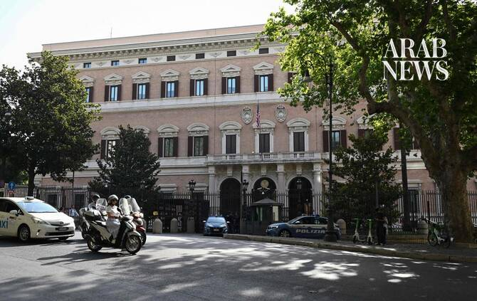

# Lebanon and Israel move toward implementing withdrawal agreement, US officials say

Source: https://www.arabnews.com/node/2651038/middle-east
Captured source: https://www.arabnews.com/node/2651038/middle-east
Published: 2026-07-15T18:39:36+03:00
Modified: 2026-07-15T20:50:50+03:00
Author: AP

## Summary

BEIRUT: After two days of US-mediated talks in Rome, Lebanon and Israel took steps toward implementing “pilot zones” in southern Lebanon where Israeli forces would withdraw and turn over control to the Lebanese army, the US State Department said Wednesday. The latest Israel-Hezbollah war began when the Lebanese militant group fired rockets into Israel days after Israel and the

## Image

## Video Or Embed URLs

- https://d65feacc65bd37bdfd2b93392d7ca19f.safeframe.googlesyndication.com/safeframe/1-0-45/html/container.html
- https://static.addtoany.com/menu/sm.25.html
- about:blank
- https://imasdk.googleapis.com/js/core/bridge3.777.0_en.html
- https://www.google.com/recaptcha/api2/aframe
- https://sync.teads.tv/wigo-no-slot
- https://cm.g.doubleclick.net/partnerpixels?gdpr=0&us_privacy=1---&gpp_sid=-1&url=https%3A%2F%2Fwww.arabnews.com%2Fnode%2F2651038%2Fmiddle-east

## Text

https://arab.news/bt7gx

The State Department said the talks were “productive” and the parties “agreed on the structure and guidelines for the pilot zone process

Following implementation of the pilot zones, “we will move to expanded technical talks ... with the aim of reaching a comprehensive agreement between Israel and Lebanon”

BEIRUT: After two days of US-mediated talks in Rome, Lebanon and Israel took steps toward implementing “pilot zones” in southern Lebanon where Israeli forces would withdraw and turn over control to the Lebanese army, the US State Department said Wednesday. The latest Israel-Hezbollah war began when the Lebanese militant group fired rockets into Israel days after Israel and the US launched their war on Iran on Feb. 28. Israel invaded Lebanon and has since occupied a large swathe of the country’s south. Hezbollah has been vehemently opposed to the direct Lebanon-Israel talks. The State Department said in a statement that the talks were “productive” and the parties “agreed on the structure and guidelines for the pilot zone process, to be finalized and implemented in the coming days.” There was no immediate statement from Lebanon or Israel on the outcome of the negotiations. Lebanon and Israel announced a “framework agreement” on June 26, laying out a plan for Israeli forces to withdraw from southern Lebanon, in exchange for the disarmament of the Iran-backed Hezbollah militant group. It also envisions steps toward an eventual peace agreement between the two countries — which technically remain in a state of war nearly 80 years after Israel’s establishment. The deal was supposed to begin with two “pilot zones” where the Israeli military is to turn over control to the Lebanese army, which would clear the areas of any Hezbollah presence. However, implementation on the ground had stalled ahead of this week’s talks. Lebanese President Joseph Aoun, who is slated to visit Washington on July 21, said in a statement ahead of the Rome talks that instructions had been given to the Lebanese delegation “to demand the immediate withdrawal of Israeli forces from the two pilot zones before any further discussions.” Wednesday’s statement did not specify where the pilot zones would be, but Lebanese and Israeli officials previously said they would include the towns of Froun, Ghandouriyeh and Zawtar. The designated zones generated some controversy in Lebanon because Israeli troops were not present in most of the selected area to begin with, raising questions about how a withdrawal could take place. The Lebanese army had pushed for pilot zones that were larger and included more area occupied by Israeli forces. The State Department said Wednesday that following implementation of the pilot zones, “we will move to expanded technical talks ... with the aim of reaching a comprehensive agreement between Israel and Lebanon. Hezbollah and Iran had sought to link the end of the war in Lebanon to the outcome of broader US-Iran talks. The Lebanese government, trying to minimize Iran’s influence, aimed to keep the two tracks separate and negotiate a ceasefire directly with Israel.” The Lebanese militant group has said it will not abide by the agreement and has no plans to disarm. Israeli officials, meanwhile, have said publicly that they plan an extended occupation of southern Lebanon. US President Donald Trump, in an interview with Fox News, a clip of which was aired Wednesday, said he wants to see Israel withdraw or “redeploy” forces from Lebanon as well as from a strip it is occupying in southern Syria. “Southern Syria and from parts of Lebanon, yeah, it would be good to get out, I think, and I think you might see things get a little bit calmer,” Trump said, adding, “We have to focus our energy on the big leagues. The big leagues are Iran.” Trump also once again repeated his proposal for Syrian President Ahmad Al-Sharaa to send forces into Lebanon to “take care of” Hezbollah, saying that Al-Sharaa “would be more precise” than Israel. Al-Sharaa has said publicly that he wants Syria to stay out of the regional war and has no desire to intervene militarily in Lebanon.
