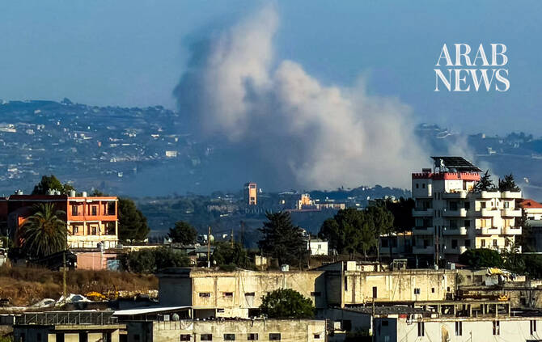

# Israel says killed three Hezbollah members in south Lebanon

Source: https://www.arabnews.com/node/2651074/middle-east
Captured source: https://www.arabnews.com/node/2651074/middle-east
Published: 2026-07-15T23:26:39+03:00
Modified: 2026-07-15T23:27:52+03:00
Author: AFP

## Summary

JERUSALEM: The Israeli military said it killed three Hezbollah members in south Lebanon on Wednesday, shortly after US-sponsored Israel-Lebanon negotiations were held in Rome. “Earlier today (Wednesday), IDF soldiers identified three armed Hezbollah terrorists in the area of Beit Yahoun, located within the Security Zone in southern Lebanon,” the military said in a statement.

## Image

## Video Or Embed URLs

- https://911e9ce36fcd9b4f7ac3849344e1de6e.safeframe.googlesyndication.com/safeframe/1-0-45/html/container.html
- https://static.addtoany.com/menu/sm.25.html
- about:blank
- https://imasdk.googleapis.com/js/core/bridge3.777.0_en.html
- https://www.google.com/recaptcha/api2/aframe
- https://sync.teads.tv/wigo-no-slot
- https://cm.g.doubleclick.net/partnerpixels?gdpr=0&us_privacy=1---&gpp_sid=-1&url=https%3A%2F%2Fwww.arabnews.com%2Fnode%2F2651074%2Fmiddle-east

## Text

https://arab.news/ptyca

IDF soldiers identified three armed Hezbollah terrorists in the area of Beit Yahoun, located within the Security Zone in southern Lebanon

JERUSALEM: The Israeli military said it killed three Hezbollah members in south Lebanon on Wednesday, shortly after US-sponsored Israel-Lebanon negotiations were held in Rome. “Earlier today (Wednesday), IDF soldiers identified three armed Hezbollah terrorists in the area of Beit Yahoun, located within the Security Zone in southern Lebanon,” the military said in a statement. “Following the identification, the IDF eliminated the three terrorists, who were carrying combat equipment, in order to remove the threat posed to IDF soldiers operating nearby,” it added. Israeli forces remain deployed in what the military describes as a security zone extending roughly 10 kilometers (six miles) into Lebanese territory. Israel and Lebanon on Wednesday concluded two days of talks aimed at reaching a permanent peace deal in Rome, with Washington describing the discussions as “productive and positive.” The US-brokered negotiations took place in the Italian capital over the framework agreement sealed last month after five rounds of talks in Washington, with Lebanese negotiators hoping for progress on an Israeli withdrawal from southern Lebanon. The deal seeks an end to the state of war between Israel and Hezbollah in Lebanon, disarmament of the Iran-backed militant group, the deployment of Lebanese troops in the south and for Israeli forces to steadily withdraw from the country, starting with two “pilot zones.” Hezbollah pulled Lebanon into the Middle East war when it launched strikes on Israel on March 2 in support of its backer Iran. Despite a ceasefire, Israel still launches occasional strikes in southern Lebanon and carries out detonations in villages it occupies near the border.
