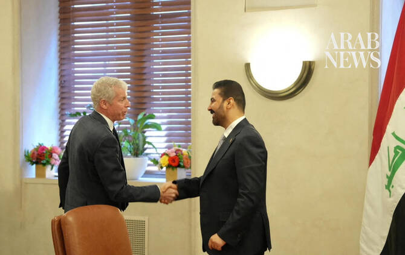

# Iraq, US sign 48 agreements during PM’s visit

Source: https://www.arabnews.com/node/2651394/middle-east
Captured source: https://www.arabnews.com/node/2651394/middle-east
Published: 2026-07-18T16:17:45+03:00
Modified: 2026-07-18T16:19:28+03:00
Author: AFP

## Summary

BAGHDAD: Iraq signed 48 agreements and partnerships with American companies, many in the oil sector, during a visit to the US by Prime Minister Ali Al-Zaidi, his office said Saturday. Oil-rich Iraq has been trying to move past decades of war and unrest, but still suffers from poor infrastructure, failing public services, mismanagement and endemic corruption. It is in urgent

## Image

## Video Or Embed URLs

- https://3c841c093acd6c6095f2de57ee06284a.safeframe.googlesyndication.com/safeframe/1-0-45/html/container.html
- https://static.addtoany.com/menu/sm.25.html
- about:blank
- https://imasdk.googleapis.com/js/core/bridge3.777.0_en.html
- https://www.google.com/recaptcha/api2/aframe
- https://sync.teads.tv/wigo-no-slot
- https://cm.g.doubleclick.net/partnerpixels?gdpr=0&us_privacy=1---&gpp_sid=-1&url=https%3A%2F%2Fwww.arabnews.com%2Fnode%2F2651394%2Fmiddle-east

## Text

https://arab.news/yhrwq

“A total of 48 agreements, memoranda of understanding, cooperation agreements, and partnership declarations were signed,” the Iraqi leader’s media office said

Iraq also signed a deal with Starlink to introduce services to the country

BAGHDAD: Iraq signed 48 agreements and partnerships with American companies, many in the oil sector, during a visit to the US by Prime Minister Ali Al-Zaidi, his office said Saturday. Oil-rich Iraq has been trying to move past decades of war and unrest, but still suffers from poor infrastructure, failing public services, mismanagement and endemic corruption. It is in urgent need of an economic boost, especially after losing revenue due to a halt in oil exports caused by the Middle East war. “A total of 48 agreements, memoranda of understanding, cooperation agreements, and partnership declarations were signed between public and private sector entities in Iraq and the United States,” the Iraqi leader’s media office said. They include “cooperation and partnerships involving the ministries of oil and electricity... with ExxonMobil, KBR, GE Vernova, Shell, and Halliburton,” as well as several deals related to the construction of a major crude oil pipeline between Iraq and Syria. Iraq also signed a deal with Starlink, which dominates the global satellite communications sector, to introduce services to the country. On Tuesday, US President Donald Trump praised Zaidi as a “champion” in a meeting at the White House. Zaidi, a businessman, came to power this year with US blessing after Trump vetoed another candidate. He has vowed to boost Iraq’s fragile economy and disarm pro-Iran armed groups in Iraq that have targeted US facilities. Iraq has long walked a tightrope between the competing influences of allies the United States and neighboring Iran.
