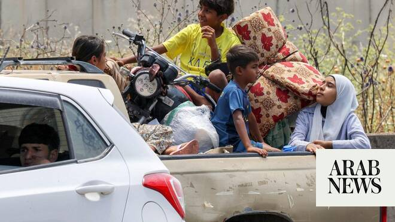

# Israeli strikes on Lebanon’s Tyre wound 10 hospital staff: CEO

Source: https://www.arabnews.com/node/2646863/middle-east
Captured source: https://www.arabnews.com/node/2646863/middle-east
Published: 2026-06-12T07:21:10+03:00
Modified: 2026-06-12T07:22:26+03:00
Author: Agencies

## Summary

TYRE, Lebanon: A strike wounded 10 staff members of a hospital in the Lebanese city of Tyre on Thursday, the facility’s director told AFP, as Israeli raids continue in the country’s south. All three of the historic city’s hospitals have been hit since the start of the latest war between Iran-backed militant group Hezbollah and Israel in early March. “An area located around 15

## Image

## Video Or Embed URLs

- https://static.addtoany.com/menu/sm.25.html
- about:blank
- https://www.google.com/recaptcha/api2/aframe
- https://imasdk.googleapis.com/js/core/bridge3.770.1_en.html
- https://sync.teads.tv/wigo-no-slot
- https://sync.teads.tv/iframe?pid=231897&gdprIab=%7B%22type%22%3A%22AddEventListenerDoesNotApply%22%2C%22reason%22%3A0%2C%22status%22%3A0%2C%22consent%22%3A%22%22%2C%22apiVersion%22%3A2%2C%22cmpId%22%3A300%7D&fromFormat=true&env=js-web&auctid=665d2230-5caa-48fe-85a3-67e55fedbb5c&vid=d16525b4-68c7-4940-991f-acfb30b71add&us_privacy=1---&1781265823604=
- https://cm.g.doubleclick.net/partnerpixels?gdpr=0&us_privacy=1---&gpp_sid=-1&url=https%3A%2F%2Fwww.arabnews.com%2Fnode%2F2646863%2Fmiddle-east

## Text

https://arab.news/vmmzx

All three of the historic city’s hospitals have been hit since the start of the latest war

Lebanon’s Christians flee Tyre, fearing Israel’s campaign will prevent return

TYRE, Lebanon: A strike wounded 10 staff members of a hospital in the Lebanese city of Tyre on Thursday, the facility’s director told AFP, as Israeli raids continue in the country’s south. All three of the historic city’s hospitals have been hit since the start of the latest war between Iran-backed militant group Hezbollah and Israel in early March. “An area located around 15 meters (50 feet) from the hospital was targeted, and 10 members of the medical and administrative staff were wounded,” said Dr. Salman Aydibi, who runs Hiram hospital. He said the strike shattered windows and damaged cars parked in front of the facility. “This is the sixth time that the area of the hospital has been targeted by Israeli raids since the start of the war,” he said. On Tuesday, the Israeli military told the entire city of Tyre to evacuate, with an AFP correspondent witnessing residents fleeing and heavy traffic heading north after the warning. Christians flee Tyre, fearing Israel’s campaign will prevent return After a ceasefire was announced between Lebanese armed group Hezbollah and Israel in April, Darine Al-Jouny Safadi thought the worst was behind her and returned home to the Christian quarter of southern Lebanon’s port city of Tyre. Around three weeks later, Safadi and her family were on the run again, fleeing Israeli bombardment for the second time in almost as many months, despite worries they’d never return. Their fears were compounded this week when Israel’s military ordered the evacuation of their historic district in Tyre and launched deadly strikes, saying Hezbollah militants were operating there without providing evidence. Previous evacuation orders had excluded the ancient city’s Christian quarter. Christians in Lebanon like Safadi have watched in horror as their ancestral lands in the south of the country have been pounded. Some ‌have insisted on ‌staying, and are now almost encircled by Israeli troops. Others, like the ‌Safadi ⁠family, fled north. “This time ⁠it felt harder,” she said of their second displacement. “Maybe because we had come back and said, “That’s it, we’re back.’” On Wednesday, Israeli Defense Minister Israel Katz said the residents of Tyre’s Christian neighborhood could return home. Several told Reuters they didn’t feel safe to do so yet. Fears of erasure Lebanon was drawn into the wider conflict centered on Iran on March 2, when Tehran-backed Hezbollah fired rockets at Israel in solidarity with Iran, which was under US-Israeli attack, prompting a major Israeli air and ground campaign. The Greek Orthodox Archbishop of Tyre, Sidon and Dependencies, Elias Kfoury, who has ⁠served in the region for more than 30 years through multiple wars, said ‌the scale of destruction is unlike anything he’d seen before. “This is ‌the hardest round,” Kfoury told Reuters. “It has spared neither people nor stone nor places of worship nor antiquities.” Christians have been ‌living in south Lebanon for as long as the religion has existed, and today are thought to ‌make up around 30 percent of Lebanon’s population. Some believe Jesus performed his first miracle of converting water into wine in Qana, a village in south Lebanon, and the region is dotted with ancient churches and religious sites. Kfoury estimates that the Israeli military has caused more than $100 million in damage to places of worship in south Lebanon. The St. George Melkite Catholic ‌Church was hit by an Israeli strike in a previous war, and remains in ruins. “Israel is trying to erase the memory of the country,” he said. “Erasing ⁠heritage means erasing the ⁠record of the region: the history, the archaeology and a person’s connection to them.” In response to a request for comment, Israel’s military said it was acting “solely against Hezbollah military targets, in accordance with international law.” “The IDF rejects any claim of intentional harm to civilians, places of worship, or heritage sites in southern Lebanon,” it said. Kfoury accused the international community of failing to hold Israel accountable and called for greater protections for the people of south Lebanon. Fears of permanent displacement More than 3,600 people have been killed in Israeli strikes on Lebanon and more than 1 million — a fifth of the population — are displaced. The US declared a ceasefire on April 16 but fighting has continued, and Lebanon says Israel has carried out nearly 3,500 strikes since the truce was announced. Sitting surrounded by family, Safadi wept at the prospect of being permanently uprooted from her home and community. “Why? I mean, churches that are thousands of years old, how can they be gone? Where are we supposed to go back to?” she said. “You can’t explain the feeling,” said her 13-year-old daughter Salma. “You won’t see your house anymore … You won’t see your church.”
