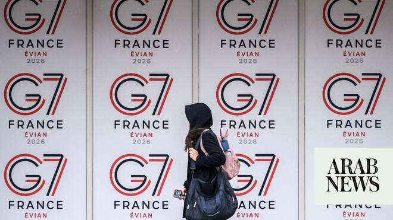

# Israeli, Palestinian civil society meet in France as two-state solution dims

Source: https://www.arabnews.com/node/2646867/middle-east
Captured source: https://www.arabnews.com/node/2646867/middle-east
Published: 2026-06-12T08:03:28+03:00
Modified: 2026-06-12T08:05:56+03:00
Author: Reuters

## Summary

PARIS : Israeli and Palestinian civil society groups will meet in France on Friday to urge the international community not to abandon a two-state solution, as Paris seeks to keep the issue alive amid the Middle East war. The meeting, attended by foreign ministers and senior officials from dozens of countries, marks one year since the UN-backed New York Declaration, which set

## Image

## Video Or Embed URLs

- about:blank
- https://static.addtoany.com/menu/sm.25.html
- https://imasdk.googleapis.com/js/core/bridge3.770.1_en.html
- https://www.google.com/recaptcha/api2/aframe
- https://sync.teads.tv/wigo-no-slot
- https://cm.g.doubleclick.net/partnerpixels?gdpr=0&us_privacy=1---&gpp_sid=-1&url=https%3A%2F%2Fwww.arabnews.com%2Fnode%2F2646867%2Fmiddle-east

## Text

https://arab.news/gfxmr

Conference marks year since UN roadmap for Palestinian state

France ‌aims to keep two-state solution on agenda amid Iran war

PARIS : Israeli and Palestinian civil society groups will meet in France on Friday to urge the international community not to abandon a two-state solution, as Paris seeks to keep the issue alive amid the Middle East war. The meeting, attended by foreign ministers and senior officials from dozens of countries, marks one year since the UN-backed New York Declaration, which set out a roadmap toward Palestinian statehood and prompted around a dozen countries, including France, Britain and ‌Canada, to recognize ‌a Palestinian state. “Given the current situation in the region, ​marked ‌by seemingly ⁠endless conflicts, ​too ⁠many civilian casualties and a cycle of violence, and in light of the stalled implementation of the Gaza ceasefire ... we believe this conference is now more essential and urgent than ever,” France’s Foreign Ministry spokesperson told reporters on Thursday. The gathering will end with an eight-point “Call for Action” urging a permanent ceasefire, a halt to settlements, Gaza reconstruction, governance reforms and stronger international backing for civil society. It will be delivered to the G7 leaders who ⁠meet in the French Alps from Monday. “The region continues to ‌fracture. Gaza is devastated, Israel remains under threat. ‌Settler terrorism, settlement expansion, and de facto annexation and threats ​to the Palestinian Authority continue to undermine ‌the viability of a future Palestinian state,” according to the action plan seen ‌by Reuters. “Israelis and Palestinians alike remain trapped in fear, insecurity, and trauma. We return because, as the G7 convenes in Évian, this conflict risks once again being set aside. The window for a solution remains open; but it is narrowing.”

Anger in West over settler violence

The conference comes ‌amid escalating violence by Israeli settlers in the occupied West Bank and underscores anger in many Western countries toward Prime ⁠Minister Benjamin Netanyahu’s government, ⁠which has expanded settlements. Diplomats say that expansion is aimed at undermining prospects for a Palestinian state. A key concern is Israel’s plan to build a settlement east of Jerusalem, known as the E1 project, which would bisect the West Bank and cut it off from East Jerusalem, fragmenting territory Palestinians seek for an independent state. Britain, Canada, France and Norway announced new coordinated sanctions on Tuesday against Israeli networks involved in financing, enabling and carrying out violence in the Israeli-occupied West Bank. Israel and the United States declined to attend the meeting. “The ambassador was invited but will not attend the conference, as it has nothing to do with promoting peace,” the Israeli embassy said in ​a statement. “France cannot act as a ​mediator between Israel and the Palestinians. Regarding the two-state solution, the ambassador recalls that the Palestinians have rejected proposals to establish a Palestinian state on five occasions.”
