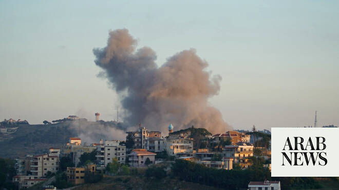

# Hezbollah says it confronted Israeli troops advancing in south Lebanon

Source: https://www.arabnews.com/node/2646987/middle-east
Captured source: https://www.arabnews.com/node/2646987/middle-east
Published: 2026-06-13T02:02:02+03:00
Modified: 2026-06-13T08:17:48+03:00
Author: AFP

## Summary

BEIRUT: Hezbollah said on Friday its fighters had confronted Israeli forces advancing toward a southern Lebanese town, as Israel pressed on with its strikes in Lebanon.

## Image

## Video Or Embed URLs

- https://static.addtoany.com/menu/sm.25.html
- about:blank
- https://www.google.com/recaptcha/api2/aframe
- https://imasdk.googleapis.com/js/core/bridge3.770.1_en.html
- https://sync.teads.tv/wigo-no-slot
- https://cm.g.doubleclick.net/partnerpixels?gdpr=0&us_privacy=1---&gpp_sid=-1&url=https%3A%2F%2Fwww.arabnews.com%2Fnode%2F2646987%2Fmiddle-east

## Text

https://arab.news/82eep

Hezbollah said its rocket barrages forced Israeli troops to retreat from Majdal Zoun

The group also claimed other attacks on Israeli troops in southern Lebanon

BEIRUT: Hezbollah said on Friday its fighters had confronted Israeli forces advancing toward a southern Lebanese town, as Israel pressed on with its strikes in Lebanon. In a statement, Hezbollah said its fighters first targeted Israeli troops advancing toward Majdal Zoun, around five kilometers (three miles) from the western side of the border, on Thursday evening “with repeated rocket barrages, forcing them to retreat.” It then said it engaged with an advancing force there on Friday “engaging them with light and medium weapons and rockets.” The group also claimed other attacks on Israeli troops in southern Lebanon. The Israeli military meanwhile issued an evacuation warning for three southern Lebanese villages. Lebanon’s state-run National News Agency reported a series of strikes across the south, including on areas not included in the Israeli warning. The NNA later reported large explosions and artillery shelling near the Ali Taher hills, which overlook the southern city of Nabatieh. An aid convoy organized by the Vatican envoy to Lebanon that was headed for southern Christian villages, whose residents remained despite the conflict, was stopped by the Israeli military and forced to change course, a convoy member told AFP on Friday. Lebanon was dragged into the Middle East war on March 2, when Hezbollah fired rockets at Israel in retaliation for the killing of Iran’s supreme leader Ali Khamenei. Israel has since carried out a massive campaign of strikes and a ground invasion that have killed more than 3,700 people in Lebanon, while occupying a large chunk of the country’s south. An April ceasefire in Lebanon was never observed, and the fighting has continued despite a new conditional truce deal announced last week after Lebanese-Israeli talks in Washington. Hezbollah rejected the conditional agreement, which requires it to stop launching attacks but makes no mention of Israel having to cease attacks or withdraw its troops from Lebanon. Iran insists that Lebanon must be part of any agreement to end the wider Middle East war.
