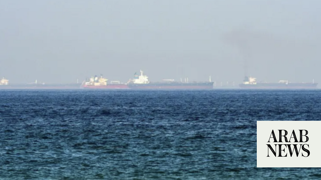

# Tanker struck by unknown projectile 6 nautical miles east of Oman, UKMTO says

Source: https://www.arabnews.com/node/2647040/middle-east
Captured source: https://www.arabnews.com/node/2647040/middle-east
Published: 2026-06-13T17:41:11+03:00
Modified: 2026-06-13T17:41:11+03:00
Author: Agencies

## Summary

LONDON: A tanker was struck ​by an unknown projectile in its port bow off the coast ‌of ‌Oman, ​the ‌United Kingdom ⁠Maritime ​Trade Operations (UKMTO) ⁠said on Saturday. UKMTO said the incident had ⁠occurred on Friday, ‌6 ‌nautical miles ​east ‌of Oman. ‌ The crew were reported safe and ‌there was no reported environmental impact, ⁠while ⁠the tanker was continuing to its next

## Image

## Video Or Embed URLs

- https://9860d581ff3886e079d84c242c1af59b.safeframe.googlesyndication.com/safeframe/1-0-45/html/container.html
- https://static.addtoany.com/menu/sm.25.html
- about:blank
- https://www.google.com/recaptcha/api2/aframe
- https://imasdk.googleapis.com/js/core/bridge3.770.1_en.html
- https://cm.g.doubleclick.net/partnerpixels?gdpr=0&us_privacy=1---&gpp_sid=-1&url=https%3A%2F%2Fwww.arabnews.com%2Fnode%2F2647040%2Fmiddle-east

## Text

https://arab.news/gbz8c

The crew were reported safe and ‌there was no reported environmental impact

LONDON: A tanker was struck ​by an unknown projectile in its port bow off the coast ‌of ‌Oman, ​the ‌United Kingdom ⁠Maritime ​Trade Operations (UKMTO) ⁠said on Saturday.

UKMTO said the incident had ⁠occurred on Friday, ‌6 ‌nautical miles ​east ‌of Oman. ‌

The crew were reported safe and ‌there was no reported environmental impact, ⁠while ⁠the tanker was continuing to its next port of call.

The incident came after Indian Foreign Minister Subrahmanyam Jaishankar called US Secretary of State Marco Rubio on Friday in protest after American strikes on three largely Indian-crewed merchant vessels off Oman killed three Indians, upping the diplomatic ante.

The call came as New Delhi summoned a senior US diplomat in the Indian capital for a second time in two days over the incident.

“Spoke to US Secretary of State Marco Rubio this evening,” Jaishankar said early Saturday in a post on X.

“I reiterated India’s strong protest at the attacks by the US Navy in the Gulf that killed three Indian mariners. Such lethal actions against commercial shipping are not justified.”
