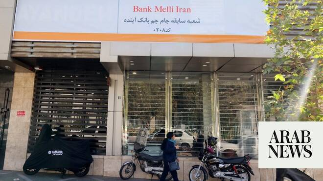

# Iran says limited cyberattack disrupts services at four banks, state media says

Source: https://www.arabnews.com/node/2647107/middle-east
Captured source: https://www.arabnews.com/node/2647107/middle-east
Published: 2026-06-14T10:29:30+03:00
Modified: 2026-06-14T10:30:01+03:00
Author: AFP

## Summary

DUBAI: A cyberattack disrupted services at four ​major Iranian banks, though no customer data was compromised, the country’s banking coordination council ‌said on Sunday, ‌according ​to ‌state ⁠media. The ​council said ⁠the attack targeted a shared communications infrastructure used by Bank Melli, ⁠Bank Tejarat, Bank ‌Saderat and ‌the Export ​Development ‌Bank of ‌Iran,

## Image

## Video Or Embed URLs

- https://static.addtoany.com/menu/sm.25.html
- about:blank
- https://imasdk.googleapis.com/js/core/bridge3.770.1_en.html
- https://www.google.com/recaptcha/api2/aframe
- https://sync.teads.tv/wigo-no-slot
- https://cm.g.doubleclick.net/partnerpixels?gdpr=0&us_privacy=1---&gpp_sid=-1&url=https%3A%2F%2Fwww.arabnews.com%2Fnode%2F2647107%2Fmiddle-east

## Text

https://arab.news/j3m6p

Attack targeted a shared communications infrastructure used by Bank Melli, ⁠Bank Tejarat, Bank ‌Saderat and ‌the Export ​Development ‌Bank of ‌Iran

DUBAI: A cyberattack disrupted services at four ​major Iranian banks, though no customer data was compromised, the country’s banking coordination council ‌said on Sunday, ‌according ​to ‌state ⁠media. The ​council said ⁠the attack targeted a shared communications infrastructure used by Bank Melli, ⁠Bank Tejarat, Bank ‌Saderat and ‌the Export ​Development ‌Bank of ‌Iran, prompting technical teams to implement protective measures and temporarily ‌affecting some banking services. It said no unauthorized ⁠access ⁠to customer information had occurred and no data had been deleted, adding that recovery efforts were underway to restore ​normal ​operations. (Reporting by Dubai Newsroom;Editing by Elaine ​Hardcastle)
