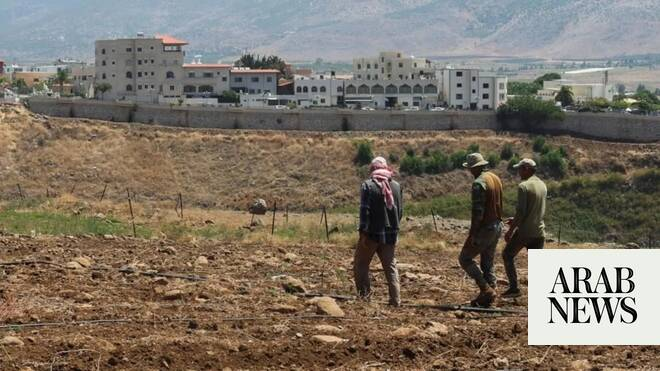

# Lebanon complains to Security Council over alleged Israeli use of herbicide

Source: https://www.arabnews.com/node/2647127/middle-east
Captured source: https://www.arabnews.com/node/2647127/middle-east
Published: 2026-06-14T15:23:44+03:00
Modified: 2026-06-14T15:25:03+03:00
Author: AFP

## Summary

BEIRUT: Lebanon’s foreign ministry said it had lodged a complaint with the United Nations over Israel’s alleged spraying of herbicide glyphosate in Lebanese territory near the border earlier this year. In a statement circulated on Sunday, the ministry said it had sent a letter to the UN Security Council and the UN secretary-general this week to complain about the incident,

## Image

## Video Or Embed URLs

- https://8a638cb2b043f350aac916b9434289df.safeframe.googlesyndication.com/safeframe/1-0-45/html/container.html
- https://static.addtoany.com/menu/sm.25.html
- about:blank
- https://www.google.com/recaptcha/api2/aframe
- https://imasdk.googleapis.com/js/core/bridge3.770.1_en.html
- https://sync.teads.tv/wigo-no-slot
- https://cm.g.doubleclick.net/partnerpixels?gdpr=0&us_privacy=1---&gpp_sid=-1&url=https%3A%2F%2Fwww.arabnews.com%2Fnode%2F2647127%2Fmiddle-east

## Text

https://arab.news/gpdcq

Lebanon’s foreign ministry said it had lodged a complaint with the United Nations over Israel’s alleged spraying of herbicide glyphosate in Lebanese territory near the border earlier this year

BEIRUT: Lebanon’s foreign ministry said it had lodged a complaint with the United Nations over Israel’s alleged spraying of herbicide glyphosate in Lebanese territory near the border earlier this year. In a statement circulated on Sunday, the ministry said it had sent a letter to the UN Security Council and the UN secretary-general this week to complain about the incident, which occurred in February, a month before the latest Israel-Hezbollah war erupted on March 2. The ministry said “laboratory tests and chemical analyzes carried out on soil samples” in the south Lebanon border villages of Aita Al-Shaab, Ras Naqura and Dhayra “confirmed the use of glyphosate at high levels of concentration.” It said the levels “greatly exceed” those usually found in agricultural areas after regular use by farmers. The statement said the complaint was based on a report from Lebanon’s government-linked National Council for Scientific Research (CNRS). At the time, the UN peacekeeping mission in Lebanon said Israel had notified it of its plans to spray a “non-toxic chemical substance” near the border and had warned peacekeepers to take shelter. Lebanon’s President Joseph Aoun had denounced the spraying as a “flagrant violation of Lebanese sovereignty and a crime against the environment and health.” The ministry statement also said Lebanon had complained to the Security Council about ongoing Israeli attacks on Lebanon, including “the targeting of a Lebanese army vehicle” earlier this month that killed two on-duty officers and a soldier. Noting ongoing direct negotiations between Israel and Lebanon aimed at ending the hostilities, the statement said “Israel’s targeting of Lebanese army personnel directly undermines these diplomatic efforts.” In April, Israel and Lebanon began landmark direct talks in Washington seeking to halt the hostilities, with another round scheduled later this month between the two countries which have no formal diplomatic relations. Military delegations from the two countries also held security talks at the Pentagon last month.
