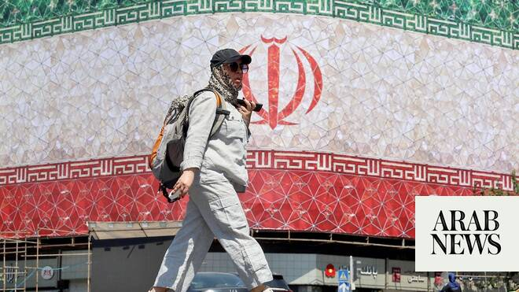

# Gulf, Arab states welcome US-Iran deal to end war, reopen Hormuz

Source: https://www.arabnews.com/node/2647225/middle-east
Captured source: https://www.arabnews.com/node/2647225/middle-east
Published: 2026-06-15T10:55:15+03:00
Modified: 2026-06-15T12:51:43+03:00
Author: Arab News

## Summary

DUBAI: Gulf and Arab states welcomed on Monday a US-Iran agreement to end the war and reopen the Strait of Hormuz, expressing hope that the deal will pave the way for lasting regional stability and broader diplomatic engagement. Saudi Arabia welcomed the agreement between Washington and Tehran to halt military operations and begin detailed negotiations over a 60-day period

## Image

## Video Or Embed URLs

- https://static.addtoany.com/menu/sm.25.html
- about:blank
- https://imasdk.googleapis.com/js/core/bridge3.771.2_en.html
- https://www.google.com/recaptcha/api2/aframe
- https://cm.g.doubleclick.net/partnerpixels?gdpr=0&us_privacy=1---&gpp_sid=-1&url=https%3A%2F%2Fwww.arabnews.com%2Fnode%2F2647225%2Fmiddle-east

## Text

https://arab.news/c327d

Gulf countries praise diplomacy and urge constructive negotiations after months of conflict

DUBAI: Gulf and Arab states welcomed on Monday a US-Iran agreement to end the war and reopen the Strait of Hormuz, expressing hope that the deal will pave the way for lasting regional stability and broader diplomatic engagement.

Saudi Arabia welcomed the agreement between Washington and Tehran to halt military operations and begin detailed negotiations over a 60-day period aimed at reaching a permanent settlement.

The United Arab Emirates called for full implementation of the preliminary US-Iran deal, including an immediate halt to hostilities and guarantees of freedom of navigation in the Strait of Hormuz, the foreign ministry said on Monday.

The ministry stressed the importance of dialogue, diplomacy and adherence to international law following the memorandum of understanding. It also noted the UAE had been affected by the conflict, with Iranian strikes hitting shipping and energy infrastructure linked to the country.

Kuwait also welcomed the deal, which includes an immediate and permanent cessation of military operations and guarantees freedom of navigation through the Strait of Hormuz.

The Gulf state praised the mediation efforts of Pakistan and Qatar, as well as other countries that helped facilitate the agreement. In a statement, Kuwait said it hoped the understanding would help address outstanding disputes through sustainable solutions based on “good neighbourliness, mutual respect, non-interference in the internal affairs of states and an end to support for proxies.”

Qatar also welcomed the agreement, saying it could pave the way for a lasting end to military operations. Doha praised Pakistan’s role in facilitating the process and reaffirmed its commitment to dialogue and diplomacy as the best means of resolving disputes.

Egypt and Lebanon also welcomed the agreement, expressing hope that it would help reduce regional tensions, support stability and create momentum for resolving outstanding issues through dialogue.

Egypt said the agreement was a significant step toward restoring regional and international stability, adding that it hoped the deal would strengthen trust, advance diplomatic efforts and create a more supportive environment for peace in the Middle East. Cairo also said it hoped the end of the war would refocus international attention on Gaza and the West Bank and accelerate efforts to implement the next phase of President Donald Trump’s peace plan.

Lebanon’s Parliament Speaker Nabih Berri welcomed the agreement, saying it would help lay the foundations for regional security and stability, including in Lebanon. He also praised mediation efforts by Pakistan, Qatar, Saudi Arabia and Egypt, and welcomed provisions aimed at ending Israeli military operations in Lebanon while preserving the country’s sovereignty.

Lebanon’s President Joseph Aoun also welcomed the agreement, saying he appreciated that Lebanon’s security and stability were included in the US-Iran deal.

Iraq also welcomed the US-Iran agreement to end the war, saying it would work to repair relations with countries affected by the conflict.

Turkiye described the agreement as an important development that would strengthen peace and stability across the region.

The Secretary-General of the Gulf Cooperation Council welcomed the signing of the memorandum, saying it could lead to a lasting agreement and help ensure regional security and stability.

Jordan also welcomed the agreement, saying the start of negotiations toward a permanent settlement marked an important step toward restoring regional and international security.

The United States and Iran announced the agreement after more than three months of conflict.

US President Donald Trump confirmed a deal had been reached and said he had authorized an end to the US naval blockade of Iranian ports in the Strait of Hormuz.

Details of the agreement were not immediately available, although key mediator Pakistan said the deal would be formally signed in Switzerland on Friday. Negotiations on issues including Iran’s nuclear program are expected to continue.
