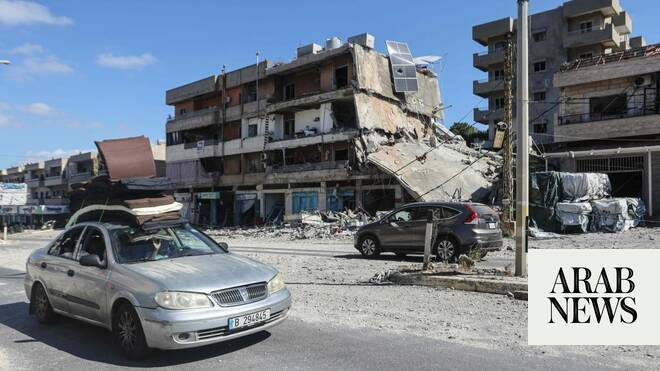

# Lebanon warns displaced against rushing home after US-Iran agreement

Source: https://www.arabnews.com/node/2647227/middle-east
Captured source: https://www.arabnews.com/node/2647227/middle-east
Published: 2026-06-15T11:13:50+03:00
Modified: 2026-06-15T13:24:09+03:00
Author: Reuters

## Summary

BEIRUT/JERUSALEM: Authorities in southern Lebanon warned people displaced by three months of war between Israel and Hezbollah against rushing home on Monday despite a US-Iran deal to end the wider conflict, as Israel said it would not withdraw troops from the south. The warning comes as Lebanon has not been informed of details of the US-Iran agreement, an official source told

## Image

## Video Or Embed URLs

- blob:https://www.arabnews.com/b10ba130-f5af-40e2-bc11-2b715f8c6f14
- https://imasdk.googleapis.com/js/core/bridge3.770.1_en.html
- about:blank
- https://static.addtoany.com/menu/sm.25.html
- https://www.google.com/recaptcha/api2/aframe
- https://cm.g.doubleclick.net/partnerpixels?gdpr=0&us_privacy=1---&gpp_sid=-1&url=https%3A%2F%2Fwww.arabnews.com%2Fnode%2F2647227%2Fmiddle-east

## Text

https://arab.news/j62tj

Lebanon has not been informed of details of the US-Iran agreement, official source tells AFP

Lebanon has suffered the deadliest spillover of the conflict between the US and Iran

BEIRUT/JERUSALEM: Authorities in southern Lebanon warned people displaced by three months of war between Israel and Hezbollah against rushing home on Monday despite a US-Iran deal to end the wider conflict, as Israel said it would not withdraw troops from the south.

The warning comes as Lebanon has not been informed of details of the US-Iran agreement, an official source told AFP on Monday.

“Lebanon was not informed of the terms of the agreement or the time of the ceasefire,” the source said on condition of anonymity.

The Lebanese army on Monday called on residents of south Lebanon to slow down before moving back to border towns.

Few details have been made public about the agreement announced overnight.

Lebanon has suffered the deadliest spillover of the conflict between the US and Iran, with thousands of people killed and some 1.2 million people uprooted by an Israeli offensive against the Iran-backed Hezbollah group, which ‌opened fire on ‌Israel in support of Tehran on March 2.

Pakistani ‌Prime ⁠Minister Shehbaz Sharif, ⁠a key mediator between Tehran and Washington, announced that a deal was struck early on Monday local time, and that the pact called for “the immediate and permanent termination of military operations on all fronts, including in Lebanon.”

In south Lebanon, where Israeli forces have occupied a self-declared security zone, municipal councils issued statements calling on residents to hold off on returning, the state-run National News ⁠Agency reported.

Mona Mazeh, a displaced woman sheltering in Beirut’s ‌Hamra district, had no immediate plans to ‌return to her village near the southern city of Tyre.

“Frankly, we are hesitant; ‌Israel cannot be trusted,” she said.

Israel is not a party to US-Iran ‌deal

Israeli Defense Minister Israel Katz, whose country is not a party to the US-Iran deal, said Israel would not withdraw from security zones in southern Lebanon, Gaza and Syria, and that it would retaliate if Iran attacked Israel due to ‌events in Lebanon.

Katz said the security zone in southern Lebanon would be cleared of local residents, and “all terrorist ⁠infrastructure, including houses in ⁠contact villages,” in reference to Hezbollah.

The Israeli military has been razing villages in southern Lebanon for weeks, saying it is acting against Hezbollah militants embedded in civilian areas of the predominantly Shiite Muslim region.

Hundreds of thousands of Lebanese Shiites are sheltering in other parts of the country.

In Nabatieh, a devastated city in the south, Mohammed Daqdouq said he had returned on Monday morning to check on his home.

“We’ll need a lifetime to rebuild — to rebuild it again and bring Nabatieh back to how it was,” he said.

Iran, whose Revolutionary Guards established Hezbollah in 1982, had insisted that a Lebanon ceasefire be included as part of any broader deal with the United States.
