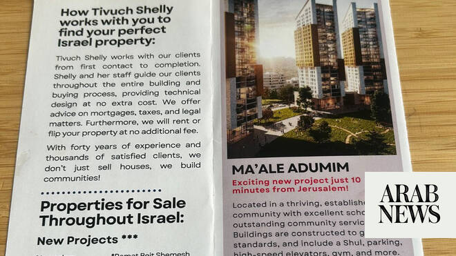

# Illegal Israeli settlement homes promoted at property show in London

Source: https://www.arabnews.com/node/2647327/world
Captured source: https://www.arabnews.com/node/2647327/world
Published: 2026-06-16T03:07:55+03:00
Modified: 2026-06-16T15:11:37+03:00
Author: Arab News

## Summary

LONDON: Homes in illegal Israeli settlements built on occupied Palestinian land were touted for sale at a property show in London over the weekend. More than 100 British politicians had called for the event to be canceled, arguing that there was a danger that property linked to Israeli settlements could be promoted there. Marketing materials handed out at the Great Israeli

## Image

## Video Or Embed URLs

- https://platform.twitter.com/embed/Tweet.html?creatorScreenName=Arab_News&creatorUserId=69172612&dnt=false&embedId=twitter-widget-0&features=eyJ0ZndfdGltZWxpbmVfbGlzdCI6eyJidWNrZXQiOltdLCJ2ZXJzaW9uIjpudWxsfSwidGZ3X2ZvbGxvd2VyX2NvdW50X3N1bnNldCI6eyJidWNrZXQiOnRydWUsInZlcnNpb24iOm51bGx9LCJ0ZndfdHdlZXRfZWRpdF9iYWNrZW5kIjp7ImJ1Y2tldCI6Im9uIiwidmVyc2lvbiI6bnVsbH0sInRmd19yZWZzcmNfc2Vzc2lvbiI6eyJidWNrZXQiOiJvbiIsInZlcnNpb24iOm51bGx9LCJ0ZndfZm9zbnJfc29mdF9pbnRlcnZlbnRpb25zX2VuYWJsZWQiOnsiYnVja2V0Ijoib24iLCJ2ZXJzaW9uIjpudWxsfSwidGZ3X21peGVkX21lZGlhXzE1ODk3Ijp7ImJ1Y2tldCI6InRyZWF0bWVudCIsInZlcnNpb24iOm51bGx9LCJ0ZndfZXhwZXJpbWVudHNfY29va2llX2V4cGlyYXRpb24iOnsiYnVja2V0IjoxMjA5NjAwLCJ2ZXJzaW9uIjpudWxsfSwidGZ3X3Nob3dfYmlyZHdhdGNoX3Bpdm90c19lbmFibGVkIjp7ImJ1Y2tldCI6Im9uIiwidmVyc2lvbiI6bnVsbH0sInRmd19kdXBsaWNhdGVfc2NyaWJlc190b19zZXR0aW5ncyI6eyJidWNrZXQiOiJvbiIsInZlcnNpb24iOm51bGx9LCJ0ZndfdXNlX3Byb2ZpbGVfaW1hZ2Vfc2hhcGVfZW5hYmxlZCI6eyJidWNrZXQiOiJvbiIsInZlcnNpb24iOm51bGx9LCJ0ZndfdmlkZW9faGxzX2R5bmFtaWNfbWFuaWZlc3RzXzE1MDgyIjp7ImJ1Y2tldCI6InRydWVfYml0cmF0ZSIsInZlcnNpb24iOm51bGx9LCJ0ZndfbGVnYWN5X3RpbWVsaW5lX3N1bnNldCI6eyJidWNrZXQiOnRydWUsInZlcnNpb24iOm51bGx9LCJ0ZndfdHdlZXRfZWRpdF9mcm9udGVuZCI6eyJidWNrZXQiOiJvbiIsInZlcnNpb24iOm51bGx9fQ%3D%3D&frame=false&hideCard=false&hideThread=false&id=2066569646543679868&lang=en&origin=https%3A%2F%2Fwww.arabnews.com%2Fnode%2F2647327%2Fworld&sessionId=3405f9114a758f9169445218ad4cd00648b0e349&siteScreenName=Arab_News&siteUserId=69172612&theme=light&widgetsVersion=6a3ad42b224df%3A1778106238597&width=600px
- https://static.addtoany.com/menu/sm.25.html
- https://platform.twitter.com/widgets/widget_iframe.1227a5674072e080ffb1ba14ac0c1079.html?origin=https%3A%2F%2Fwww.arabnews.com
- about:blank
- https://imasdk.googleapis.com/js/core/bridge3.771.2_en.html
- https://www.google.com/recaptcha/api2/aframe
- https://cm.g.doubleclick.net/partnerpixels?gdpr=0&us_privacy=1---&gpp_sid=-1&url=https%3A%2F%2Fwww.arabnews.com%2Fnode%2F2647327%2Fworld

## Text

https://arab.news/vssdf

Protest group obtains marketing materials advertising properties within Israeli developments in the occupied West Bank and East Jerusalem

MPs had previously called for the Great Israeli Real Estate Event to be canceled over concerns it would promote Israeli settlement properties

LONDON: Homes in illegal Israeli settlements built on occupied Palestinian land were touted for sale at a property show in London over the weekend.

More than 100 British politicians had called for the event to be canceled, arguing that there was a danger that property linked to Israeli settlements could be promoted there.

Marketing materials handed out at the Great Israeli Real Estate Event promoted properties in Ma’Ale Adumin and Givat Zeev in the West Bank, and Ramat Eshkol and Givat HaMatos in East Jerusalem, Sky News reported. The settlements were built on Palestinian land occupied by Israel since 1967 and are considered illegal under international law.

The UK-based organization Jewish Anti-Zionist Action, a pro-Palestinian protest group run by Jewish people, said it obtained the marketing materials after signing up to attend the event, which took place on Sunday.

“After passing through security, I was given a free tote bag and a booklet advertising the different real estate companies present at the fair that day,” a member of the group told Sky News.

“These companies included Yigal Realty, selling homes in the illegal settlement of Givat Zeev, and Tivuch Shelly, selling homes in Givat HaMatos and Ramat Eshkol, which are both settlements in East Jerusalem.

“I visited Tivuch Shelly’s stall and was given a leaflet advertising properties in Ma’ale Adumim, which is an illegal West Bank settlement.”

Before the event, the organizers rejected allegations that properties in West Bank settlements would be marketed at the show. A spokesperson described the claims as “ridiculous” and said all exhibitors would only present information about properties and projects within Israel’s internationally recognized boundaries, Jewish News reported.

References to the West Bank settlement of Gush Etzion that had appeared in earlier promotional material were removed from the event’s website.

A letter sent to the foreign secretary, Yvette Cooper, signed by 101 parliamentarians from the House of Commons and House of Lords, had warned that the property show could contribute to settlement expansion on occupied Palestinian territory.

Labour MP Andy McDonald, co-chair of the Britain-Palestine All-Party Parliamentary Group, told Sky News that their concerns about the event had been vindicated.

“It’s an absolute abomination that people have the audacity to come to our capital and trade in lands they do not own,” he said. “How would it look if the Russians were here trading lands in Ukraine? I’m aghast that it is tolerated.

“It’s imperative our government should act and respond. They shouldn’t say to British companies they should not trade with settlements; they need to say they must not.”

The UK government has repeatedly stated that Israeli settlements are illegal under international law and threaten prospects for a two-state solution to the Israeli-Palestinian conflict.

The real estate show was the latest in a series of international property exhibitions that have touted homes and investment opportunities in Israel. Hundreds of people took part in protests for and against the event, which took place at a synagogue in northwest London. Police said 15 people were arrested.
