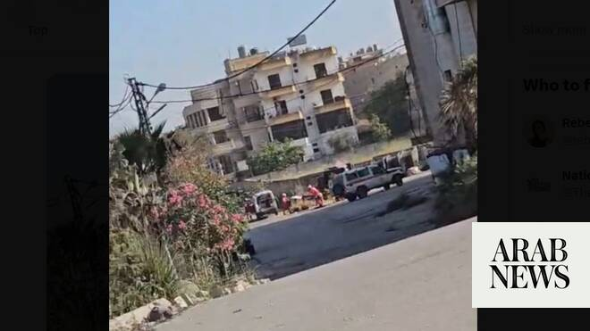

# Israeli drone strikes kill at least 4 in Lebanon, Iran threatens to respond

Source: https://www.arabnews.com/node/2647442/middle-east
Captured source: https://www.arabnews.com/node/2647442/middle-east
Published: 2026-06-16T20:04:08+03:00
Modified: 2026-06-16T22:42:01+03:00
Author: Reuters

## Summary

BEIRUT: Israeli drone strikes targeted three vehicles in southern Lebanon on Tuesday, killing at least four people and wounding others, Lebanon’s National News Agency (NNA) reported. Iran's military threatened to respond to the strikes despite a deal between Tehran and Washington ending the Middle East war, including in Lebanon.

## Image

## Video Or Embed URLs

- https://static.addtoany.com/menu/sm.25.html
- about:blank
- https://imasdk.googleapis.com/js/core/bridge3.771.2_en.html
- https://sync.teads.tv/wigo-no-slot
- https://www.google.com/recaptcha/api2/aframe
- https://cm.g.doubleclick.net/partnerpixels?gdpr=0&us_privacy=1---&gpp_sid=-1&url=https%3A%2F%2Fwww.arabnews.com%2Fnode%2F2647442%2Fmiddle-east

## Text

https://arab.news/6gh5t

Two people were killed in a double-tap strike, with a drone hitting a car in the village of Mayfadoun

Another drone strike ‌on ⁠the town of ⁠Shoukin killed two other people, said NNA

BEIRUT: Israeli drone strikes targeted three vehicles in southern Lebanon on Tuesday, killing at least four people and wounding others, Lebanon’s National News Agency (NNA) reported.

Iran's military threatened to respond to the strikes despite a deal between Tehran and Washington ending the Middle East war, including in Lebanon.

"If the child-killing army of the Zionist regime does not put an end to its acts of aggression in southern Lebanon, it should await a harsh response from the powerful armed forces of the Islamic Republic of Iran," said the Iranian military's central command Khatam al-Anbiya. It added that Israel had violated the ceasefire in Lebanon "84 times" since the deal was announced.

Two people were killed in a double-tap strike, with a drone hitting a car in the village of Mayfadoun followed by a second strike ‌after people ‌had gathered at the scene. Another drone strike ‌on ⁠the town of ⁠Shoukin killed two other people, the agency said. Fighting in Lebanon between Israel and Iran-backed Hezbollah has eased but has not completely stopped following the announcement of an interim peace deal between the United States and Iran on Monday. Throughout Tuesday, the Israeli military pounded southern Lebanon with drone strikes, a missile launch, and artillery strikes, according to ⁠NNA, while drones hovered over the capital Beirut. There ‌was no immediate comment from ‌the Israeli military on the reported strikes. Israeli troops continue to occupy large ‌swathes of southern Lebanon and have flattened dozens of villages there ‌and emptied them of their residents. In a statement, Israel’s military said it had intercepted rockets launched by Hezbollah at an area of southern Lebanon that was witnessing operations by Israeli soldiers. The military also said it ‌had struck a launcher that had fired some of the rockets. The Israeli military said it identified ⁠a suspicious ⁠vehicle where its soldiers were operating and fired a warning shot toward it before conducting a strike “to remove the threat.” Lebanon has been enmeshed in the wider regional war centered on Iran since Hezbollah launched strikes on Israel in support of Tehran on March 2. Israel responded by launching an offensive that has killed more than 3,820 people and displaced around 1.2 million people, according to Lebanese authorities. At least 28 Israeli soldiers have been killed in Lebanon in the latest conflict, according to a Reuters tally of Israeli military announcements, and four Israeli civilians have been killed in Hezbollah attacks. Hezbollah has not said how many of its fighters have been killed.
