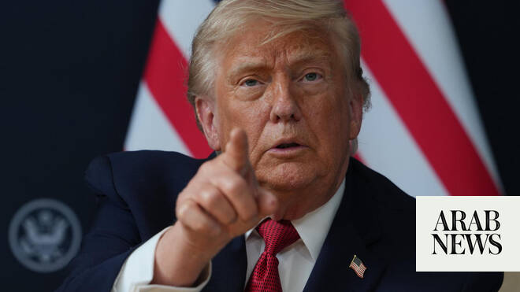

# Trump says he talked to Syrian leader about taking on Hezbollah

Source: https://www.arabnews.com/node/2647584/middle-east
Captured source: https://www.arabnews.com/node/2647584/middle-east
Published: 2026-06-17T18:19:12+03:00
Modified: 2026-06-17T18:21:30+03:00
Author: Reuters

## Summary

EVIAN-LES-BAINS, France: US President Donald Trump ‌said on Wednesday he had spoken to Syria’s leader about combatting Iran-backed Hezbollah in Lebanon, a day after criticizing Israel for killing too many civilians and not getting the ​job done. Asked at a Group of Seven summit in Evian-les-Bains, France, if he had talked to Syrian President Ahmed Al-Sharaa about Hezbollah,

## Image

## Video Or Embed URLs

- https://a5a6b9dba9add857e9dc7e7701b35f64.safeframe.googlesyndication.com/safeframe/1-0-45/html/container.html
- https://static.addtoany.com/menu/sm.25.html
- about:blank
- https://imasdk.googleapis.com/js/core/bridge3.771.2_en.html
- https://www.google.com/recaptcha/api2/aframe
- https://sync.teads.tv/wigo-no-slot
- https://cm.g.doubleclick.net/partnerpixels?gdpr=0&us_privacy=1---&gpp_sid=-1&url=https%3A%2F%2Fwww.arabnews.com%2Fnode%2F2647584%2Fmiddle-east

## Text

https://arab.news/7m3vb

Trump made the comment a day after criticizing Israel for killing too many civilians in its war with Hezbollah

US president Trump has strongly backed Syrian leader Al-Sharaa

EVIAN-LES-BAINS, France: US President Donald Trump ‌said on Wednesday he had spoken to Syria’s leader about combatting Iran-backed Hezbollah in Lebanon, a day after criticizing Israel for killing too many civilians and not getting the ​job done. Asked at a Group of Seven summit in Evian-les-Bains, France, if he had talked to Syrian President Ahmed Al-Sharaa about Hezbollah, Trump nodded and said “yes.” Asked if Al-Sharaa was willing to take on the Shiite armed group, Trump said he would talk about that later. The remark came after Trump criticized Israel’s tactics in fighting Hezbollah while praising Al-Sharaa, who took power in Syria in 2025 after years of civil war and has ‌moved cautiously since US-Israeli ‌strikes on Iran in late February. “I consider ​that (Lebanon) ‌the ⁠minor ​war, Iran’s ⁠a big one, but we have that little pinprick out there that constantly rears its head, and that’s Hezbollah,” Trump told reporters on Tuesday on the sidelines of the summit. Trump has strongly backed Al-Sharaa, a former Islamist militant commander who toppled long-ruling autocrat Bashar Assad and has sought to portray himself as a moderate leader trying to unify his war-ravaged nation and end its isolation. “He’s ⁠done an amazing job of pulling it together. ‌He’s not a Boy Scout, but he’s done ‌an amazing job of pulling it together, and ​he is very good with ‌Hezbollah. Does not like them,” Trump said on Tuesday. Reuters reported in March ‌that the US had encouraged Syria to consider sending forces into eastern Lebanon to help disarm Hezbollah, but that Damascus was reluctant to embark on such a mission for fear of being sucked into the war in the Middle East and inflaming ‌sectarian tensions in Syria and Lebanon. Al-Sharaa said on Saturday that “the rumors circulating about Syria entering Lebanon are completely unfounded,” ⁠according to comments published ⁠on Syrian state media. Trump in recent days has expressed his displeasure with Israeli Prime Minister Benjamin Netanyahu over Israeli attacks in Beirut that he said could have endangered his peace deal with Iran. On Tuesday, he said Israel had been fighting the Lebanese militia group for too long and has killed too many civilians. “You don’t have to knock down an apartment house every time you’re looking for somebody,” Trump said. “Because there are a lot of people in those apartment houses, and they’re not all Hezbollah, that I can tell you.” “I suggested to Israel to let Syria take ​care of Hezbollah, because to be ​honest with you, I think they do a better job of doing it.”
