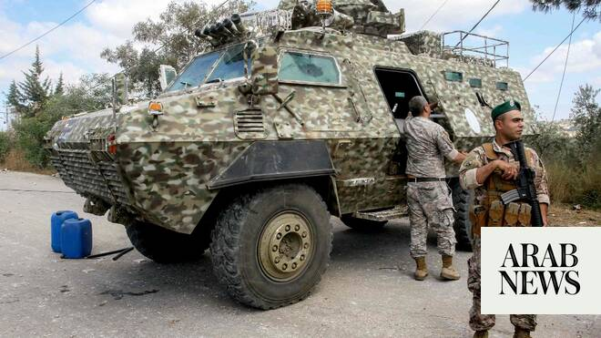

# Israel military says will keep operating in south Lebanon

Source: https://www.arabnews.com/node/2647686/middle-east
Captured source: https://www.arabnews.com/node/2647686/middle-east
Published: 2026-06-18T15:25:51+03:00
Modified: 2026-06-18T15:27:31+03:00
Author: AFP

## Summary

JERUSALEM: The Israeli military said on Thursday it will continue operating in southern Lebanon and “remove threats” beyond its so-called security zone, after the US and Iran signed an agreement to end the Middle East war, including in Lebanon. The military published a map of its declared “security zone” — which runs some 10 kilometers (six miles) inside Lebanese territory.

## Image

## Video Or Embed URLs

- https://static.addtoany.com/menu/sm.25.html
- about:blank
- https://www.google.com/recaptcha/api2/aframe
- https://imasdk.googleapis.com/js/core/bridge3.772.0_en.html
- https://sync.teads.tv/wigo-no-slot
- https://cm.g.doubleclick.net/partnerpixels?gdpr=0&us_privacy=1---&gpp_sid=-1&url=https%3A%2F%2Fwww.arabnews.com%2Fnode%2F2647686%2Fmiddle-east

## Text

https://arab.news/brwte

The Israeli military published a map of its declared “security zone” which runs some 10 kilometers inside Lebanese territory

JERUSALEM: The Israeli military said on Thursday it will continue operating in southern Lebanon and “remove threats” beyond its so-called security zone, after the US and Iran signed an agreement to end the Middle East war, including in Lebanon. The military published a map of its declared “security zone” — which runs some 10 kilometers (six miles) inside Lebanese territory. It said troops would continue to be deployed there “to remove threats and strengthen the defense of Israel’s northern residents.” In a later statement, an Israeli military official said the army “will continue to remove threats to IDF soldiers and the civilians of the State of Israel that are identified beyond the security zone.” The announcement came after the United States and Iran signed a memorandum of understanding on Wednesday meant to end the Middle East war, with fighting supposed to be halted on all fronts, including in Lebanon. Hours after the agreement was signed, Lebanese state media reported one person killed in an Israeli drone strike in southern Lebanon. Israel’s military meanwhile announced the death of one of its soldiers the night before during an incident in south Lebanon that also left seven other troops wounded. The military official on Thursday called on the Lebanese Armed Forces to operate in coordination with Israeli forces and urged Lebanese civilians to avoid entering the security zone. Since Iran and the US announced they had reached an agreement on Monday, there has been a sharp decrease in the level of violence in Lebanon. Hezbollah, an Iran-backed militant group, drew Lebanon into the Middle East war in March by attacking Israel to avenge the killing of the Islamic republic’s supreme leader at the start of the US-Israeli campaign. Israel retaliated with broad strikes across Lebanon and by launching a ground invasion into the south, which borders Israel and has long been under Hezbollah’s sway. Lebanon and Israel have been holding direct talks in Washington since April, seeking to end the hostilities between Israel and Hezbollah and separate their conflict from the wider regional war. “Further steps are still being discussed within the framework of direct negotiations between Israel and Lebanon,” the Israeli military official said on Thursday, adding that “the representatives will reconvene next week.”
