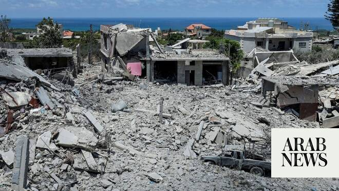

# Lebanon receives assurances from Syria on non-interference after Trump remarks, official says

Source: https://www.arabnews.com/node/2647714/middle-east
Captured source: https://www.arabnews.com/node/2647714/middle-east
Published: 2026-06-18T18:09:43+03:00
Modified: 2026-06-18T18:09:43+03:00
Author: NAJIA HOUSSARI

## Summary

BEIRUT: Lebanon has received assurances from Syria that it will not interfere in Lebanese affairs, Deputy Prime Minister Tarek Mitri told Arab News on Thursday, rejecting suggestions that Damascus could play a role in confronting Hezbollah as fighting between Israel and the group continues. Mitri’s remarks came days after US President Donald Trump reportedly suggested that

## Image

## Video Or Embed URLs

- https://static.addtoany.com/menu/sm.25.html
- about:blank
- https://www.google.com/recaptcha/api2/aframe
- https://imasdk.googleapis.com/js/core/bridge3.771.2_en.html
- https://cm.g.doubleclick.net/partnerpixels?gdpr=0&us_privacy=1---&gpp_sid=-1&url=https%3A%2F%2Fwww.arabnews.com%2Fnode%2F2647714%2Fmiddle-east

## Text

https://arab.news/prv5s

Tarek Mitri rejected suggestions that Damascus could play a role in confronting Hezbollah as fighting between Israel and the group continues

Trump praised Al-Sharaa, saying that “he’s done an amazing job ​of pulling it together, and he is very good with Hezbollah”

BEIRUT: Lebanon has received assurances from Syria that it will not interfere in Lebanese affairs, Deputy Prime Minister Tarek Mitri told Arab News on Thursday, rejecting suggestions that Damascus could play a role in confronting Hezbollah as fighting between Israel and the group continues.

Mitri’s remarks came days after US President Donald Trump reportedly suggested that Israel could look to Syria to “take care of Hezbollah,” a proposal that has drawn skepticism in Beirut and Damascus.

“The Syrian authorities have clearly and repeatedly assured us that they do not intend to interfere in Lebanon’s internal affairs, and we are confident that this will not happen,” Mitri said.

He added that Lebanese-Syrian relations are entering a new phase based on “trust, mutual respect for each country’s sovereignty, and shared interests,” a departure from the tensions and interventions that shaped relations between the two countries for decades.

The comments echoed statements made earlier this week by Syrian President Ahmed Al-Sharaa, who dismissed reports of a possible Syrian military role in Lebanon and stressed that Damascus has no intention of becoming involved in the country’s internal affairs.

Speaking during a meeting with community leaders and dignitaries from Rural Damascus, Al-Sharaa said “the rumors circulating about Syria ​entering Lebanon are completely ​unfounded,” according to comments ⁠published on Syrian state media.

Instead, he called for an end to the war in Lebanon, a de-escalation of hostilities, stronger Lebanese state institutions and closer economic cooperation between the two neighboring countries.

Al-Sharaa also stated that “border demarcation with Lebanon is not currently a priority and that detailed discussions on the issue have been postponed.”

Meanwhile, Syrian TV quoted a diplomatic source who said that Damascus had rejected US proposals for a security or military role against Hezbollah in Lebanon’s Bekaa Valley, despite offers that reportedly included economic incentives as well as political and security arrangements linked to several Syrian issues.

Walid Choucair, political analyst, told Arab News that Trump’s proposal was intended to “send messages to both Israeli Prime Minister Benjamin Netanyahu and Iran.”

Trump said that although he has a “great relationship” with Netanyahu, in the same breath he added that he should be “more responsible” with Lebanon. The US president expressed his displeasure over Israeli attacks in Beirut that he said could have endangered his peace deal with Iran.

Notably, Trump praised Al-Sharaa, saying that “he’s done an amazing job ​of pulling it together, and he is very good with Hezbollah.” He said Israel has been fighting Hezbollah “too long” and “too many people have been killed.”

Choucair argued that Trump’s message to Netanyahu was clear: if Israel refuses to comply with Washington’s demands, the task could be entrusted to another regional partner, namely Al-Sharaa.

Trump’s remarks also appeared to carry a message to Iran, suggesting that if Tehran continued to oppose efforts to disarm Hezbollah in Lebanon, other regional actors could be called upon to play a greater role in addressing the issue, Choucair said.

He argued that such a scenario could open the door to Syrian involvement, risking further instability in a country already vulnerable to external intervention and sectarian tensions.

Lebanese and Syrian authorities are continuing efforts to reset bilateral relations after decades shaped by Syria’s political and military dominance over Lebanon under the Assad regime.

That period began with the deployment of Syrian forces to Lebanon in 1976 and lasted until their withdrawal in 2005 after the assassination of former Lebanese Prime Minister Rafik Hariri.

Although the military presence ended, Damascus retained considerable influence through Lebanese allies, most notably Hezbollah. The regional balance of power, however, shifted dramatically with the fall of the Assad regime, opening the way for a new chapter in Lebanese-Syrian relations.

Trump’s suggestion that Syria could play a role in confronting Hezbollah has raised concerns in Lebanon and drawn widespread criticism on social media, despite ongoing efforts by Beirut and Damascus to build a new relationship based on mutual respect for sovereignty and non-interference in each other’s affairs.

Mohanad Hage Ali, deputy director for research at the Malcolm H. Kerr Carnegie Middle East Center in Beirut, told Arab News that several developments have fueled such concerns.

“The Syrian side has recently issued a series of statements about Hezbollah’s involvement in Syria and the presence of affiliated terrorist cells that have been apprehended there, which suggested an attempt to build a case for a future role in Lebanon.”

Hage Ali argued that any future US-Iran agreement would be expected to have implications across Tehran’s regional network, including in Lebanon.

“If an Iranian-American agreement is reached, its positive effects should be reflected throughout the region,” he said. “That makes it necessary to find an approach to the Hezbollah issue that does not rely solely on Israeli action.”

However, dealing with Hezbollah and the repercussions of the agreement cannot be done through Al-Sharaa, according to Hage Ali.

He said Al-Sharaa would have to weigh carefully the potential costs of any involvement in Lebanon.

“He could jeopardize his international relationships if he intervenes,” he said, adding that Damascus would also have to consider whether it could withstand a potential Iranian response.

Another key question, he argued, is whether Syria would be willing to be drawn into Lebanon’s complex security landscape, particularly in the Bekaa Valley, where Hezbollah has a strong presence and where any military operation would face significant challenges.

An official Lebanese source told Arab News that Al-Sharaa has repeatedly stressed that he does not want to revisit the troubled history of Syrian-Lebanese relations and has no interest in confronting any Lebanese faction or the Lebanese people.

“There is no benefit in dragging Syria into a conflict that could further inflame tensions between the two countries,” the source said. Such a scenario, he added, could create opportunities for regional actors, including Israel, Iran and others, to exploit the situation and potentially reignite sectarian and religious divisions.

Meanwhile, Lebanon continues to advance the Lebanese-Israeli negotiations to achieve rapid results and establish a protective framework.

Some Lebanese political forces are skeptical of Tehran’s ability to guarantee a complete Israeli withdrawal from Lebanese territory under the US-Iran agreement.

Hezbollah on Tuesday said it understood that Iran would demand an Israeli withdrawal as part of the next round of US-Iran talks, set to begin after the two formally signed their memorandum of understanding on Thursday.

“We believe there will be no nuclear deal between Iran and the United States if Israel does not withdraw,” Hezbollah's media office told Reuters.

The fifth round of Lebanese-Israeli negotiations is expected to begin in Washington next week, running from Monday through Wednesday. Recent developments are expected to be discussed through separate security and diplomatic channels, in line with an approach long advocated by Washington and referenced in State Department statements.
