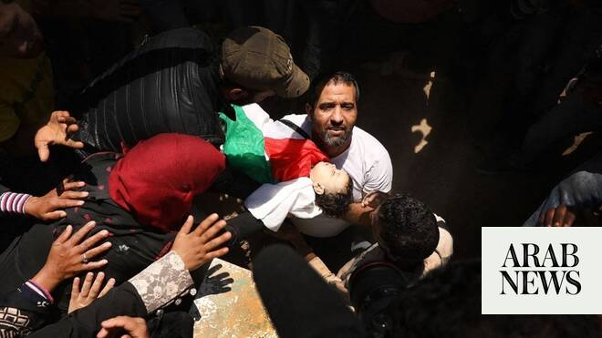

# For first time in 30 years, states and not armed groups are top killers of children in war, UN says

Source: https://www.arabnews.com/node/2647752/world
Captured source: https://www.arabnews.com/node/2647752/world
Published: 2026-06-18T22:40:38+03:00
Modified: 2026-06-18T22:58:46+03:00
Author: Ephrem Kossaify

## Summary

NEW YORK CITY: For the first time since the UN’s mandate on children and armed conflict was established three decades ago, government forces, rather than nonstate armed groups, are responsible for the majority of grave violations against children, the latest report from the UN secretary-general revealed.

## Image

## Video Or Embed URLs

- https://static.addtoany.com/menu/sm.25.html
- about:blank
- https://www.google.com/recaptcha/api2/aframe
- https://imasdk.googleapis.com/js/core/bridge3.772.0_en.html
- https://cm.g.doubleclick.net/partnerpixels?gdpr=0&us_privacy=1---&gpp_sid=-1&url=https%3A%2F%2Fwww.arabnews.com%2Fnode%2F2647752%2Fworld

## Text

https://arab.news/cccx2

Israel and Sudan among worst offenders as secretary-general’s report finds 38,558 verified grave violations against 24,174 children, the most since mandate created in 1996

‘These horrors should shock the conscience of the international community,’ says Vanessa Frazier, UN special representative for children and armed conflict

Patterns ‘reflect persistent and blatant disregard for international law and for the rights and special protections owed to children across all contexts,’ report warns

NEW YORK CITY: For the first time since the UN’s mandate on children and armed conflict was established three decades ago, government forces, rather than nonstate armed groups, are responsible for the majority of grave violations against children, the latest report from the UN secretary-general revealed.

The organization’s child rights chief said the findings reflected “a worrying shift” and “a deeper erosion of respect for international law.”

The report, published on Wednesday, found 38,558 verified grave violations against 24,174 children during 2025, the highest number since the mandate was created in December 1996.

Government forces were the leading perpetrators of attacks that killed or maimed, assaults on schools and hospitals, and the denial of humanitarian access, patterns the report said “reflect persistent and blatant disregard for international law and for the rights and special protections owed to children across all contexts.”

Vanessa Frazier, the UN’s special representative for children and armed conflict, said: “These horrors should shock the conscience of the international community.

“I want to pause for a moment to let these numbers sink in. Behind these statistics are a son, a daughter, a sister, a brother, a student, a newborn, a parent’s entire world; lives, dreams, stories and futures cut short by man-made walls.

“The lives of these 24,174 children, and their families, are as many scars on our collective moral conscience. I hope we carry them with us so that we use their memory and their pain to act.”

Killings of children increased by 34 percent to 6,266, while cases of maiming, the most prevalent violation, raised the combined toll to 14,224. Denial of humanitarian access was recorded in 8,322 incidents, and 6,607 children were recruited and used by parties to conflict. One in three of all victims were girls, and 1,667 children were detained over alleged ties to armed groups.

The report found that sexual violence against children, especially girls, continued to be used as a tactic of war to humiliate, terrorize and displace entire communities. It cited a rise in cases of gang rape committed by parties to conflict that pointed to the deliberate, organized use of sexual violence within the ranks of armed forces.

Israel topped the list countries responsible for violations, followed by the Democratic Republic of the Congo, Nigeria, Myanmar and Somalia, as well as Sudan.

How Gaza’s children keep learning amid the destruction

In Israel and the Palestinian territories, the UN verified 12,445 grave violations committed against 5,663 children, 9,465 of which were attributed to Israeli armed and security forces.

The organization verified the killing of 57 Palestinian children in the West Bank, including East Jerusalem, as well as the maiming of 2,921 across that territory and Gaza, mostly from explosive weapons used in populated areas.

The report documented 828 attacks on Palestinian schools and hospitals, and nearly 6,000 incidents of denial of humanitarian access, as well as the killing of 184 humanitarian workers in Gaza during 2025 alone.

Frazier said that efforts to document violations for the report had taken place amid extraordinary adversity and insecurity, including the abduction and killing of humanitarian and UN personnel on an unprecedented scale: about 325 humanitarian workers were killed in conflict cones across 18 countries last year.

Famine was declared in Gaza in August 2025, with 113 child deaths linked to malnutrition. The UN also verified the detention of 981 Palestinian children, with one boy dying in Israeli custody amid findings suggesting severe malnutrition among detainees.

Asked by Arab News what Israel would need to do to be removed from the UN’s so-called “list of shame” of the worst perpetrators of violence against children, Frazier said the country’s inclusion this year was not new but a continuation, and that the Israeli public response had so far largely consisted of accusing the UN of bias.

“Part of it was the usual accusation that we are a club that is anti-Israeli,” she said. “This report is not only about them but their reaction has been very public and in the media, and they have not been interested in having discussions with us.”

The only way off the list, she added, was by “entering into a commitment plan with the United Nations,” a time-bound plan that must be verified as having been implemented, with commitments that center on “how to protect children going forward.”

She added that the process is forward-looking: “We don’t do accountability, we don’t look backwards … the data is to help us moving forward.”

In Sudan, the UN verified 1,889 grave violations against 1,681 children amid what the report described as “one of the world’s gravest protection crises,” driven by sieges in North Darfur and South Kordofan.

The Rapid Support Forces, which is locked in civil war with the Sudanese Armed Forces for control of the country, were blamed for 740 of the 1,331 cases of children being killed or maimed, mostly as a result of shelling, and with the bulk of 193 cases of sexual violence against children.

In Lebanon, 294 violations were verified against 281 children, with Israeli forces accused of killing 21 and maiming 136 children, largely due to the use of explosive weapons and cross-border shelling.

Armed groups, including Fatah, Hamas and Hezbollah, recruited 132 boys to their ranks, mostly in support roles, the report said, while Fatah and Jund Al-Sham continued to use UN Relief and Works Agency schools within refugee camps for military purposes.

Frazier said that what had struck her most about the situation was hearing directly from children in the field that many of the worst violations were avoidable, the product of “conscious decisions” by state actors who could choose weapons that spare nearby schools or hospitals but opt not to.

“If you are targeting a drone factory and you know that next to that drone factory there is a school, then you should use weaponry that will harm only the drone factory and not the school, the hospital or civilian housing nearby,” Frazier said.

“That is an operational decision taken by the army that decides to carry out that attack.”

What will become of war-devastated Gaza’s orphaned children?

She cited comments by US President Donald Trump this week about Hezbollah’s use of apartment buildings in Lebanon, and said he was right to point out that civilians who happen to live alongside a single fighter should not pay the price of a strike against an entire building.

Trump said that “just because one Hezbollah target walks into an apartment building, you don’t blow up the whole apartment building.” Frazier said this was correct, since other people also live there.

“These are operational decisions taken at the time of the operation and so there are choices. These are human choices,” she said, warning that AI-assisted targeting without sufficient oversight compounded the risk to children.

“We need more human oversight. You cannot send a drone into, say, Gaza and say, ‘Look for a man who is five-and-a-half feet tall, with olive skin, brown hair, and brown eyes,’ because that description matches countless people. You have to give these weapons better data. Who is carrying out that operation is making these choices.”

Frazier added: “For state actors, it is worse than non-state actors because this mandate was originally created really to target armed groups.”
