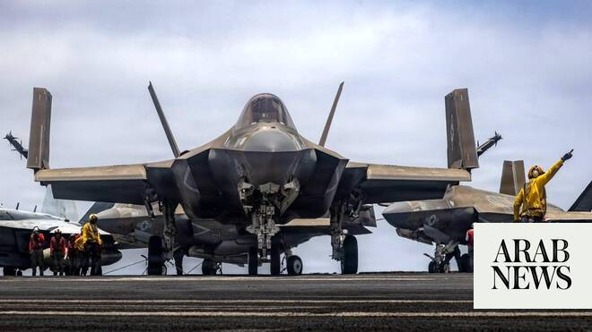

# US says needs $80 billion for Iran war, other bills: media

Source: https://www.arabnews.com/node/2647811/middle-east
Captured source: https://www.arabnews.com/node/2647811/middle-east
Published: 2026-06-19T12:44:36+03:00
Modified: 2026-06-19T12:44:36+03:00
Author: AFP

## Summary

WASHINGTON: The US Defense Department will ask Congress to approve around $80 billion to cover costs from the Iran war and other expenses, the Wall Street Journal reported Thursday.President Donald Trump has faced backlash from Americans who accuse him of pouring billions of taxpayer dollars into the Middle East conflict while oil prices and inflation skyrocket in the United

## Image

## Video Or Embed URLs

- https://static.addtoany.com/menu/sm.25.html
- about:blank
- https://www.google.com/recaptcha/api2/aframe
- https://imasdk.googleapis.com/js/core/bridge3.772.0_en.html
- https://sync.teads.tv/wigo-no-slot
- https://cm.g.doubleclick.net/partnerpixels?gdpr=0&us_privacy=1---&gpp_sid=-1&url=https%3A%2F%2Fwww.arabnews.com%2Fnode%2F2647811%2Fmiddle-east

## Text

President Donald Trump has faced backlash from Americans who accuse him of pouring billions of taxpayer dollars into the Middle East conflict

The Pentagon said the cost of the war with Iran climbed to nearly $29 billion although critics have suggested the true cost could be far higher

WASHINGTON: The US Defense Department will ask Congress to approve around $80 billion to cover costs from the Iran war and other expenses, the Wall Street Journal reported Thursday. President Donald Trump has faced backlash from Americans who accuse him of pouring billions of taxpayer dollars into the Middle East conflict while oil prices and inflation skyrocket in the United States. Deputy Defense Secretary Stephen Feinberg shared the request with lawmakers this week, the Journal said, citing people familiar with the discussions. Pentagon leaders have said they risk running out of money for operations in the coming months unless Congress passes a new wartime spending bill, the newspaper said. The military may need to cut back on training and troop deployment along the US-Mexico border as part of Trump’s immigration crackdown, it added. The Pentagon said last month the cost of the war with Iran had climbed to nearly $29 billion, although Democrats and other critics of the war have suggested the true cost — including damage inflicted by Iran — could be far higher. Concerns over the war straining US weapons stockpiles also deepened last month after Acting US Navy Secretary Hung Cao cited the conflict as a reason for pausing arms sales to Taiwan. Defense Secretary Pete Hegseth dismissed the idea when asked in an interview if there was a crisis in munitions stockpiles. Some of the $80 billion, if approved, would go toward munitions, personnel pay and ship operations, the Journal cited a source as saying. The war, triggered by US-Israeli strikes on Tehran in late February, has engulfed the crude-rich Middle East and choked the Strait of Hormuz, a vital waterway for the world’s oil supplies. A deal to end the war was under strain on Friday after fighting flared between Israel and Iran-backed group Hezbollah in Lebanon and talks in Switzerland were postponed. Some lawmakers have said they will not vote to back additional funding for the war unless the conflict receives congressional authorization. Democrats have accused Trump of violating the Constitution by starting the war without Congress’s backing. Under the War Powers Act, presidents have 60 days to obtain congressional approval after introducing US forces into hostilities. That deadline passed weeks ago, and Democrats say Trump is now breaking the law.
