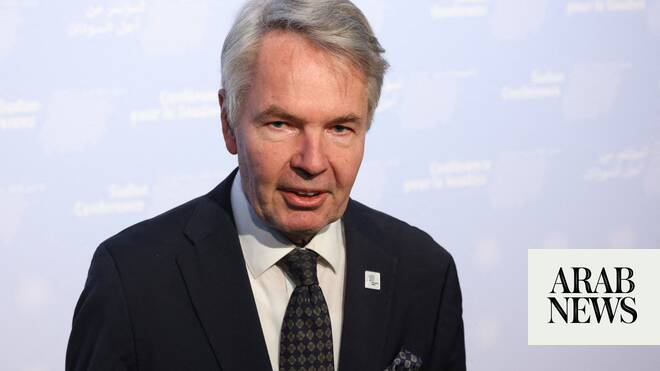

# UN Sudan envoy urges paramilitaries to halt El-Obeid assault

Source: https://www.arabnews.com/node/2647897/middle-east
Captured source: https://www.arabnews.com/node/2647897/middle-east
Published: 2026-06-20T04:41:07+03:00
Modified: 2026-06-20T08:33:46+03:00
Author: AFP

## Summary

UNITED NATIONS: The UN secretary-general’s special envoy for Sudan on Friday called the head of rebel paramilitary forces to urge him not to attack the major city of El-Obeid, where the United Nations fears an imminent offensive. In a phone call with General Mohamed Hamdan Dagalo, Pekka Haavisto “made a very strong appeal,” according to the spokesman for UN Secretary-General

## Image

## Video Or Embed URLs

- https://static.addtoany.com/menu/sm.25.html
- about:blank
- https://imasdk.googleapis.com/js/core/bridge3.772.0_en.html
- https://www.google.com/recaptcha/api2/aframe
- https://sync.teads.tv/wigo-no-slot
- https://cm.g.doubleclick.net/partnerpixels?gdpr=0&us_privacy=1---&gpp_sid=-1&url=https%3A%2F%2Fwww.arabnews.com%2Fnode%2F2647897%2Fmiddle-east

## Text

https://arab.news/mwaph

UNITED NATIONS: The UN secretary-general’s special envoy for Sudan on Friday called the head of rebel paramilitary forces to urge him not to attack the major city of El-Obeid, where the United Nations fears an imminent offensive. In a phone call with General Mohamed Hamdan Dagalo, Pekka Haavisto “made a very strong appeal,” according to the spokesman for UN Secretary-General Antonio Guterres, Stephane Dujarric. Haavisto “underscored the need to urgently de-escalate the situation in El-Obeid and avoid any actions that may further worsen the already dire humanitarian situation and put civilian lives further at risk,” Dujarric said. The spokesman said aid workers were “preparing for the potential movements of large numbers of people” fleeing the city, and that “our humanitarian colleagues are doing the responsible thing, which is getting ready for the worst while hoping for the best.” The city of El-Obeid, in the Kordofan region, has been under siege for several months by the Rapid Support Forces , which has been at war with the regular army since April 2023. The UN fears a repeat of the atrocities committed during the October 2025 assault on the city of El-Fasher, which the UN said bore “hallmarks of genocide.” Dujarric said that Haavisto was also talking to countries with influence over the warring parties to encourage dialogue and prevent the assault. The conflict in Sudan has killed tens of thousands of people and forced more than 11 million from their homes, creating what the UN describes as the world’s largest displacement and hunger crises.
