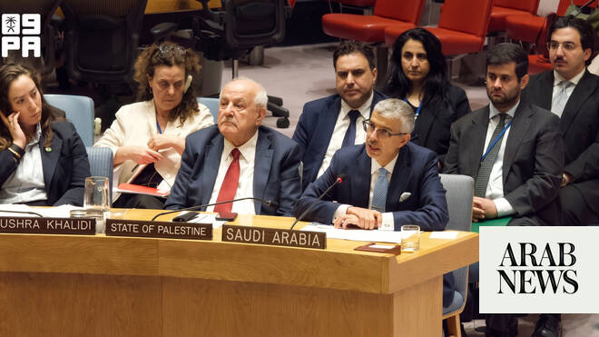

# Saudi Arabia delivers Arab Group statement on Gaza at UN Security Council

Source: https://www.arabnews.com/node/2647992/middle-east
Captured source: https://www.arabnews.com/node/2647992/middle-east
Published: 2026-06-21T06:06:20+03:00
Modified: 2026-06-21T09:45:13+03:00
Author: Arab News

## Summary

NEW YORK: Saudi Arabia, speaking on behalf of the Arab Group, reaffirmed support for a two-state solution and called for an immediate and sustained flow of humanitarian aid into Gaza during a UN Security Council emergency session on the humanitarian situation in the Palestinian enclave, the Saudi Press Agency reported. In a statement delivered by Saudi Arabia's Permanent

## Image

## Video Or Embed URLs

- https://static.addtoany.com/menu/sm.25.html
- about:blank
- https://www.google.com/recaptcha/api2/aframe
- https://imasdk.googleapis.com/js/core/bridge3.772.0_en.html
- https://cm.g.doubleclick.net/partnerpixels?gdpr=0&us_privacy=1---&gpp_sid=-1&url=https%3A%2F%2Fwww.arabnews.com%2Fnode%2F2647992%2Fmiddle-east

## Text

https://arab.news/nszs4

Kingdom urges ceasefire, aid access and implementation of UN resolutions

Group rejects settlement expansion, displacement and attacks on civilians

NEW YORK: Saudi Arabia, speaking on behalf of the Arab Group, reaffirmed support for a two-state solution and called for an immediate and sustained flow of humanitarian aid into Gaza during a UN Security Council emergency session on the humanitarian situation in the Palestinian enclave, the Saudi Press Agency reported.

In a statement delivered by Saudi Arabia's Permanent Representative to the United Nations Dr. Abdulaziz Alwasil, the Kingdom said the Palestinian cause remains at the heart of the Middle East conflict and stressed that achieving a just and lasting peace requires the implementation of the two-state solution.

The statement reiterated support for the establishment of an independent Palestinian state based on the June 4, 1967 borders, with East Jerusalem as its capital.

Alwasil, speaking on behalf of the Arab Group, rejected Israeli settlement expansion, land confiscation, forced displacement and attacks on civilians. The statement also rejected attempts to impose Israeli sovereignty over occupied Palestinian territories or alter the legal and historical status of Jerusalem and its holy sites.

Saudi Arabia welcomed international efforts aimed at securing a permanent ceasefire in Gaza, including initiatives led by the United States, and stressed the need to ensure the immediate, sustained and unhindered delivery of humanitarian assistance to the territory.

The Kingdom also rejected the use of humanitarian aid as a form of collective punishment or political pressure, according to the SPA.

Saudi Arabia called on the Security Council to fulfill its responsibilities in maintaining international peace and security and to implement relevant UN resolutions, including Resolution 2334.

The statement underscored the importance of upholding international legal obligations to protect the Palestinian people and support efforts aimed at achieving peace and stability in the region.
