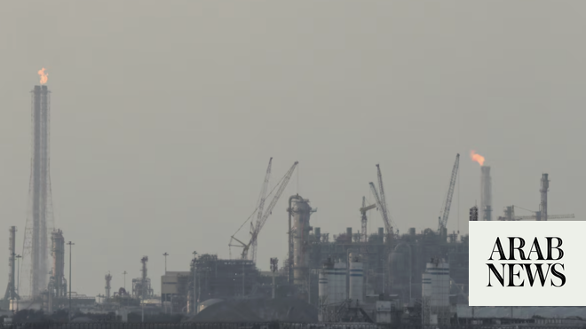

# Qatar reports several injured in explosion at factory in Ras Laffan, fire under control

Source: https://www.arabnews.com/node/2648064/middle-east
Captured source: https://www.arabnews.com/node/2648064/middle-east
Published: 2026-06-21T23:03:45+03:00
Modified: 2026-06-21T23:54:56+03:00
Author: Reuters

## Summary

DOHA: Qatar’s interior ​ministry said an explosion resulting from a “technical accident” occurred on Sunday at a factory in Ras Laffan, an industrial ‌city north ‌of the ​capital ‌Doha ⁠and ​site of the ⁠country’s core LNG processing operations. It said several injuries were reported but no leak that “threatens safety.” The ⁠ministry did not ‌give ‌the exact ​location of ‌the

## Image

## Video Or Embed URLs

- https://949522db77703a52c6da4df2cf20f9bd.safeframe.googlesyndication.com/safeframe/1-0-45/html/container.html
- https://imasdk.googleapis.com/js/core/bridge3.772.0_en.html
- https://static.addtoany.com/menu/sm.25.html
- about:blank
- https://www.google.com/recaptcha/api2/aframe
- https://sync.teads.tv/wigo-no-slot
- https://cm.g.doubleclick.net/partnerpixels?gdpr=0&us_privacy=1---&gpp_sid=-1&url=https%3A%2F%2Fwww.arabnews.com%2Fnode%2F2648064%2Fmiddle-east

## Text

https://arab.news/rput7

DOHA: Qatar’s interior ​ministry said an explosion resulting from a “technical accident” occurred on Sunday at a factory in Ras Laffan, an industrial ‌city north ‌of the ​capital ‌Doha ⁠and ​site of the ⁠country’s core LNG processing operations.

It said several injuries were reported but no leak that “threatens safety.”

The ⁠ministry did not ‌give ‌the exact ​location of ‌the explosion, but a ‌source with knowledge of the matter said it occurred at the Barzan ‌gas plant in Ras Laffan and ⁠was ⁠due to an “operational error.”

A Reuters witness had said a loud boom was heard in Doha.
