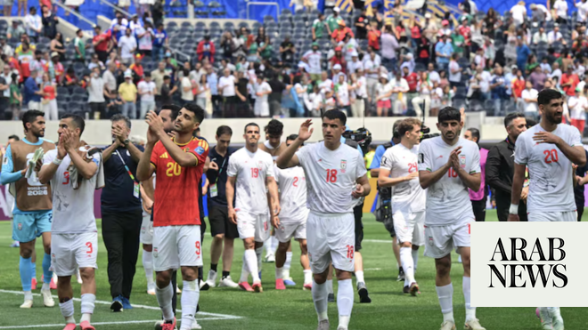

# Iran leaves message of peace after World Cup draw in Los Angeles

Source: https://www.arabnews.com/node/2648151/sport
Captured source: https://www.arabnews.com/node/2648151/sport
Published: 2026-06-22T16:59:04+03:00
Modified: 2026-06-22T17:03:04+03:00
Author: Arab News

## Summary

LONDON: The Iran national football team left a handwritten message calling for peace and friendship after their World Cup group-stage match against Belgium in Los Angeles on Sunday. The note, left in the dressing room following the goalless draw, thanked the city for its hospitality and paid tribute to Iranian supporters. “From the ancient Persia of thousands of years ago to

## Image

## Video Or Embed URLs

- https://static.addtoany.com/menu/sm.25.html
- about:blank
- https://www.google.com/recaptcha/api2/aframe
- https://imasdk.googleapis.com/js/core/bridge3.773.0_en.html
- https://cm.g.doubleclick.net/partnerpixels?gdpr=0&us_privacy=1---&gpp_sid=-1&url=https%3A%2F%2Fwww.arabnews.com%2Fnode%2F2648151%2Fsport

## Text

https://arab.news/z35uc

The note, left in the dressing room following the goalless draw, thanked the city for its hospitality and paid tribute to Iranian supporters

LONDON: The Iran national football team left a handwritten message calling for peace and friendship after their World Cup group-stage match against Belgium in Los Angeles on Sunday.

For the latest updates, follow us @ArabNewsSport

The note, left in the dressing room following the goalless draw, thanked the city for its hospitality and paid tribute to Iranian supporters.

“From the ancient Persia of thousands of years ago to the civilised Iran of today, the spirit of Iran remains alive and steadfast,” it read.

“We came to Los Angeles with pride, competed with honour, and leave with dignity,” the note, which was released by the Football Federation of Iran, continued.

“Thank you Los Angeles for your hospitality. And thank you to every Iranian who gave their heart, voice and soul for Iran throughout these 180 minutes.

“May peace, respect and friendship prevail among all nations,” the message concluded.

Iran are competing at the World Cup in the US, Canada and Mexico while Tehran and Washington remain engaged in negotiations aimed at ending their recent conflict.

The team opened their Group G campaign with a 2-2 draw against New Zealand and will face Egypt in their final group match in Seattle on June 27.

Iran’s participation in the tournament has been overshadowed by uncertainty linked to the conflict in the Middle East and related security concerns.
