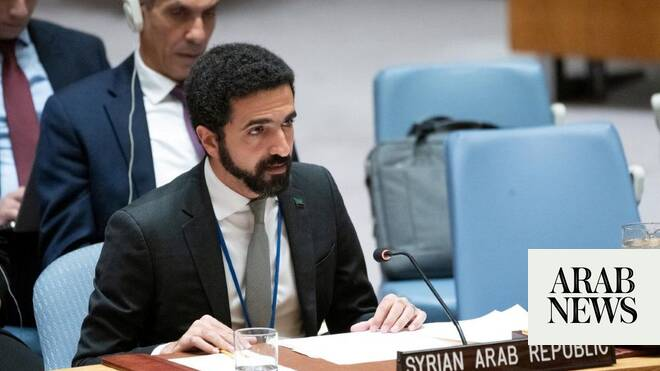

# Israel the main obstacle to stability in Syria, envoy warns as Security Council reviews transition

Source: https://www.arabnews.com/node/2648187/middle-east
Captured source: https://www.arabnews.com/node/2648187/middle-east
Published: 2026-06-22T23:42:56+03:00
Modified: 2026-06-23T01:14:21+03:00
Author: Ephrem Kossaify

## Summary

NEW YORK CITY: The main obstacle to stability in Syria is Israel, the country’s envoy to the UN told the Security Council, as he also accused the Israeli prime minister, Benjamin Netanyahu, of undermining a US-brokered deal to end the war with Iran. It came as senior UN officials described the political transition in Syria as caught between fragile progress and persistent

## Image

## Video Or Embed URLs

- https://static.addtoany.com/menu/sm.25.html
- about:blank
- https://imasdk.googleapis.com/js/core/bridge3.773.0_en.html
- https://www.google.com/recaptcha/api2/aframe
- https://cm.g.doubleclick.net/partnerpixels?gdpr=0&us_privacy=1---&gpp_sid=-1&url=https%3A%2F%2Fwww.arabnews.com%2Fnode%2F2648187%2Fmiddle-east

## Text

https://arab.news/8wez9

Syria’s representative to the UN, Ibrahim Olabi, accuses Israel of violating international law and UN resolutions while Syria ‘is choosing wisdom and diplomacy’

Senior UN officials describe the post-Assad political transition in the country as caught between fragile progress and persistent risk

NEW YORK CITY: The main obstacle to stability in Syria is Israel, the country’s envoy to the UN told the Security Council, as he also accused the Israeli prime minister, Benjamin Netanyahu, of undermining a US-brokered deal to end the war with Iran.

It came as senior UN officials described the political transition in Syria as caught between fragile progress and persistent risk.

Syria’s permanent representative to the UN, Ibrahim Olabi welcomed the recent memorandum of understanding between Washington and Tehran, which aims to deescalate tensions in the region. But he noted that on the same day the agreement was announced, Netanyahu declared that Israeli forces would not withdraw from territory they had seized in Syria.

“This statement confirms that Israel is the main obstacle to stability in Syria,” Olabi said. He accused Israel of violating international law and Security Council resolutions at the same time Syria “is choosing wisdom and diplomacy.”

Speaking during a meeting of the Security Council on Monday to discuss the latest political and humanitarian developments in Syria, Olabi highlighted the case of Rania Al-Abbasi, a dentist and former Syrian national chess champion who went missing 13 years ago with her husband and six children. It was confirmed this month that all of them were killed during the civil war by gunmen loyal to the former Assad regime.

Olabi said that “the ambiguity has ended” regarding their fate “but the responsibility to uncover the truth and achieve justice has not.”

He renewed the commitment of the new authorities in Syria to uncover the fate of all those who went missing or were forcibly disappeared by the Assad regime, which was toppled by opposition forces in December 2024, and pledged to advance the process of transitional justice “without compromising.”

He added that his country stands with Lebanon’s official institutions and had become “an active partner in combating terrorism and transnational crime,” citing in particular the announcement this month that Syria was joining a global coalition against human trafficking.

Olabi set out five areas in which he said progress has been made: about 6,000 members of the former regime who are in detention, including dozens of senior officers, and will face the transitional justice process; the implementation of Presidential Decree No. 13 which provides a legal pathway to citizenship for eligible Kurds; economic initiatives, including new energy investment partnerships with international companies such as ConocoPhillips; the return of more than 3.5 million refugees and displaced persons; and continuing operations against the terrorist group Daesh and cross-border arms smugglers.

“These battles are not Syria’s alone; they are global battles, even if Syria is fighting them on your behalf on the ground,” Olabi said. He pledged that the Syrian people “are building their future with their own hands, and they await your support.”

The UN secretary-general’s deputy special envoy for Syria, Claudio Cordone, said the post-Assad transition in Syria was “at a critical phase, with opportunity and fragility existing side-by-side.”

He said Israeli forces have maintained a near-daily presence and conducted incursions in southern Syria, in violation of the 1974 Disengagement of Forces Agreement, during which they have detained civilians, some of whom remain in custody.

Damascus has “exercised restraint while signaling openness to a security arrangement with Israel,” Cordone said, as he reiterated calls by the UN for Israel to respect the agreement and Syria’s sovereignty.

Indirect elections for the transitional parliament took place peacefully last month in Hasakeh and Ain Al-Arab (Kobane), he added, but more than eight months after the main election process, the People’s Assembly has still not been constituted as it awaits presidential appointment of a third of its members.

“The delay is generating anxiety,” Cordone said, as he stressed the need for all Syrians, particularly women, to feel that they are meaningfully represented.

Demonstrations took place last week in Idlib, Aleppo, Hama, Deir Ez-Zor and Damascus calling for accountability for civil war-era crimes, some of them accompanied by violence that prompted government calls for restraint, he added.

Syria’s mufti has issued a fatwa criminalizing revenge, Cordone said, and authorities have reported that 5,989 people linked to the former regime are in detention awaiting prosecution.

He called for a draft transitional justice law to cover “all perpetrators of atrocity crimes, not just those associated with the Assad regime.” He highlighted the sentencing by a Dutch court on June 15 of a former member of a regime-linked paramilitary force to 26 years for crimes against humanity.

Cordone described the confirmation of the fate of Al-Abbasi and her family as “a painful reminder of the suffering endured by countless Syrian families.” He also referenced a UN report that documented sexual violence committed by members of the former regime, Daesh and the Syrian National Army against various groups including the Alawite, Murshid, Bedouin and Druze communities.

Regarding the situation in northeastern Syria, Cordone said implementation of the Jan. 29 agreement between the government and the Syrian Democratic Forces was progressing, with four SDF brigades now integrated and paid through national security infrastructures, and about 1,300 SDF-affiliated detainees have been released.

In contrast, there has been no progress toward implementation of the September 2025 Sweida roadmap agreement between Syria, Jordan and the US, he added, as distrust in the region persists, calls for secession threaten national unity, and UN mediation efforts to allow more than 13,500 students in Sweida to sit exams failed.

Briefing the Security Council on humanitarian conditions in Syria on behalf of UN humanitarian chief Tom Fletcher, Indrika Ratwatte, the acting assistant secretary-general for humanitarian affairs and deputy emergency relief coordinator, said: “A better future for Syria remains within reach,” with about 1.6 million refugees and nearly 2 million displaced people returning home since December 2024.

He added that the $2.92 billion humanitarian appeal for the country was only 20 percent funded at midyear, and he called for more predictable funding alongside investment under the government’s “No Camps, No Tents” vision.

Recent flooding along the Euphrates had affected more than 17,600 people, Ratwatte said. Conditions remain fragile in Quneitra, where nearly 80 percent of the population requires humanitarian assistance, and in Sweida, where more than 13,000 students missed exams, he added.
