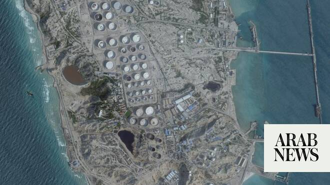

# US authorizes Iranian oil sales amid talks on final peace deal

Source: https://www.arabnews.com/node/2648206/middle-east
Captured source: https://www.arabnews.com/node/2648206/middle-east
Published: 2026-06-23T07:28:23+03:00
Modified: 2026-06-23T07:58:18+03:00
Author: Reuters

## Summary

WASHINGTON: The United States authorized Iranian oil sales on Monday, easing decades-old sanctions as it pushes toward a final peace deal with Tehran in return for commitments on nuclear inspections and free transit through the Strait of Hormuz. The general license, announced by the Treasury Department, allows the sale of crude oil and petrochemical and petroleum products of

## Image

## Video Or Embed URLs

- https://static.addtoany.com/menu/sm.25.html
- about:blank
- https://imasdk.googleapis.com/js/core/bridge3.773.0_en.html
- https://www.google.com/recaptcha/api2/aframe
- https://sync.teads.tv/wigo-no-slot
- https://cm.g.doubleclick.net/partnerpixels?gdpr=0&us_privacy=1---&gpp_sid=-1&url=https%3A%2F%2Fwww.arabnews.com%2Fnode%2F2648206%2Fmiddle-east

## Text

The general license allows the sale of crude oil and petrochemical and petroleum products of Iranian origin through August 21

The license says Iranian oil can be imported into the US when necessary to complete ‌its sale, delivery ‌or offloading

WASHINGTON: The United States authorized Iranian oil sales on Monday, easing decades-old sanctions as it pushes toward a final peace deal with Tehran in return for commitments on nuclear inspections and free transit through the Strait of Hormuz. The general license, announced by the Treasury Department, allows the sale of crude oil and petrochemical and petroleum products of Iranian origin through August 21. The license says Iranian oil can be imported into the US when necessary to complete ‌its sale, delivery ‌or offloading. The US has not meaningfully imported Iranian ‌oil ⁠since Washington imposed measures ⁠after the 1979 revolution. “In line with the ongoing productive talks in Switzerland, Iran has committed to free and open transit in the Strait of Hormuz and to permit International Atomic Energy Agency (IAEA) inspectors into their country,” Treasury Secretary Scott Bessent wrote on X. “As part of the framework, Treasury has issued a temporary 60-day general license authorizing the production, delivery and sale of Iranian oil.” Under a memorandum of ⁠understanding signed last week between Washington and Tehran, the US ‌agreed to issue waivers for the export ‌of Iranian crude oil, petroleum products and derivatives, and all associated services, including banking transactions, insurances ‌and transportation. Payment of funds to Iran may be made in US dollar-denominated ‌funds, according to the license. Cuba, North Korea and Crimea are among those excluded from the license. Washington first sanctioned Iran in 1979 when revolutionary students seized the US embassy in Tehran, holding diplomats hostage. Numerous additional sanctions have been imposed since then over the ‌nuclear program and Iran’s support for groups the US deems terrorist organizations. Independent Chinese refiners have been the main buyers ⁠of sanctioned Iranian ⁠oil, taking advantage of deep discounts as others avoided such purchases. India, South Korea, Japan, Italy, Greece, Taiwan and Turkiye were also major buyers of Iranian crude before US sanctions were reimposed in 2018. Mediators said on Monday that Washington and Tehran made “encouraging progress” at the first round of talks aimed at reaching a final peace deal. The talks began under the terms of the memorandum of understanding reached last week to extend a tenuous ceasefire from April for at least another 60 days. Oil prices had risen sharply when Tehran started blockading the Strait of Hormuz, prompting a US blockade of Iranian ports, but after the interim deal, fell to their lowest since before the war began on February 28 with US-Israeli attacks on Iran.
