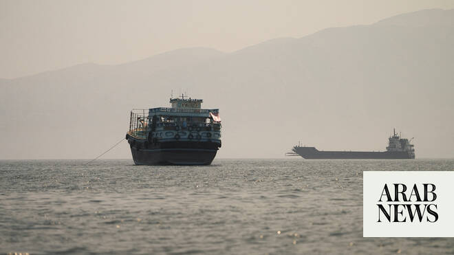

# Oman and Iran to pursue talks on managing Strait of Hormuz navigation

Source: https://www.arabnews.com/node/2648296/middle-east
Captured source: https://www.arabnews.com/node/2648296/middle-east
Published: 2026-06-23T17:51:54+03:00
Modified: 2026-06-23T17:51:54+03:00
Author: Reuters

## Summary

Oman and Iran agreed on Tuesday to press on with ​discussions about the future administration of navigation in the Strait of Hormuz, including maritime services in the strategic waterway and the costs associated with them. In a joint statement issued after talks in Muscat, the two countries said a joint working group involving their foreign ministries ‌would be ‌formed to

## Image

## Video Or Embed URLs

- https://static.addtoany.com/menu/sm.25.html
- https://www.google.com/recaptcha/api2/aframe
- https://imasdk.googleapis.com/js/core/bridge3.773.0_en.html
- https://sync.teads.tv/wigo-no-slot
- https://cm.g.doubleclick.net/partnerpixels?url=https%3A%2F%2Fwww.arabnews.com%2Fnode%2F2648296%2Fmiddle-east

## Text

https://arab.news/6p4f5

Oman and Iran reaffirmed their commitment to the strait being a secure and open route ​for international navigation

Oman and Iran agreed on Tuesday to press on with ​discussions about the future administration of navigation in the Strait of Hormuz, including maritime services in the strategic waterway and the costs associated with them. In a joint statement issued after talks in Muscat, the two countries said a joint working group involving their foreign ministries ‌would be ‌formed to continue the discussions ​and ‌that they ⁠would ​consult other ⁠littoral states and relevant parties. The move appears to implement a provision of the memorandum of understanding signed last week that calls for Iran to hold talks with Oman and other Gulf coastal states on the future management of ⁠navigation and maritime services in the strait, ‌a vital waterway ‌for global oil supplies. The agreement ​was announced following a ‌visit by Iranian Parliament Speaker Mohammad Baqer Qalibaf ‌and Foreign Minister Abbas Araqchi, who met Oman’s Sultan Haitham bin Tariq and held talks with Omani Foreign Minister Sayyid Badr Albusaidi. In the statement, Oman and ‌Iran, the two states bordering the strait, reaffirmed their commitment to ensuring ⁠safe ⁠passage through the waterway in accordance with international law while underlining sovereignty over their territorial waters. Since the start of the US-Israeli war against Iran in February, the strait has been largely closed to commercial shipping. The United States blockaded Iranian ports after Iran started effectively blocking the strait. Oman and Iran reaffirmed their commitment to the strait being a secure and open route ​for international navigation ​and to promoting maritime safety, freedom of navigation and regional stability.
