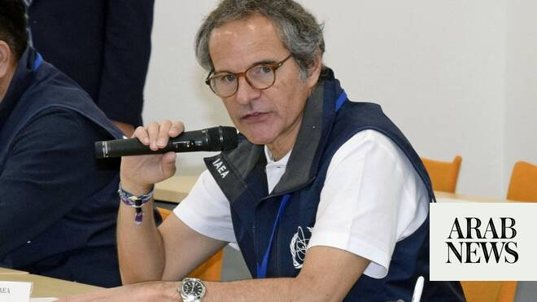

# UN nuclear boss says inspectors will visit Iran sites, as Tehran says only after a final deal

Source: https://www.arabnews.com/node/2648366/middle-east
Captured source: https://www.arabnews.com/node/2648366/middle-east
Published: 2026-06-24T08:16:19+03:00
Modified: 2026-06-24T15:36:44+03:00
Author: AP

## Summary

TOKYO: The head of the UN’s nuclear agency signaled Wednesday that Iranian nuclear enrichment sites would be visited by his inspectors, a key component in the interim US-Iran to reach an end to the war. But an Iranian diplomat promptly rejected this, saying such a visit can only come after a final deal — a denial that highlighted the precariousness of the ongoing negotiations.

## Image

## Video Or Embed URLs

- https://8437660651c90df6947d84332689814d.safeframe.googlesyndication.com/safeframe/1-0-45/html/container.html
- blob:https://www.arabnews.com/d42b9a30-6c7a-405f-81ec-7b0876a2e483
- https://imasdk.googleapis.com/js/core/bridge3.773.0_en.html
- https://static.addtoany.com/menu/sm.25.html
- about:blank
- https://sync.teads.tv/wigo-no-slot
- https://ep2.adtrafficquality.google/sodar/sodar2/255/runner.html
- https://www.google.com/recaptcha/api2/aframe
- https://cm.g.doubleclick.net/partnerpixels?gdpr=0&us_privacy=1---&gpp_sid=-1&url=https%3A%2F%2Fwww.arabnews.com%2Fnode%2F2648366%2Fmiddle-east

## Text

https://arab.news/673he

“I can understand political statements, they are part of the reality,” said Grossi

“The fundamental thing I would like to remind you and draw your attention to is that there has been a Memorandum of Understanding, signed by both presidents”

TOKYO: The head of the UN’s nuclear agency signaled Wednesday that Iranian nuclear enrichment sites would be visited by his inspectors, a key component in the interim US-Iran to reach an end to the war. But an Iranian diplomat promptly rejected this, saying such a visit can only come after a final deal — a denial that highlighted the precariousness of the ongoing negotiations. The remarks by International Atomic Energy Agency head Rafael Mariano Grossi was the firmest yet from the United Nations agency, which is viewed as key in determining the status of Iran’s nuclear stockpile. Since Israel launched a 12-day war on Iran in 2025, the IAEA has been blocked by Tehran from visiting enrichment sites where the Islamic Republic is believed to store enough highly enriched uranium to potentially build as many as 10 nuclear weapons, should it choose to rush for the bomb. Iran long has maintained that its program is peaceful, though it is the only country in the world to have uranium enriched up to 60 percent purity without a weapons program. The US and Iran offered contradictory remarks Tuesday about whether those sites would be inspected. Grossi acknowledged the contradictions, calling it a “war of words” at the moment. Grossi says inspections are ‘going to happen’ “I can understand political statements, they are part of the reality, but the fundamental thing I would like to remind you and draw your attention to is that there has been a Memorandum of Understanding, signed by both presidents,” he told journalists at a news conference at the tsunami-hit Fukushima Daiichi nuclear power plant. The accord “says explicitly that the nuclear activities that are going to be carried out with regards to the nuclear material facilities will be supervised by the IAEA — in all letters,” he said. Grossi added: “Obviously, to do that, we will have to inspect. Whether this happens the day after tomorrow or in one week or in 10 days, it’s important, but not essential. This is going to happen.” Those inspections are key for the deal, which calls for Iran’s stockpile of uranium to be “downblended” from highly enriched levels. Kazem Gharibabadi, a Iranian deputy foreign minister, took his own shot at Grossi after his remarks, saying Tehran didn’t meet with him while in Switzerland. “These issues will be reviewed and decided only within the framework of a final agreement and as a result of practical action by the other side to end all sanctions and other measures.” Gharibabadi wrote on X. He added: “You cannot advance the ‘stir up and take over’ policy with media hype.” IAEA blocked from seeing bombed sites The IAEA has been allowed to visit other nuclear sites in Iran since the 12-day war in 2025, such as the Bushehr nuclear power plant. But without accessing the enrichment sites, the IAEA says it is unable to verify the status of Iran’s stockpile or check the cascades of centrifuges used to enrich uranium. Both Iran and the IAEA say Tehran hasn’t been enriching uranium, but nonproliferation experts worry that the Islamic Republic may be moving its stockpile to undeclared areas. The US and Iran agreed to a deal last week that calls for Tehran to dilute its stockpile of enriched uranium and waives US-backed sanctions on Iranian oil, while giving each side 60 days to hammer out broader agreements. But the uneasy ceasefire already has been tested by Iran saying it closed the strait again over fighting between Israel and the Iranian-backed militia Hezbollah in Lebanon. Violence again broke out in Lebanon on Tuesday, but it did not escalate. Technical-level talks between the US and Iran are expected to resume early next week at the Bürgenstock resort in Switzerland, Pakistan’s Foreign Ministry said Wednesday. Pakistan has been a key mediator. Marco Rubio is in the Middle East Grossi’s remarks came as US Secretary of State Marco Rubio arrived in the Arabian Gulf for a three-nation tour, beginning with a closed-door meeting and private working lunch in Abu Dhabi with Emirati President Mohamed bin Zayed Al Nahyan, the State Department said Wednesday. Rubio is scheduled to travel next to Kuwait and then Bahrain for meetings with their leaders later Wednesday and Thursday.
