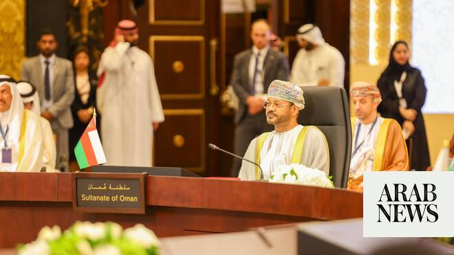

# Oman confirms Strait of Hormuz will remain toll-free

Source: https://www.arabnews.com/node/2648575/middle-east
Captured source: https://www.arabnews.com/node/2648575/middle-east
Published: 2026-06-25T18:42:46+03:00
Modified: 2026-06-25T18:47:48+03:00
Author: Arab News

## Summary

DUBAI: Oman confirmed on Thursday that no transit fees would be imposed on ships using the Strait of Hormuz as part of any future managing of the waterway. Foreign Minister Badr Al-Busaidi’s comments came after his country and Iran said this week that they were discussing “costs” for maritime services in the Strait. “Future arrangements regarding the Strait do not entail the

## Image

## Video Or Embed URLs

- https://fa5ed5602ab07589749cd814c38f09ef.safeframe.googlesyndication.com/safeframe/1-0-45/html/container.html
- https://static.addtoany.com/menu/sm.25.html
- about:blank
- https://imasdk.googleapis.com/js/core/bridge3.773.0_en.html
- https://www.google.com/recaptcha/api2/aframe
- https://cm.g.doubleclick.net/partnerpixels?gdpr=0&us_privacy=1---&gpp_sid=-1&url=https%3A%2F%2Fwww.arabnews.com%2Fnode%2F2648575%2Fmiddle-east

## Text

https://arab.news/6d7gw

Foreign Minister Badr Al-Busaidi tells GCC meeting that future arrangements for the waterway will not include fees

Tankers start to use new UN-backed temporary routes through the Strait along Oman’s coast

DUBAI: Oman confirmed on Thursday that no transit fees would be imposed on ships using the Strait of Hormuz as part of any future managing of the waterway.

Foreign Minister Badr Al-Busaidi’s comments came after his country and Iran said this week that they were discussing “costs” for maritime services in the Strait.

“Future arrangements regarding the Strait do not entail the imposition of any transit fees,” Al-Busaidi told a meeting of Gulf foreign ministers in Bahrain.

The minister highlighted the importance of restoring freedom of navigation through the Strait and ensuring its safe and uninterrupted flow.

He added that Oman, as a state bordering the Strait, "has a special responsibility to support international efforts to secure maritime navigation."

The the Gulf Cooperation Council meeting was attended by US Secretary of State Marco Rubio, who during his visit to the region repeatedly stated Washington’s opposition to any tolls being applied to shipping using the waterway.

Oman and Iran border either side of the Strait through which one-fifth of the world's crude oil and liquefied natural gas supplies were being transported before Israel and the US launched a war against Iran at the end of February.

Tehran responded by closing the waterway to shipping, a move that brought severe economic disruption to the global economy.

Iran and the US signed an initial agreement to end the conflict last week. The memorandum of understanding said that commercial ships may transit the strait free of charge for a 60 day period while negotiations continue toward a final peace deal.

Rubio said after the GCC meeting that there was "zero support" for tolls in the Strait among Gulf countries.

“Ultimately there's not going to be any fees or tolls,” he said. “They (Oman) were there in the meeting today and they said that they are not in favor of the tolling system.”

A day before the meeting, Oman announced new, toll-free temporary routes through the Strait to the north and south of the Traffic Separation Scheme corridor used before the conflict.

The new routes were coordinated with the International Maritime Organisation, the UN agency responsible for marine safety.

A number of oil tankers sailed along the southerly route on Thursday, which passes by Oman's Musandam Peninsula, AP reported.

Iran's Revolutionary Guards on Thursday warned that any crossings of the Strait of Hormuz without authorization from them, "will be dealt with.”

*With AP, AFP and Reuters
