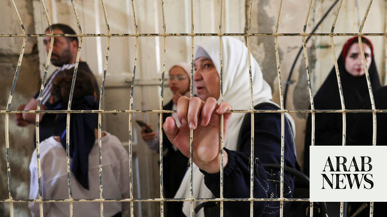

# Could Israel’s Hebron planning takeover become a blueprint for annexing the West Bank?

Source: https://www.arabnews.com/node/2648616/middle-east
Captured source: https://www.arabnews.com/node/2648616/middle-east
Published: 2026-06-26T00:43:07+03:00
Modified: 2026-06-26T08:59:44+03:00
Author: Sherouk Zakaria

## Summary

DUBAI: The decision by Israeli authorities to strip Hebron Municipality of its planning and construction powers in parts of the city’s historic center has triggered fresh concerns over the future of the Oslo Accords peace framework and the prospects for Palestinian statehood. Palestinian officials and analysts warned that the move amounts to another step toward de facto

## Image

## Video Or Embed URLs

- https://591005743d09329dff11583fdb0ba82c.safeframe.googlesyndication.com/safeframe/1-0-45/html/container.html
- https://static.addtoany.com/menu/sm.25.html
- about:blank
- https://www.google.com/recaptcha/api2/aframe
- https://imasdk.googleapis.com/js/core/bridge3.773.0_en.html
- https://cm.g.doubleclick.net/partnerpixels?gdpr=0&us_privacy=1---&gpp_sid=-1&url=https%3A%2F%2Fwww.arabnews.com%2Fnode%2F2648616%2Fmiddle-east

## Text

https://arab.news/gxq27

Decision to strip Palestinian municipality of planning and construction authority condemned as de facto annexation

Oslo dismantled ‘not through dramatic formal revocation, but through incremental administrative decisions,’ analyst says

DUBAI: The decision by Israeli authorities to strip Hebron Municipality of its planning and construction powers in parts of the city’s historic center has triggered fresh concerns over the future of the Oslo Accords peace framework and the prospects for Palestinian statehood.

Palestinian officials and analysts warned that the move amounts to another step toward de facto annexation of the occupied West Bank, depriving Palestinians of land they claim for a future state.

Last week, Israel’s finance minister, Bezalel Smotrich, announced that the Higher Planning Council within the Israeli Civil Administration would take over planning, zoning and construction decisions in Hebron’s H2 area, which is home to the Ibrahimi Mosque, known to Jews as the Tomb of the Patriarchs, and an enclave of Israeli settlers in the heart of the city.

The following day, Israeli authorities approved construction plans for a new Jewish school in the city center, and new homes in Israeli settlements.

The move strips Hebron Municipality of one of the key civil powers granted to Palestinians in the H2 area under the 1997 Hebron Protocol, an agreement signed by the Israeli prime minister, Benjamin Netanyahu, and the chair of the Palestine Liberation Organization, Yasser Arafat, as part of the Oslo Accords peace process that divided the West Bank between Palestinian and Israelis.

Israel’s Foreign Ministry insisted that the Hebron Agreement remained in force but observers said the decision served as the latest illustration of a decades-long process of Israeli expansionism in the occupied territory, and the steady erosion of the substance of the Oslo Accords.

Jaser AbuMousa, a Palestinian political analyst and senior fellow at the Middle East Institute, said the “architecture” of the Oslo Accords has been dismantled over 30 years “not through dramatic formal revocation, but through incremental administrative decisions that empty the agreements of their operative content while preserving them as formal shells.”

He told Arab News: “It converts a de facto (in fact) situation into a de jure (by law) one, and that conversion is how Israel has consistently transformed temporary occupation measures into permanent sovereign arrangements.”

At the heart of the dispute lies Hebron’s Old City and the Ibrahimi Mosque, a flashpoint for the Israeli-Palestinian conflict.

Under the Hebron Protocol, Israeli troops remain deployed in H2, but any construction plans, including around the shrine, have generally required approval by the Palestinian municipality.

Meanwhile H1, which comprises about 80 percent of the city, is administered by the Palestinian Authority.

H2 is home to approximately 80,000 Palestinians, including about 7,000 residents of Hebron’s Old City who live alongside about 1,000 Israeli settlers concentrated around the Ibrahimi Mosque and nearby compounds that are under complete Israeli security control.

AbuMousa said that the removal of Palestinian planning authority clears the administrative path for the further expansion of settlements and the infrastructure that serves the settler population, while increasing the physical constrictions on Palestinians living in H2, which is already one of the most heavily restricted areas in the occupied West Bank.

“For Palestinians, it confirms that even their most sacred sites are not beyond the reach of the settlement project,” said AbuMousa.

The restrictions on everyday life are already clear. Palestinians in the Old City must navigate a network of more than 120 checkpoints and gates. Main roads, including Shuhada Street, remain largely closed to Palestinian traffic. Commercial activity is heavily constrained, and daily movement is tightly controlled by Israeli security measures.

The move in Hebron is the latest in a broader campaign led by Smotrich that aims to deepen what he has described as “practical sovereignty” and entrench Israeli rule over the West Bank.

Since October 2023, Israel has established about 200 new outposts and approved 102 new settlements as part of a process that Smotrich has repeatedly declared is intended to prevent the creation of a Palestinian state.

In a statement to Arab News, Hebron’s mayor, Yousef Al-Jabari, said the latest decision would worsen living conditions for residents who already live under strict Israeli military rule, and are subject to a curfew that is imposed two days a week, as well as restrictions on movement by car or on foot.

He said the municipality planned to challenge the decision through international courts and has launched diplomatic outreach efforts through Palestinian representatives and ambassadors worldwide in an attempt to rally regional and international opposition.

“People often have to park their cars several kilometers from their homes and walk the rest of the way, sometimes carrying groceries and other essentials,” Al-Jabari said.

“They are unable to build or expand their homes and are routinely subjected to settler violence, including attacks on their homes and schools.”

He condemned the move by Israeli authorities as a violation of the Hebron Protocol and international agreements signed under US sponsorship.

“Smotrich’s decision aims to find legal ways to seize more of the municipality’s buildings and diminish our services, but we will continue providing services for our people in H2,” Al-Jabari told Arab News.

He accused Israel of attempting to alter the very character of Hebron’s Old City, recognized by UNESCO since 2017 as a Palestinian World Heritage Site, and the Ibrahimi Mosque, both of which hold deep religious, cultural and historical significance for the Palestinian people.

Al-Jabari also called for the reinstatement of the Temporary International Presence in Hebron, an international observer mission that was established in 1994 and terminated by Israeli authorities in 2019, saying its return was needed to help protect the rights of Palestinians living in H2.

In a statement last week, the Palestinian Authority condemned the seizure of powers by Israel as an “infringement upon the political and legal status of Hebron” and a violation of international law.

AbuMousa warned that the move threatened not only to undermine the Palestinian Authority’s legitimacy and erode public confidence in its ability to govern, but also to accelerate the process of de facto annexation in H2.

Hebron is particularly significant for the Palestinian Authority, he said, because the Hebron Protocol granted the municipality highly visible, day-to-day responsibilities, from garbage collection to the issuing of building permits and planning approvals.

“These are not abstract diplomatic competencies, they are tangible services,” AbuMousa said. “When that authority is removed and the PA can do nothing but issue a statement of condemnation, the message to ordinary Palestinians is clear: the institutional path does not work.”

Under the new planning regime, he said, the expansion of settlements and outposts was likely to accelerate, with new housing and infrastructure integrated with the existing settlement of Kiryat Arba on the eastern outskirts of Hebron, and the broader settlement network.

At the same time, Palestinian construction projects could be restricted or denied permission, gradually reshaping the demographic and physical landscape of the area, following the model of East Jerusalem.

“The settler population will grow,” said AbuMousa. “It has political incentives, subsidized housing and strong ideological commitment.

“The Palestinian population of H2 will likely shrink through the cumulative pressure of movement restrictions, demolition orders, settler violence and the daily reality of living under a system designed to encourage departure.”

In the absence of an international presence to constrain this trajectory, AbuMousa warned that within a few years H2 could begin to resemble East Jerusalem: a territory that remains occupied under international law but in practice is governed as an extension of Israeli sovereignty, with a residual Palestinian population that is left with no institutional representation, no planning authority and few effective mechanisms to defend its rights.

The implications extend beyond Hebron itself, however. Left unchallenged by the international community, the decision could establish a model for the transfer of additional powers from Palestinian institutions to Israeli authorities elsewhere in the West Bank, including Area B, which is administered by the Palestinian Authority under a system of shared security control with Israel, established under the 1995 Oslo II Accord.

While Palestinians have several legal and diplomatic avenues available to challenge the decision, AbuMousa said none of them have a track record of success in reversing developments on the ground.

International courts and UN bodies consider Israel’s settlements in the territory illegal under international law, but they lack enforcement mechanisms, while diplomatic efforts are often constrained by geopolitical realities.

“Palestinians have accumulated an extraordinary body of international legal opinion affirming their rights,” AbuMousa said. “What they lack is any mechanism to translate legal recognition into legal protection.”
