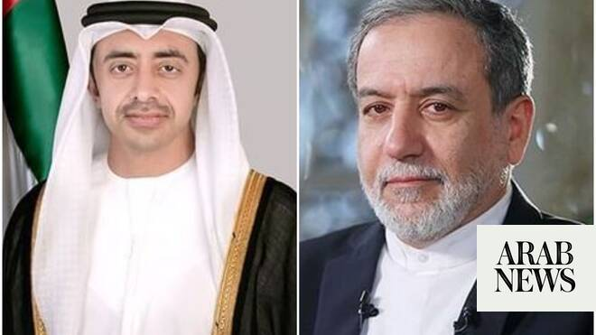

# UAE foreign minister tells Iran: Shipping must pass freely through Hormuz

Source: https://www.arabnews.com/node/2648684/middle-east
Captured source: https://www.arabnews.com/node/2648684/middle-east
Published: 2026-06-26T17:54:29+03:00
Modified: 2026-06-26T18:04:56+03:00
Author: Arab News

## Summary

DUBAI: The flow of shipping through the Strait of Hormuz should not be interrupted, the UAE foreign minister told his Iranian counterpart on Friday, after a ship using a UN-approved corridor in the waterway came under fire. Sheikh Abdullah bin Zayed's comments came during a phone call with Iran's Foreign Minister Abbas Araghchi, the Emirates' state news agency reported, as

## Image

## Video Or Embed URLs

- https://7980ec1fae06cac020a30b30429f5b69.safeframe.googlesyndication.com/safeframe/1-0-45/html/container.html
- https://static.addtoany.com/menu/sm.25.html
- about:blank
- https://www.google.com/recaptcha/api2/aframe
- https://imasdk.googleapis.com/js/core/bridge3.773.0_en.html
- https://cm.g.doubleclick.net/partnerpixels?gdpr=0&us_privacy=1---&gpp_sid=-1&url=https%3A%2F%2Fwww.arabnews.com%2Fnode%2F2648684%2Fmiddle-east

## Text

https://arab.news/4dk9j

UAE Foreign Minister Sheikh Abdullah bin Zayed and his Iranian counterpart Abbas Araghchi hold phone call amid tensions over the reopening of waterway

Emirates stresses to Iran importance of complying with an initial agreement to end conflict with the US

DUBAI: The flow of shipping through the Strait of Hormuz should not be interrupted, the UAE foreign minister told his Iranian counterpart on Friday, after a ship using a UN-approved corridor in the waterway came under fire.

Sheikh Abdullah bin Zayed's comments came during a phone call with Iran's Foreign Minister Abbas Araghchi, the Emirates' state news agency reported, as Iran and the US attempt to negotiate a final peace agreement.

The minister stressed to Araghchi the importance of fully complying with an initial agreement between Washington and Tehran signed last week to end their conflict and reopen the Strait of Hormuz.

This includes the "protection of maritime corridors and freedom of international navigation, including ensuring the uninterrupted flow of maritime traffic through the Strait of Hormuz," Sheikh Abdullah said.

He highlighted other areas of the agreement for Iran to follow, including the "immediate and comprehensive cessation of hostilities in the region, respect for the sovereignty of states and the principles of good neighborliness."

The UAE, along with other Gulf countries, was targeted by waves of Iranian drone and missile attacks during the conflict that started on Feb. 28 when Israel and the US launched a bombing campaign against Iran.

Tehran also blocked ships from passing through the Strait of Hormuz at the entrance to the Arabian Gulf, cutting off a waterway through which a fifth of the world's oil and liquefied natural gas are shipped.

The memorandum of understanding between the US and Iran launched a 60-day period for the two sides to iron out major issues, including Iran's nuclear program.

Sheikh Abdullah said he hoped that the negotiations "would yield positive outcomes, leading to lasting security and stability in the region."

Gulf foreign ministers said on Thursday that the Strait of Hormuz must be reopened fully with "free, unconditional, and unrestricted navigation ... essential to regional and global security."

Their meeting in Bahrain was attended by US Secretary of State Marco Rubio, who said that Iran would not be allowed to impose tolls for ships using the waterway — something Iran says it wants to do.

US officials told Reuters that Iran fired on a ship on Thursday as it sailed along a temporary UN-backed corridor near Oman's coast.
