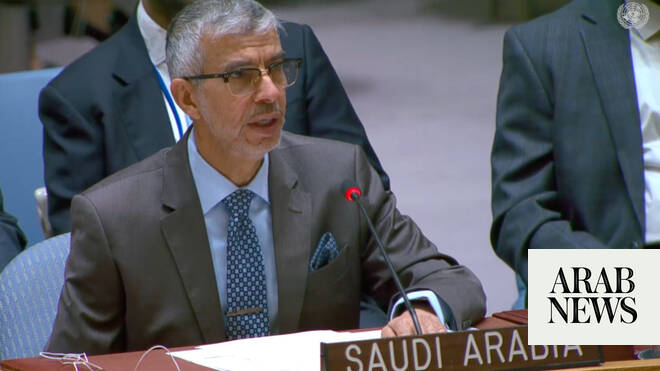

# Saudi UN envoy warns external arms suppliers are fueling war in Sudan, rejects parallel rule

Source: https://www.arabnews.com/node/2648723/middle-east
Captured source: https://www.arabnews.com/node/2648723/middle-east
Published: 2026-06-27T00:32:08+03:00
Modified: 2026-06-27T00:32:08+03:00
Author: Ephrem Kossaify

## Summary

NEW YORK CITY: Saudi Arabia’s envoy to the UN, Abdulaziz Alwasil, told the Security Council on Friday that there can be no military solution to the civil war in Sudan. He warned that the continued fighting in the country and arms support provided to the warring factions by other countries were worsening a humanitarian catastrophe that has already displaced more than 11 million

## Image

## Video Or Embed URLs

- https://a9ac5662a7ec74055bd3911fb12e489d.safeframe.googlesyndication.com/safeframe/1-0-45/html/container.html
- https://static.addtoany.com/menu/sm.25.html
- about:blank
- https://imasdk.googleapis.com/js/core/bridge3.773.0_en.html
- https://www.google.com/recaptcha/api2/aframe
- https://cm.g.doubleclick.net/partnerpixels?gdpr=0&us_privacy=1---&gpp_sid=-1&url=https%3A%2F%2Fwww.arabnews.com%2Fnode%2F2648723%2Fmiddle-east

## Text

https://arab.news/bevht

Abdulaziz Alwasil laments ‘lack of compassion and humanity of extreme proportions’ as militia leaders ‘hungry for power’ ignore civilian suffering

Kingdom evacuated 8,445 people of 110 nationalities from Sudan, and had provided more than $100m of humanitarian assistance by June 2025, he adds

NEW YORK CITY: Saudi Arabia’s envoy to the UN, Abdulaziz Alwasil, told the Security Council on Friday that there can be no military solution to the civil war in Sudan.

He warned that the continued fighting in the country and arms support provided to the warring factions by other countries were worsening a humanitarian catastrophe that has already displaced more than 11 million people.

“Sudanese citizens are facing immense challenges, a tragedy that continues,” Alwasil said, describing “a lack of compassion and humanity of extreme proportions” as the leaders of rival militias, “hungry for power,” ignore civilian suffering.

The Kingdom’s priorities remain the stability of Sudan, a ceasefire agreement, and the preservation of state institutions, unity, territorial integrity and resources, he added, stressing that any solution must be “an inter-Sudanese, political one” rooted in Sudanese sovereignty and state structures.

Sudan has been locked in a civil war between the Sudanese Armed Forces and the paramilitary Rapid Support Forces since April 2023. Alwasil attributed the worsening security and humanitarian situation in the country directly to the continued fighting and noncompliance with the Jeddah Declaration, an agreement on the protection of civilians signed by both sides on May 11, 2023, and with short-term ceasefire and humanitarian arrangements signed days later. He also highlighted the nonimplementation of Security Council resolutions on Sudan.

“The continuation of military operations will only lead to escalation and the worsening of humanitarian suffering,” he said as he called for a comprehensive political solution led by the Sudanese people as “the only pathway” to ending the conflict.

Alwasil urged council members to take all necessary steps to ensure unobstructed humanitarian access to all affected areas of Sudan, including Darfur and Kordofan, in line with international humanitarian law and the Jeddah Declaration.

He voiced grave concern over the thousands of civilian deaths during the conflict, and condemned the Rapid Support Forces for targeting World Food Programme aid convoys with drones in North Kordofan, describing this as “a flagrant violation of humanitarian principles.”

He also denounced crimes against civilians in El-Fasher, and demanded an unconditional end to the smuggling of weapons into Sudan.

Alwasil welcomed a statement on Sept. 12, 2025, by the Quad nations (the US, Saudi Arabia, the UAE and Egypt) on the restoration of peace and security in Sudan as a step toward stronger international and regional coordination on the issue, including the establishment of a technical committee to oversee concrete measures on the ground. He also underscored the continued importance of the African Union, its envoy, and the League of Arab States in efforts to address the crisis.

He reiterated Saudi Arabia’s rejection of “all measures undertaken outside of official institutional frameworks” in Sudan, warning that this risked fragmenting the unity of the country, disregarding the will of the Sudanese people, and enabling the establishment of a parallel administration.

Alwasil said that the Kingdom had evacuated 8,445 people of 110 nationalities from Sudan since the war began, and had expanded its cooperation with the International Committee of the Red Cross in efforts using the Jeddah-Port Sudan route.

Riyadh had pledged $100 million to Sudan through the Saudi aid agency KSrelief, he added, and launched the “Sahem” donation campaign, bringing the total humanitarian assistance provided by the Kingdom to more than $100 million by June 2025 across health, food, shelter, and water and sanitation services. Total aid delivered worldwide through all Saudi platforms has exceeded $3.2 billion to date, he said.

Alwasil welcomed all regional and international efforts to achieve a permanent ceasefire agreement and a comprehensive political process in Sudan. He called on the international community to honor its humanitarian aid commitments, and to support the return of displaced people and refugees, and the restoration of essential services.
