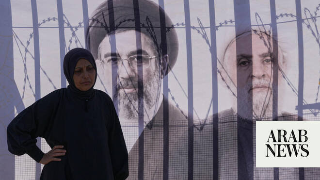

# Hezbollah rejects US-brokered Israel-Lebanon security deal as ‘surrender’

Source: https://www.arabnews.com/node/2648786/middle-east
Captured source: https://www.arabnews.com/node/2648786/middle-east
Published: 2026-06-27T17:07:32+03:00
Modified: 2026-06-27T17:16:31+03:00
Author: Reuters

## Summary

BEIRUT: Hezbollah leader Naim Qassem rejected a US-brokered security agreement between Lebanon and Israel on Saturday ​a day after it was signed, describing it as a surrender to Israel. In the latest example of ongoing hostilities despite repeated ceasefires and agreements, Israel launched a drone strike in Lebanon’s south. More than a million Lebanese have been driven from

## Image

## Video Or Embed URLs

- https://static.addtoany.com/menu/sm.25.html
- about:blank
- https://imasdk.googleapis.com/js/core/bridge3.773.0_en.html
- https://www.google.com/recaptcha/api2/aframe
- https://cm.g.doubleclick.net/partnerpixels?gdpr=0&us_privacy=1---&gpp_sid=-1&url=https%3A%2F%2Fwww.arabnews.com%2Fnode%2F2648786%2Fmiddle-east

## Text

https://arab.news/g25rw

Qassem ‌called it “null and void,” and accused ‌the Lebanese government of making unilateral ​concessions

BEIRUT: Hezbollah leader Naim Qassem rejected a US-brokered security agreement between Lebanon and Israel on Saturday ​a day after it was signed, describing it as a surrender to Israel.

In the latest example of ongoing hostilities despite repeated ceasefires and agreements, Israel launched a drone strike in Lebanon’s south.

More than a million Lebanese have been driven from their homes by a conflict that has run in parallel with the wider Iran war. Hezbollah and ‌Iran say Washington ‌pledged to end hostilities in Lebanon ​as ‌part ⁠of ​its memorandum ⁠of understanding signed two weeks ago to end the wider war.

The framework agreed on Friday provides for a phased Israeli withdrawal from some parts of southern Lebanon, alongside the deployment of the Lebanese army. But Israeli forces would be permitted to remain in an expanded security zone for the ⁠time being, pending further implementation.

In a statement, Qassem ‌called it “null and void,” and accused ‌the Lebanese government of making unilateral ​concessions and undermining Lebanon’s sovereignty.

He ‌criticized provisions linking Israel’s withdrawal to Hezbollah’s disarmament, saying they ‌effectively legitimized Israel’s military presence and crossed “all red lines.”

The group would continue its armed resistance, he added: “We did not leave the battlefield in the most difficult circumstances, and we will not leave ‌it.”

Lebanon’s state news agency said an Israeli drone struck Nabatieh Al-Fawqa on Saturday. The area ⁠is outside ⁠the security zone shown on a map published by Israel of the territory its troops will continue to control.

The Israeli military told Reuters it had carried out the strike, using a drone because it had no troops in the immediate area. It said it targeted an individual who posed a threat to its forces, without giving further details or evidence.

Qassem said the Iran-US memorandum of understanding reached earlier this month, which guarantees Lebanon’s territorial integrity, should serve ​as the basis for ​ending the conflict, rather than Friday’s Washington agreement.
