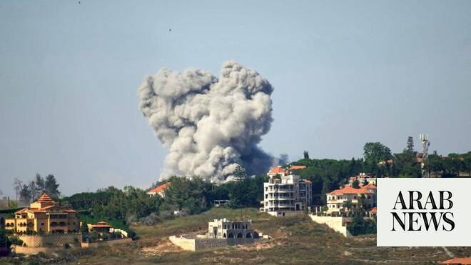

# Hezbollah militants killed, rocket launcher hit in the Nabatieh area — Israeli army

Source: https://www.arabnews.com/node/2648849/middle-east
Captured source: https://www.arabnews.com/node/2648849/middle-east
Published: 2026-06-28T07:28:09+03:00
Modified: 2026-06-28T07:29:22+03:00
Author: Reuters

## Summary

Israeli military said on Sunday it killed Hezbollah militants armed with ‌rocket-propelled ‌grenades and struck ‌a ⁠rocket launcher in ⁠the Nabatieh area of southern Lebanon to ⁠remove ‌threats to ‌its soldiers. The ‌Israeli ‌military said it struck the ‌structure from which the militants ⁠operated ⁠and dismantled a rocket launcher that posed a threat.

## Image

## Video Or Embed URLs

- https://fab28cc238c0899fa8668fb2c94673e7.safeframe.googlesyndication.com/safeframe/1-0-45/html/container.html
- https://static.addtoany.com/menu/sm.25.html
- about:blank
- https://imasdk.googleapis.com/js/core/bridge3.773.0_en.html
- https://www.google.com/recaptcha/api2/aframe
- https://sync.teads.tv/wigo-no-slot
- https://cm.g.doubleclick.net/partnerpixels?gdpr=0&us_privacy=1---&gpp_sid=-1&url=https%3A%2F%2Fwww.arabnews.com%2Fnode%2F2648849%2Fmiddle-east

## Text

https://arab.news/vugyz

Israeli ‌military says it struck the ‌structure from which the militants ⁠operated ⁠and dismantled a rocket launcher that posed a threat

Israeli military said on Sunday it killed Hezbollah militants armed with ‌rocket-propelled ‌grenades and struck ‌a ⁠rocket launcher in ⁠the Nabatieh area of southern Lebanon to ⁠remove ‌threats to ‌its soldiers. The ‌Israeli ‌military said it struck the ‌structure from which the militants ⁠operated ⁠and dismantled a rocket launcher that posed a threat.
