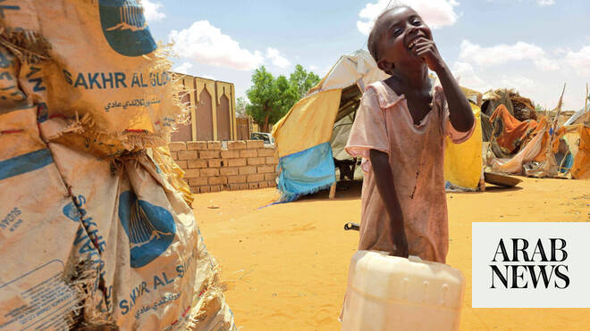

# In Sudan’s Kordofan, a key city reels as paramilitary offensive looms

Source: https://www.arabnews.com/node/2648936/middle-east
Captured source: https://www.arabnews.com/node/2648936/middle-east
Published: 2026-06-29T04:46:26+03:00
Modified: 2026-06-29T04:46:26+03:00
Author: AFP

## Summary

EL-OBEID, Sudan: In a displacement camp near El-Obeid in Sudan’s southern Kordofan region, Agsam Hamad trudges through searing heat to fetch murky water from a distant well, as paramilitary forces unleash their fiercest assault yet on the strategic city. “We walk long distances for this water and it is undrinkable,” the 35-year-old mother of seven told AFP from the camp on the

## Image

## Video Or Embed URLs

- https://64d646e4a923e8b4a6e4d19e933200cf.safeframe.googlesyndication.com/safeframe/1-0-45/html/container.html
- https://static.addtoany.com/menu/sm.25.html
- about:blank
- https://imasdk.googleapis.com/js/core/bridge3.773.0_en.html
- https://www.google.com/recaptcha/api2/aframe
- https://sync.teads.tv/wigo-no-slot
- https://cm.g.doubleclick.net/partnerpixels?gdpr=0&us_privacy=1---&gpp_sid=-1&url=https%3A%2F%2Fwww.arabnews.com%2Fnode%2F2648936%2Fmiddle-east

## Text

https://arab.news/9hrzw

Recent attacks have hit the main power station and fuel depots, plunged neighborhoods into darkness and shut down water pumps

EL-OBEID, Sudan: In a displacement camp near El-Obeid in Sudan’s southern Kordofan region, Agsam Hamad trudges through searing heat to fetch murky water from a distant well, as paramilitary forces unleash their fiercest assault yet on the strategic city. “We walk long distances for this water and it is undrinkable,” the 35-year-old mother of seven told AFP from the camp on the edge of El-Obeid, a key prize in the three-year war between the army and the paramilitary Rapid Support Forces (RSF). “Our situation is very difficult. We need food and water.” El-Obeid, a city of half a million people that hosts nearly 100,000 refugees displaced by violence elsewhere, has, in recent weeks, faced its most intense RSF attacks yet. After breaking a prolonged siege in February last year, the army has struggled to stop the RSF from reimposing a blockade through repeated drone strikes targeting the city, its infrastructure and the main highway out. Recent attacks have hit the main power station and fuel depots, plunged neighborhoods into darkness and shut down water pumps. With taps dry, residents now depend on tanker trucks, wells and a handful of distribution points, they told AFP. The UN has warned of “substantial” RSF troop movements around the city ahead of a possible ground assault, raising fears of a repeat of the atrocities seen in El-Fasher, the Darfur city which fell to the RSF last October in an attack the UN said bore “the hallmarks of genocide.” Nohad Eltayeb of the Armed Conflict Location and Event Data Project (ACLED), a US-based non-profit, said that over the past month troop movements have been observed roughly 60 kilometers north, south and west of El-Obeid. The eastern route to Kosti, about 300 kilometers from the capital Khartoum, remains under army control but is extremely dangerous, she told AFP. El-Obeid sits at a key crossroads linking army-held areas in central and eastern Sudan, including Khartoum, with RSF-controlled Darfur to the west. Analysts say capturing it would consolidate RSF control over western Sudan and potentially open the way for a push toward the capital. El-Obeid hosts an infantry division, an air base, a key oil pipeline and a major tree gum market. “Controlling it is about power, land and money,” said analyst Kholood Khair.

Fighting and tight restrictions have all but cut off access to the city, making independent reporting increasingly difficult. An AFP journalist captured rare footage at Al-Rahmaniyah camp showing exhausted women shuffling under a punishing sun, jerrycans swaying on their heads after hours spent waiting for water at a distant well. At the camp, nearly 200 families are crammed into fragile shelters stitched together from straw, torn fabric and sheets of plastic. Children linger in the narrow shade cast by the huts, some too tired to play, others trailing silently after their mothers. “We have nothing. No water, food or mattresses,” Waseela Mohamed, a 70-year-old grandmother of seven, told AFP. Aid deliveries that reached the camp weeks ago have dwindled as services across the city are repeatedly hit. “Humanitarian groups are doing what they can, but the needs are far greater,” said a volunteer, who asked not to be named. Inside El-Obeid, drones buzz almost constantly, said Adam Hussein, using a pseudonym for fear of reprisals. “We don’t know what is really happening. “Everything is in crisis. Civilians and infrastructure are constantly targeted,” he told AFP. As he spoke, a drone crashed nearby, causing no casualties. With water prices doubling, food costs rising by up to 300 percent and transport fares also surging, many residents are now effectively “surrounded,” said Khair. “Many haven’t left because they can’t afford to or don’t know where to go,” she told AFP.

Mohamed Refaat of the International Organization for Migration warned the city is nearing a total siege, with civilians “soon unable to leave or return.” UN agencies have suspended access as security deteriorates while needs are outpacing pre-positioned supplies, he told AFP. Without immediate aid, Refaat said conditions could “within weeks” mirror those seen in El-Fasher, where civilians survived on animal feed during 18 months under siege. The UN says more than 6,000 people were killed in the first three days of its fall. Western countries have warned of the risk of similar atrocities if El-Obeid falls. A government source told AFP the army has tried to slow the RSF advance, destroying equipment en route last week. A source close to the RSF accused the army of using civilians as “human shields,” arguing they should be evacuated. While the city’s demographics differ from El-Fasher, where violence fell on ethnic lines, ACLED’s Eltayeb said civilians “could still face looting, sexual violence and attacks on those accused of supporting the army.”
