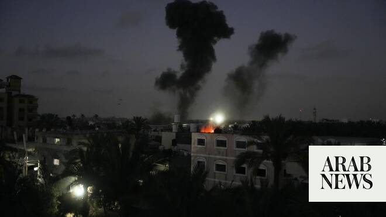

# Israeli strike targeting a militant kills 3, including a child, in Gaza

Source: https://www.arabnews.com/node/2648964/middle-east
Captured source: https://www.arabnews.com/node/2648964/middle-east
Published: 2026-06-29T12:34:00+03:00
Modified: 2026-06-29T12:35:43+03:00
Author: AP

## Summary

DEIR AL-BALAH, Gaza Strip: An Israeli airstrike killed at least three Palestinians, including a child, in the Gaza Strip on Monday, after hitting a tent sheltering displaced people that Israel said housed a militant. Health authorities in the coastal enclave said the strike hit a neighborhood in Deir Al-Balah, one of the least damaged towns in central Gaza. Al-Aqsa Martyrs

## Image

## Video Or Embed URLs

- https://9f460598524ae6ca49df248c8266abf2.safeframe.googlesyndication.com/safeframe/1-0-45/html/container.html
- https://static.addtoany.com/menu/sm.25.html
- about:blank
- https://imasdk.googleapis.com/js/core/bridge3.774.0_en.html
- https://www.google.com/recaptcha/api2/aframe
- https://sync.teads.tv/wigo-no-slot
- https://cm.g.doubleclick.net/partnerpixels?gdpr=0&us_privacy=1---&gpp_sid=-1&url=https%3A%2F%2Fwww.arabnews.com%2Fnode%2F2648964%2Fmiddle-east

## Text

https://arab.news/ntvyk

Health authorities in the coastal enclave said the strike hit a neighborhood in Deir Al-Balah

DEIR AL-BALAH, Gaza Strip: An Israeli airstrike killed at least three Palestinians, including a child, in the Gaza Strip on Monday, after hitting a tent sheltering displaced people that Israel said housed a militant. Health authorities in the coastal enclave said the strike hit a neighborhood in Deir Al-Balah, one of the least damaged towns in central Gaza. Al-Aqsa Martyrs Hospital said the fatalities were two men and an 8-year-old while a third man was wounded. Israel’s military identified the target as Zaher Abu Salem, who it said was a member of Islamic Jihad and was involved in the Oct. 7, 2023, attack on Israel that triggered the war. While the heaviest fighting has subsided since a ceasefire took hold in October, Israeli forces have carried out repeated airstrikes, killing 1,045 Palestinians, according to health officials in Gaza. Israel has announced a series of strikes targeting militants, including three over the weekend. The ministry, which is part of the Hamas-led government, maintains detailed casualty records that are seen as generally reliable by UN agencies and independent experts. But it does not give a breakdown of civilians and militants. Militants have carried out shooting attacks on troops, and Israel says its strikes are in response to that and other violations. Five Israeli soldiers have been killed since the ceasefire. The Oct. 7 attack by militants on Israel killed some 1,200 people and saw 251 taken hostage. Israel’s retaliatory offensive in Gaza has killed more than 73,058 Palestinians, including those killed since the ceasefire, Gaza’s Health Ministry said.
