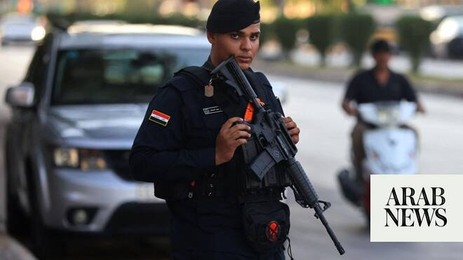

# Iraq sets 3-month deadline for pro-Iran groups to disarm

Source: https://www.arabnews.com/node/2648992/middle-east
Captured source: https://www.arabnews.com/node/2648992/middle-east
Published: 2026-06-29T16:59:22+03:00
Modified: 2026-06-29T19:00:22+03:00
Author: AFP

## Summary

BAGHDAD: Iraq’s government has given pro-Iran armed groups in the country until Sept. 30 to disarm, coinciding with the end of the US-led anti-jihadist coalition’s mission, its spokesman said on Monday. The announcement comes ahead of a visit to the United States by new Prime Minister Ali Al-Zaidi, with Washington exerting pressure on Baghdad to ensure the factions turn in

## Image

## Video Or Embed URLs

- https://a989d0419df7f79cea50c9931e0cab00.safeframe.googlesyndication.com/safeframe/1-0-45/html/container.html
- https://static.addtoany.com/menu/sm.25.html
- about:blank
- https://imasdk.googleapis.com/js/core/bridge3.774.0_en.html
- https://www.google.com/recaptcha/api2/aframe
- https://sync.teads.tv/wigo-no-slot
- https://cm.g.doubleclick.net/partnerpixels?gdpr=0&us_privacy=1---&gpp_sid=-1&url=https%3A%2F%2Fwww.arabnews.com%2Fnode%2F2648992%2Fmiddle-east

## Text

https://arab.news/b2u99

Announcement comes ahead of a visit to the United States by new Prime Minister Ali Al-Zaidi

Militias launched attacks on US interests in Iraq during the Iran war

BAGHDAD: Iraq’s government has given pro-Iran armed groups in the country until Sept. 30 to disarm, coinciding with the end of the US-led anti-jihadist coalition’s mission, its spokesman said on Monday. The announcement comes ahead of a visit to the United States by new Prime Minister Ali Al-Zaidi, with Washington exerting pressure on Baghdad to ensure the factions turn in their weapons. “All the armed groups have been informed of a specific date that marks the end of this issue (of disarmament)... which is September 30, which also marks the end of the international coalition’s presence,” government spokesman Haidar Al-Aboudi said in a weekly press conference. “After this date, all weapons outside the state framework will be subject to legal redress,” he added. Iraq is home to dozens of powerful Iran-backed armed factions, many of which form part of the former paramilitary Hashed Al-Shaabi, or Popular Mobilization Forces (PMF). Many emerged in the wake of the 2003 US-led invasion of Iraq and gained further power and prominence during the fight against the Daesh group from 2014 onwards. Under heavy US pressure in recent months, Iraqi authorities said they would seek the full integration of those member factions in the PMF into government forces in a bid to limit the possession of weapons to the hands of the state. The government aims to include within the integration drive brigades that currently operate outside the framework of the PMF. The move came after some of the factions with forces in the PMF launched attacks on US interests in Iraq following the start of the Middle East war in late February. Washington in turn launched its own attacks on the factions, before withholding cash payments for Iraqi oil revenues that are paid as part of a deal following the 2003 US-led invasion. Iraqi authorities have repeatedly attempted to fully integrate the PMF into the state forces, but some of the groups have cited the continued presence of US forces in Iraq as a reason to delay the disarmament process. Earlier in June, Iraqi authorities announced that they had received data on weapons belonging to the pro-Iran faction Kataeb Imam Ali, a first step in the plan to integrate such groups into the state forces. Shortly before, two pro-Iran factions, the Kataeb Imam Ali and Asaib Ahl Al-Haq, announced they would be handing over administration of their brigades in the Hashed Al-Shaabi to the state. The PMF was formed in 2014, bringing together armed factions to fight the Daesh group after it seized swathes of the country.
