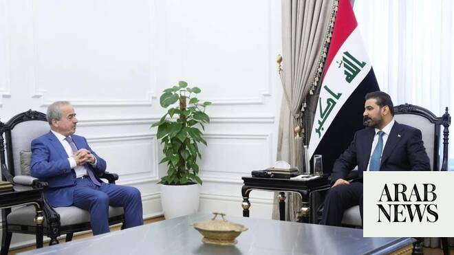

# Iraq PM to Asharq Al-Awsat: Corruption crackdown Is irreversible, arms must be under state control

Source: https://www.arabnews.com/node/2649028/middle-east
Captured source: https://www.arabnews.com/node/2649028/middle-east
Published: 2026-06-30T01:13:13+03:00
Modified: 2026-06-30T01:34:31+03:00
Author: Ghassan CharbelAsharq Al-Awsat

## Summary

BAGHDAD: Journalists live for the unexpected especially in Iraq, where events can overtake a carefully planned interview before it even begins. I had requested a meeting with Iraq’s new prime minister, Ali al-Zaidi, who emerged after a prolonged political contest involving two of his predecessors, Nouri al-Maliki and Mohammed Shia al-Sudani. The interview was scheduled for

## Image

## Video Or Embed URLs

- https://12cba6daa810941a38f833c4b0f87e59.safeframe.googlesyndication.com/safeframe/1-0-45/html/container.html
- https://static.addtoany.com/menu/sm.25.html
- about:blank
- https://www.google.com/recaptcha/api2/aframe
- https://imasdk.googleapis.com/js/core/bridge3.774.0_en.html
- https://cm.g.doubleclick.net/partnerpixels?gdpr=0&us_privacy=1---&gpp_sid=-1&url=https%3A%2F%2Fwww.arabnews.com%2Fnode%2F2649028%2Fmiddle-east

## Text

https://arab.news/c8cj6

Al-Zaidi rejects foreign pressure and pledges closer ties with neighbouring countries and the Gulf states

BAGHDAD: Journalists live for the unexpected especially in Iraq, where events can overtake a carefully planned interview before it even begins.

I had requested a meeting with Iraq’s new prime minister, Ali al-Zaidi, who emerged after a prolonged political contest involving two of his predecessors, Nouri al-Maliki and Mohammed Shia al-Sudani. The interview was scheduled for June 28th, so I arrived in Baghdad the day before. As it turned out, the timing could not have been better.

When al-Zaidi took office, I wondered whether he had made the biggest mistake of his life. He had built a successful career in finance and business and amassed considerable personal wealth. Why abandon that world for the unforgiving arena of Iraqi politics, and for a job in which success has often proved elusive?

From his first day in office, he appeared to be confronting two of Iraq’s most dangerous challenges: entrenched corruption, which has drained the country’s wealth, and armed groups operating beyond state control, which have exacted a heavy price on Iraq’s economy, reputation and regional and international relations.

I woke early in the Green Zone to messages saying that armored vehicles had sealed off the area overnight and restricted access. At first, I assumed it was a routine security incident. It soon became clear that something far more significant was under way.

Acting on judicial warrants, security forces raided the homes of figures who had long believed themselves beyond reach. Within hours, influential politicians, lawmakers and provincial officials had been detained for questioning over allegedly stolen public funds. The operation extended beyond Baghdad to other provinces and remained ongoing.

Al-Zaidi launched his tenure by giving up his salary and official allowances, declaring that he would accept no gifts, “not even a necktie.” In Baghdad, there was widespread talk that a man accused of offering him $200 million to draw him into a corruption network was now himself under investigation.

Al-Zaidi speaks in firm, unambiguous terms. He says there will be no protection for the corrupt and “no retreat from the decision to fight corruption or from the decision to bring all weapons under state control. Both will be enforced through the law.”

He also rejects foreign dictates and tutelage, insisting that Iraq will not submit to pressure from any side. When I joked that those with money seek power and those with power seek money, he replied that he was already financially secure. He said he would neither contest the next parliamentary elections nor seek a second term as prime minister. Iraqi Prime Minister Ali al-Zaidi during an interview with Asharq Al-Awsat Editor-in-Chief in Baghdad on Sunday.

The fatigue was visible in his eyes when we met. He said he had not slept for 24 hours, having followed what Baghdad residents were calling “the night the big fish were caught.”

A visit by Iranian Foreign Minister Abbas Araghchi shortened the time available for al-Zaidi’s first interview with an Arab media outlet, leaving some questions unasked.

The following is the full interview:

Q: Is the fight against corruption an irreversible decision?

A: Yes. There is no turning back, and it is not a matter of choice. Corruption has become a threat to the very existence of the Iraqi state.

Some chose to enter the institutions of the Iraqi state to steal rather than to serve. There is no longer any place for such people.

From 1980 to 2003, Iraq's wealth was consumed by wars, followed by years of sanctions, leaving Iraqis unable to benefit from the riches of their own country. That was 23 years. From 2003 until this year, 2026, another 23 years have passed, and you can clearly see what Iraq has gone through during that period. A distorted mindset emerged, driven by a race to plunder and steal. We are determined to end that era, open a new chapter for Iraq, and turn the page on that period.

Q: So, you have decided to close the chapter on corruption?

A: Yes. There is no place for corruption, and there is no place for weapons outside the authority of the state. By the end of this year, we will announce a National Sovereignty Conference that will establish the state's exclusive authority over the use of force through its official institutions alone. No group will be allowed to bear arms outside the framework of the state, and Iraqis will finally enjoy the wealth of their country.

We face two paths: either we protect the interests of certain individuals and lose the approval of God and the people, or we remove them. Today, we will instruct the finance minister to open a dedicated account to recover Iraq's stolen funds from those involved, and they must return them. Anyone who refuses to do so will face other measures. We are prepared to reach settlements with those who return misappropriated public funds while safeguarding the rights of the Iraqi people in accordance with the law. The procedures will remain confidential. I have undertaken this mission with sincere intentions for the sake of God. We owe Iraq a debt that we are duty-bound to repay.

Q: What do you mean by that responsibility?

A: Iraq has blessed us with all that we have. Where would we be today without this country? We now have a duty to repay that debt. That is why I announced that I will not receive a salary or accept any gift, even if it is only a necktie, and that my hands will never touch public money. If I ever act otherwise, I hope I receive what I deserve. I have made this pledge to myself so there can be no turning back. The highest aspiration we have is to earn God's approval and secure the happiness of the Iraqi people.

Q: Will you continue the anti-corruption campaign regardless of the cost?

A: I see death as a meeting with God, and it is the least we can offer Iraq. We have already announced that we will not seek another term and will not establish a political party. My priority is for the world to see Iraq as a true source of leadership and to recognize that its people are fully capable of governing this ancient country. I will not allow any dictates from outside our borders, whether from the East or the West. Iraq's decisions belong to its people and are expressed through parliament, and it is the government's duty to implement those decisions.

Q: So, your slogan is “Iraq First,” not the interests of major powers or regional powers?

A: Absolutely. Iraq comes first, and nothing takes precedence over it. The interests of the Iraqi people come first for me. It is also in our people's interest to build strong relations with the international community, neighboring countries, and the Arab Gulf states. Iraq is a state, not a village.

Prime Minister Ali al-Zaidi during the parliamentary vote on his government in the Iraqi Parliament (Government Media)

Q: Prime Minister, during the recent war with Iran, Iraq's relations with the Gulf Cooperation Council countries came under strain after attacks on targets in the Gulf were reportedly launched from Iraqi territory.

A: Specialized committees have been formed to verify those reports, and we are also awaiting evidence from the relevant authorities in the Gulf states. We will take the necessary measures. We have ordered an investigation and instructed all security commanders to prevent any attempt to use Iraqi territory to launch attacks against neighboring countries. At the same time, I urge everyone not to judge the present by the past. This situation already existed when we assumed office.

Q: You are scheduled to visit Washington in the middle of next month, and I assume there will be other foreign visits as well.

A: We have received many invitations to visit a number of brotherly and friendly countries, including France, Britain, and Germany. However, the visits that take priority because of the importance of our joint agenda will be to the Republic of Türkiye, the Islamic Republic of Iran, and the Kingdom of Saudi Arabia, following my visit to Washington.

Q: What do you expect from your visit to Washington? And would it be an exaggeration to say that Iraq is facing a severe financial crisis?

A: That characterization is inaccurate. State employees' salaries are secure and are being paid regularly, and we are fully committed to maintaining that. When our government took office, Iraq's debt stood at about 208 trillion dinars. The state budget relies on oil for 93 percent of its revenues, while non-oil revenues account for the remaining 7 percent.

My view is that Iraq's economy is caught between two competing economic models; an old economic model that refuses to die and a modern one struggling to be born. Our economic vision is to move decisively toward a market economy and leave the old model behind.

In practice, however, we face a large body of conflicting legislation. Some laws date back to the dissolved Revolutionary Command Council and were drafted with a socialist mindset that is no longer effective, while Iraq's constitution is founded on the principle of economic freedom. We have launched a broad effort to reform these inherited laws. In the coming days, the Council of Ministers will finalize the legislative package and submit it to parliament.

We are also moving ahead with the establishment of an Energy and Development Fund, with participation from the Central Bank of Iraq. The fund will be offered through a public subscription, and we will invite Saudi Arabia, the United Arab Emirates, and Qatar to participate, along with American and European funds and banks. The fund will support development, industry, agriculture, and all other productive sectors needed by the Iraqi people.

Q: How did your government manage public finances during the closure of the Strait of Hormuz? Did you rely on borrowing from the Central Bank while drawing on reserves?

A: We discounted promissory notes and borrowed from commercial banks as well as the Central Bank of Iraq.

Q: Iraq's position within OPEC has sparked considerable debate, and it is clear that Iraq wants a larger production quota. How do you balance increasing output with maintaining oil prices?

A: I would like to address those responsible within OPEC. Iraq entered a war in 1980 and emerged eight years later with debts exceeding $100 billion. It then became embroiled in the occupation of Kuwait and came out owing more than $200 billion. After 2003, terrorism took root in our country, and we endured years of instability. Iraqis later fought the terrorist group ISIS, not only in defense of Iraq, but on behalf of the entire region. Had ISIS succeeded in taking control of Iraq, the national security of neighboring countries and the wider region would have been threatened.

That war caused nearly $400 billion in damage to our infrastructure, and to this day thousands of Iraqis have yet to return to their hometowns and destroyed homes. These circumstances must be taken into account. In addition, Iraq's population has reached 47 million, while our production quota stands at 3.4 million barrels per day. These realities should be taken into account when OPEC determines production quotas. That is why we are seeking a fair allocation mechanism that does not undermine the rights of Iraq and its people.

Q: There have been reports that Iraq could enter a lending program with the International Monetary Fund or the World Bank. Is that still under consideration?

A: With the resumption of shipping and exports in the Gulf region and the reopening of the Strait of Hormuz, those financing options have been set aside. They are no longer needed.

Q: Washington withheld shipments of US dollar cash destined for Iraq. Do you expect to resolve this issue with the US president?

A: Those were precautionary measures, not an attempt to extract concessions in return for specific demands. There were concerns regarding cash transactions, and we explained to the American side the mechanisms governing those funds and the channels through which they moved. The issue has since been resolved, and the cash shipments have been delivered.

Members of the Saraya al-Salam cheer during a ceremony marking the start of the process of handing over their weapons to Iraqi state forces in Samarra, north of Baghdad, Iraq, Thursday, June 4, 2026. (AP Photo/Anmar Khalil)

Q: Did the government negotiate with the armed factions that oppose restricting weapons to the state? And if they ultimately refuse after the withdrawal process, will the government be forced to confront them?

A: Let me be clear: there is no force other than the force of the state. We will enforce that through the rule of law. There will be no weapons outside the state's authority.

Q: Some believe the plan to restrict weapons to the state is little more than a symbolic measure adopted to accommodate political forces.

A: If we listen to the skeptics, we will never achieve any results. As for the armed factions, they are ideological groups. We believe that their public acceptance of giving up their weapons is an important and significant first step. In practice, weapons have already been handed over to the state, in various forms, from Saraya Al-Salam, Asaib Ahl Al-Haq, and the Imam Ali Brigades. More important than the handover of weapons itself, however, is severing the link between each faction and the fighters under its command.

In practice, the weapons of these factions are now in the state's custody, with only a small amount remaining. The transfer of the remaining weapons to the armed forces will begin soon. This issue will be resolved in full. Nothing is stronger than the state. We believe resistance is a necessity, not a profession, and that necessity no longer exists. We will not accept the existence of a state within a state.

Q: What did US envoy Tom Barrack ask of you?

A: He did not make any requests. However, we discussed the suspension of operations by some American companies because of bureaucratic obstacles, and we have since facilitated the procedures affecting those companies.

Q: Do you believe the United States is genuinely prepared to support your government's plans?

A: I have spoken with President Donald Trump only once by telephone, and yes, we have sensed a willingness to provide support. At the same time, we place Iraq's interests first in every decision we make. Others may have made concessions in pursuit of material interests, but that is not something we would ever do.

Q: Prime Minister, have the political forces pledged to facilitate your mission?

A: Yes, absolutely. In fact, I was offered the post of prime minister twice before, and I declined it both times.

Q: Is there anyone who has personally influenced you?

A: Yes. My late father had the greatest influence on me. He always took me with him, detested injustice, and warned me never to incur God's displeasure by wronging His servants.

Q: How would you describe your relationship with Syria and President Ahmad al-Sharaa?

A: Our relationship is moving in a positive direction. Our foreign minister will visit Syria soon, and President al-Sharaa called to congratulate me. We are working toward greater economic openness and cooperation for the benefit of our two brotherly peoples.
