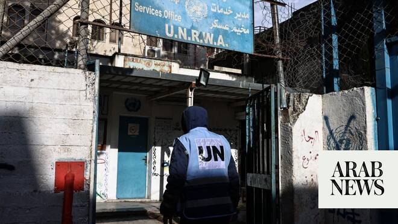

# UNRWA warns of breaking point as funding crisis threatens mandate to help Palestine refugees

Source: https://www.arabnews.com/node/2649198/middle-east
Captured source: https://www.arabnews.com/node/2649198/middle-east
Published: 2026-07-01T01:01:18+03:00
Modified: 2026-07-01T01:07:41+03:00
Author: Ephrem Kossaify

## Summary

NEW YORK CITY: The operations of the UN Relief and Works Agency for Palestine Refugees are at breaking point, its chief warned the UN General Assembly on Tuesday. Christian Saunders, UNRWA’s acting commissioner-general, appealed for emergency funding to prevent the underfunded agency from collapsing under the weight of war in Gaza, settler violence in the West Bank, and a $100

## Image

## Video Or Embed URLs

- https://189e69e6e51043edd9edd5d68b3d3403.safeframe.googlesyndication.com/safeframe/1-0-45/html/container.html
- https://static.addtoany.com/menu/sm.25.html
- about:blank
- https://imasdk.googleapis.com/js/core/bridge3.774.0_en.html
- https://www.google.com/recaptcha/api2/aframe
- https://cm.g.doubleclick.net/partnerpixels?gdpr=0&us_privacy=1---&gpp_sid=-1&url=https%3A%2F%2Fwww.arabnews.com%2Fnode%2F2649198%2Fmiddle-east

## Text

https://arab.news/mh5rb

UN Relief and Works Agency’s ‘financial situation is untenable and the viability of our operations across the region is at stake,’ says acting chief Christian Saunders

He calls for emergency funding to prevent underfunded agency collapsing under weight of war in Gaza, West Bank settler violence and $100m cash shortfall

NEW YORK CITY: The operations of the UN Relief and Works Agency for Palestine Refugees are at breaking point, its chief warned the UN General Assembly on Tuesday.

Christian Saunders, UNRWA’s acting commissioner-general, appealed for emergency funding to prevent the underfunded agency from collapsing under the weight of war in Gaza, settler violence in the West Bank, and a $100 million cash shortfall.

“UNRWA’s financial situation is untenable and the viability of our operations across the region is at stake,” he told a pledging conference convened by the president of the UN General Assembly.

Austerity measures valued at $175 million in 2025 had so far staved off mass layoffs, Saunders said, but the agency was forced in January to cut service-delivery hours by 20 percent, slash the salaries of many Palestinian members of staff, and keep 15.5 percent of international posts vacant.

“These severe austerity and cost-control measures are not sustainable in the long term and cannot continue indefinitely,” he added, warning that without fresh funding it would be impossible “to restore UNRWA operations to their past scope, or to prevent further deterioration.”

The agency, established by the General Assembly in 1949 to provide relief “necessary to prevent conditions of starvation and distress” among Palestine refugees, finds itself still indispensable 77 years later and more embattled than ever.

The fact that this is the case “reflects our collective failure to definitively address the plight of Palestine refugees today,” Saunders said.

The UN’s secretary-general, Antonio Guterres, delivered an assessment of the toll of UNRWA’s struggles on Palestinians and on the agency itself, saying that “the safety and welfare of millions of Palestine refugees hangs in the balance.”

Describing conditions in Gaza, he said that Israeli attacks had killed more than 1,000 Palestinians since last October’s ceasefire agreement, and “living conditions are utterly appalling,” with the challenges including unexploded ordnance, open sewers, rodent infestations, disease outbreaks and widespread displacement.

Guterres said he was “deeply concerned about UNRWA’s liquidity crisis, which jeopardizes its ability to implement its mandate” — a mandate, he noted, that was renewed by an overwhelming majority of UN member states just six months ago, and which underpins services provided for 2.6 million people.

He praised UNRWA staff who are working “under some of the harshest conditions imaginable,” saying: “I have rarely, if ever, seen such dedication. But let’s be real: they cannot keep going like this without urgent backing and financial support from member states.”

More than 390 agency workers have been killed, and thousands injured or subjected to abuse, since October 2023, Guterres said.

“Every single one of the agency’s premises in the Strip has been damaged or destroyed,” he added, and international staff have been barred from entering Gaza for nearly 18 months.

He condemned the seizure in January of UNRWA’s East Jerusalem headquarters as “a striking and unacceptable violation of United Nations privileges and immunities,” and said he was “appalled by continuing efforts to marginalize and undermine” the agency through “disinformation, smear campaigns, legislative actions, operational restrictions, diplomatic roadblocks and more.”

Saunders said that despite the restrictions it faced, UNRWA remained the single largest primary healthcare provider in Gaza, delivering about 80,000 medical consultations a week, approximately 14,000 a day, by more than 1,300 health workers. Its water, desalination and waste systems serve more than 1 million people, while its digital and in-person learning programs reach hundreds of thousands of children.

“These services, which keep people and hope alive, continue despite the draconian restrictions imposed on UNRWA,” he said.

Regarding the situation in the West Bank, Saunders described the largest displacement of Palestinian refugees since 1967, with military orders shutting refugee camps in the north and preventing 33,000 displaced residents from returning home.

He described the seizure by Israel of UNRWA’s compound in Sheikh Jarrah, East Jerusalem, for the stated purpose of building an Israeli military complex, “a grave escalation.”

Both Saunders and Guterres framed the survival of the agency as a matter of regional stability, rather than simply charity alone.

Guterres described it as “a stabilizing force in an age of instability” that helped counter “the hopelessness that can fuel insecurity,” and said UNRWA remains essential to the preservation of the conditions required for a two-state solution.

Saunders said the agency’s workforce of about 11,000 people was, given its scale and community trust, vital for the implementation of Security Council Resolution 2803 in support of the Gaza peace plan and the work of the Board of Peace, until power can be handed over to the Palestinian Authority.

Israel’s campaign against UNRWA has included serious allegations that agency personnel had participated in the Oct 7, 2023, terror attacks by Hamas, accusations that resulted in sweeping suspensions of international funding.

This verbal and diplomatic attempt to delegitimize the agency has been accompanied by devastating physical attacks on its facilities and personnel, culminating in legislation that effectively banned it from operating within Israel

Saunders said UNRWA had implemented 40 out of 50 recommendations from an independent review of its neutrality led by French diplomat Catherine Colonna in 2024, with the remainder underway, and reiterated its “zero tolerance” policy on any breaches of neutrality or staff misconduct.

Guterres echoed this assurance that the agency had “taken decisive steps to ensure its house is in order.”

Both officials appealed for member states to match political backing for the agency with funding.

“Your political support is crucial but I urge you to match it with the necessary financial resources,” Guterres said. “Not next year. Not next month. Now.”

Saunders asked donors for sustained political support to ensure UNRWA’s capacities can be “fully deployed in Gaza,” and for the funding needed for a 5-to-10-year program of reforms that would make the agency “more financially sustainable” and “fit for purpose.”
