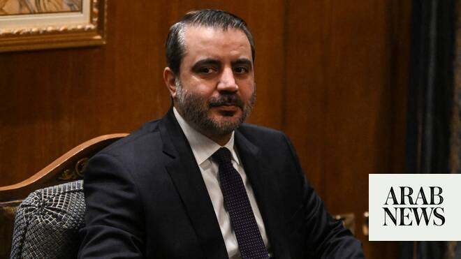

# Syrian foreign minister says Syria open to meeting Hezbollah, according to media reports

Source: https://www.arabnews.com/node/2649380/middle-east
Captured source: https://www.arabnews.com/node/2649380/middle-east
Published: 2026-07-02T12:42:26+03:00
Modified: 2026-07-02T15:14:01+03:00
Author: Reuters

## Summary

BEIRUT: Syria’s foreign ​minister said during a visit to Beirut on Thursday that Syria was open to meeting the Iran-backed Lebanese group Hezbollah “if interests require it,” Lebanon’s state news agency reported. Asaad Al-Shibani met Lebanese government leaders including President Joseph Aoun and parliament speaker Nabih Berri, a Hezbollah ally. It was his first visit there

## Image

## Video Or Embed URLs

- blob:https://www.arabnews.com/6e92d9a3-e90c-4fdf-8b82-62548d0e7f73
- https://imasdk.googleapis.com/js/core/bridge3.774.0_en.html
- https://fa690619b2323c0853f1cf93ebddc753.safeframe.googlesyndication.com/safeframe/1-0-45/html/container.html
- https://static.addtoany.com/menu/sm.25.html
- about:blank
- https://ep2.adtrafficquality.google/sodar/sodar2/255/runner.html
- https://www.google.com/recaptcha/api2/aframe
- https://cm.g.doubleclick.net/partnerpixels?gdpr=0&us_privacy=1---&gpp_sid=-1&url=https%3A%2F%2Fwww.arabnews.com%2Fnode%2F2649380%2Fmiddle-east

## Text

https://arab.news/ncg94

US President Donald Trump in June raised possibility of Syrian forces combating Hezbollah

Syrian ‌foreign minister Asaad Al-Shibani met Lebanese president and parliament speaker

BEIRUT: Syria’s foreign ​minister said during a visit to Beirut on Thursday that Syria was open to meeting the Iran-backed Lebanese group Hezbollah “if interests require it,” Lebanon’s state news agency reported.

Asaad Al-Shibani met Lebanese government leaders including President Joseph Aoun and parliament speaker Nabih Berri, a Hezbollah ally. It was his first visit there since US President Donald Trump raised the possibility of Syrian forces combating Hezbollah in Lebanon.

Syrian President Ahmed Al-Sharaa has previously denied what he called rumors about any Syrian presence entering Lebanon.

The former rebels and commanders that now run Syria fought against Hezbollah for ‌years while it ‌deployed to Syria to support former President Bashar Assad.

Now that ​they ‌are ⁠in ​power, they ⁠are having to calibrate alliances and military action carefully in efforts to maintain relative stability in Syria, which is still recovering from 14 years of civil war.

Shibani said the “Hezbollah file” was not raised during his meetings in Lebanon on Thursday, but that Syria was open to meeting the group, the Lebanese state news agency cited him as saying. It did not immediately publish any further comments from Shibani.

A statement from Aoun said that neighbors Syria and Lebanon wanted each other’s stability and ⁠that Sharaa had assured him that Syria would not take sides in ‌Lebanon’s internal issues.

Syria’s new government under former al ‌Qaeda commander Sharaa has emerged as a US ally since ​his forces toppled President Bashar Assad in 2024, ‌and has largely stayed out of the regional war between the US and Israel, ‌and Iran.

Hezbollah is in a war with Israel that has brought destruction to large parts of southern Lebanon. US-sponsored efforts to halt fighting between the two sides have reduced hostilities but failed to bring peace.

Trump said last month he had spoken to Sharaa about combating Hezbollah, after criticizing Israel for killing too many ‌civilians in Lebanon. “I suggested to Israel to let Syria take care of Hezbollah, because to be honest with you, I think they do ⁠a better job ⁠of doing it,” Trump said.

Damascus wary of being drawn into war

Sharaa has since said that “the rumors circulating about Syria entering Lebanon are completely unfounded,” according to Syrian state media.

Reuters reported in March that the US had encouraged Syria to consider sending forces into eastern Lebanon to help disarm Hezbollah, but that Damascus was reluctant to embark on such a mission for fear of being sucked into the war in the Middle East and inflaming sectarian tensions in Syria and Lebanon.

Trump’s special envoy to Syria, Tom Barrack, dismissed the report of the US encouraging Syria to send forces into Lebanon as “false and inaccurate.”

Syria long dominated Lebanon under the Assad family, sending in forces in 1976 during the 1975-90 civil war and controlling Lebanon’s post-war politics ​until its withdrawal in 2005.

Any Syrian ​intervention could fuel sectarian tensions in both Syria and Lebanon, home to a mosaic of sects including Sunni Muslims, Shiite Muslims, Christians and Druze.

Lebanese President committed to establishing fraternal relations

After a meeting with the Syrian foreign minister, Aoun said he is keen on both countries' stability and is reassured by the coordination between Beirut and Damascus, especially in the areas of border control and preventing the smuggling of persons and weapons.

The president also said Al Sharaa assured him multiple times that Syria's role “will not be like its role in the past” and that a “new page has been opened” dispeling rumors about Syria's involvement in fighting Hezbollah. Aoun added it is not in Lebanon's interest in this critical phase is not to squander American support for reaching a solution as per the framework formula, in addition to the positions of the European Union and supportive Gulf states as he stated the country will not cede “a single inch” of territory to Israel.
