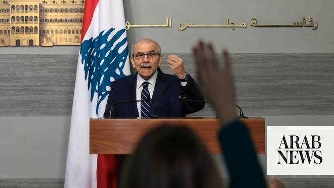

# Can Lebanon still prosecute Israel for war crimes under framework agreement?

Source: https://www.arabnews.com/node/2649436/middle-east
Captured source: https://www.arabnews.com/node/2649436/middle-east
Published: 2026-07-02T18:36:24+03:00
Modified: 2026-07-02T18:36:24+03:00
Author: NAJIA HOUSSARI

## Summary

BEIRUT: Lebanese Prime Minister Nawaf Salam reassured critics that the US-brokered framework agreement with Israel does not prevent Lebanon from pursuing legal action over alleged Israeli war crimes, insisting the accord merely suspends such action while negotiations proceed in good faith. The clarification came after Clause 13 of the framework agreement sparked criticism from

## Image

## Video Or Embed URLs

- https://a8ee81864ae1e644853680ca507c34a5.safeframe.googlesyndication.com/safeframe/1-0-45/html/container.html
- https://static.addtoany.com/menu/sm.25.html
- about:blank
- https://imasdk.googleapis.com/js/core/bridge3.774.0_en.html
- https://www.google.com/recaptcha/api2/aframe
- https://cm.g.doubleclick.net/partnerpixels?gdpr=0&us_privacy=1---&gpp_sid=-1&url=https%3A%2F%2Fwww.arabnews.com%2Fnode%2F2649436%2Fmiddle-east

## Text

https://arab.news/8wxpe

Clarification came after Clause 13 of the framework agreement sparked criticism from legal experts, activists and opposition figures

Lebanese PM Nawaf Salam pointed to past peace negotiations in which parties temporarily suspended legal proceedings to facilitate political settlements

BEIRUT: Lebanese Prime Minister Nawaf Salam reassured critics that the US-brokered framework agreement with Israel does not prevent Lebanon from pursuing legal action over alleged Israeli war crimes, insisting the accord merely suspends such action while negotiations proceed in good faith.

The clarification came after Clause 13 of the framework agreement sparked criticism from legal experts, activists and opposition figures, who argued that its wording could undermine Lebanon’s ability to hold Israel accountable before international courts.

Speaking in a televised address on Wednesday evening, Salam rejected those concerns, saying Lebanon had “not given up any right.”

The clause, he explained, “stipulates the halting or suspension of the right to resort to international courts for as long as negotiations are proceeding in good faith.”

Salam, a former president of the International Court of Justice, argued that international humanitarian law does not permit states to waive accountability for war crimes. Under the Fourth Geneva Convention, he said, such rights fall within peremptory norms of international law, or jus cogens, and therefore cannot be surrendered through political agreements.

Article 13 of the framework states that Lebanon and Israel, “in line with their shared goals to establish stable and peaceful relations,” will take “good faith measures” including refraining from “all hostile or adverse actions in international political or legal fora.”

Critics, however, argued that the clause is too “broadly worded”, raising concerns that it could hinder Lebanon’s ability to pursue future war crimes cases against Israel before international courts, including the International Criminal Court, or that Israel could cite the agreement to challenge Lebanese complaints before international courts or the United Nations.

Opponents warned that, if interpreted broadly, the provision could effectively delay accountability for alleged Israeli violations committed since the war began in October 2023, which killed thousands of people and devastated entire villages in southern Lebanon.

A constitutional source told Arab News that the decision on whether to prosecute Israel rests with the Lebanese state, which has the authority to determine if and when to initiate legal proceedings.

“The right to prosecute Israel is guaranteed under both the Constitution and international law, and no one can prevent the Lebanese state from exercising it,” the source said.

“However, the state may consider the current circumstances unfavorable and choose to initiate legal proceedings at a more opportune time.”

The source rejected claims that signing the framework agreement would bind Lebanon to Israel, stressing that the right to prosecute is recognized under international law.

“Even if Lebanon signed the framework agreement stipulating that clause, its right to pursue legal action would supersede any such agreement.”

The source noted that war crimes do not have a statute of limitations. Peremptory norms of international law, such as the Geneva Conventions and the Vienna Convention, invalidate any political agreement that waives the state’s right to prosecute perpetrators of these crimes.

The UN High Commissioner for Human Rights had previously sent a team to Lebanon to assess the impact of the attacks on civilians and infrastructure, in a move to strengthen existing efforts to document violations.

In his address, Salam said Deputy Prime Minister Tarek Mitri’s trip to Geneva was also part of a continuing effort to document every Israeli war crime and violation through Lebanon’s channels there, building a case to be wielded as a “deterrent legal weapon” in the international courts should the talks go astray.

Salam pointed to past peace negotiations in which parties temporarily suspended legal proceedings to facilitate political settlements, citing Algeria’s National Liberation Front during the Évian Accords and the African National Congress in South Africa.

A Lebanese official source following the Lebanese-Israeli negotiations confirmed to Arab News that Lebanon decided during the negotiation phase to temporarily suspend legal action against Israel, based on the good faith outlined in the framework agreement, until the current phase concludes.

However, the source said Lebanon will take “further action” if Israel breaches the implementation of everything agreed upon in the framework.

The withdrawal phase, according to the pilot zones agreement, remains suspended by the Israeli side. The official source told Arab News that Israel continues to link the withdrawal to political and security considerations.

The legal debate carries significant implications given the scale of alleged violations that Lebanon says could eventually form the basis of future prosecutions.

Among the alleged violations that could be prosecuted before the ICC is the widespread destruction of dozens of towns and residential neighborhoods in southern Lebanon. Demolition operations have continued even after the framework agreement was signed in Washington, according to Lebanese officials.

The Rome Statute considers the widespread destruction of property, when not militaryly necessary, a war crime requiring accountability.

Israeli violations include targeting bridges, roads, and civilian infrastructure, which are objects of special protection under international humanitarian law.

The violations also include the displacement of more than 1.2 million people from their homes as a result of direct Israeli evacuation notices.

The Rome Statute criminalizes the deportation or forcible transfer of civilian populations when carried out through coercion or compulsory acts.

Amnesty International has previously accused Israel of forcible displacement and the destruction of infrastructure in southern Lebanon.

Among the violations are the targeting of hospitals, doctors, paramedics, and journalists.

These are civilians whose protection is guaranteed under international law, and the rules of humanitarian law affirm that deliberately attacking these groups, when the elements of the crime are met, constitutes war crimes that are not subject to statutes of limitations.

The total number of journalists and photographers killed by Israeli rockets reached 26, with dozens more wounded, including some who sustained permanent disabilities.

The Lebanese Ministry of Foreign Affairs had previously submitted two complaints against Israel to the Security Council on June 10 and 11 of last year, due to the Israeli army's spraying of glyphosate over a number of border Lebanese villages.

The ministry highlighted in its complaints that the Chemical Weapons Convention prohibits the use of herbicides as a method of warfare, in addition to the Israeli army's targeting of a Lebanese military vehicle, which resulted in the martyrdom of two officers and a soldier.

It called upon the UN to condemn this targeting, take the necessary immediate measures, and ensure compliance with the UN Charter and international resolutions.

The latest data from the Lebanese Ministry of Health indicates that 4,230 people have been killed and more than 12,000 wounded during the recent war that broke out since last March 2.
