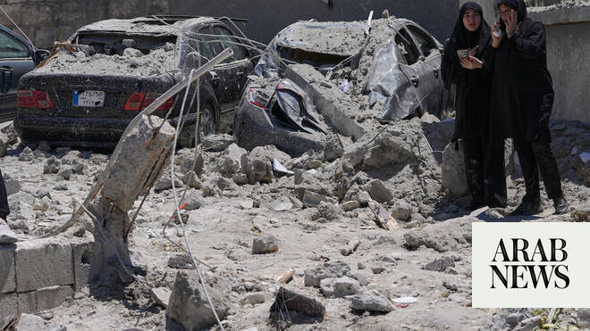

# UN human rights investigators begin work in Lebanon in ‘first of its kind’ mission

Source: https://www.arabnews.com/node/2649600/middle-east
Captured source: https://www.arabnews.com/node/2649600/middle-east
Published: 2026-07-03T23:49:19+03:00
Modified: 2026-07-03T23:49:19+03:00
Author: Ephrem Kossaify

## Summary

NEW YORK: A team of UN human rights investigators is on the ground in Lebanon collecting evidence on violations committed by all parties to the conflict since March 2, after Beirut granted guarantees for the mission’s deployment, a spokesman for the UN Human Rights Office told Arab News. “Our team is currently working in Lebanon after having received the necessary guarantees

## Image

## Video Or Embed URLs

- https://a46a1ff38045f63f876da053a0d3c690.safeframe.googlesyndication.com/safeframe/1-0-45/html/container.html
- https://static.addtoany.com/menu/sm.25.html
- about:blank
- https://imasdk.googleapis.com/js/core/bridge3.774.0_en.html
- https://www.google.com/recaptcha/api2/aframe
- https://cm.g.doubleclick.net/partnerpixels?gdpr=0&us_privacy=1---&gpp_sid=-1&url=https%3A%2F%2Fwww.arabnews.com%2Fnode%2F2649600%2Fmiddle-east

## Text

https://arab.news/6npk9

Investigators will probe all parties to the conflict, and will collect information, evidence for possible use in future investigations

OHCHR spokesman tells Arab News team security ‘paramount’ as access sought to areas hit by hostilities on both sides of Lebanese-Israeli border

NEW YORK: A team of UN human rights investigators is on the ground in Lebanon collecting evidence on violations committed by all parties to the conflict since March 2, after Beirut granted guarantees for the mission’s deployment, a spokesman for the UN Human Rights Office told Arab News.

“Our team is currently working in Lebanon after having received the necessary guarantees from the government of Lebanon,” OHCHR spokesman Thameen Al-Kheetan said.

“Their work entails interviews with victims of human rights violations, witnesses, civil society representatives, human rights defenders and other relevant actors.”

The mission, whose deployment was announced by UN High Commissioner for Human Rights Volker Turk on June 10, will seek access to areas hit by hostilities on both sides of the Lebanese-Israeli border, Al-Kheetan said, adding that “the security and safety of our team and our interlocutors are obviously paramount.”

Speaking to reporters in Geneva when he announced the mission, Turk called it a first for his office.

“It’s the first time that we are sending this assessment mission, and the idea is, indeed, to look at violations by all parties — violations of international law, violations of international human rights law, and to document this, and eventually to report back to you on our findings,” he said.

In a statement issued the same day, Turk said that accountability “cannot be overstated,” calling for “prompt and independent investigations into alleged violations.”

Al-Kheetan said the mission was conducted “upon agreement between the UN Human Rights Office and the government of Lebanon, which agreed to provide appropriate guarantees for its deployment.”

He added that the team “will seek to collect information and evidence on alleged violations and abuses by all parties and will therefore seek access to victims on all sides of the conflict.”

The mission follows weeks of engagement between Beirut and Geneva. Lebanese Prime Minister Nawaf Salam told a Cabinet meeting in May that it was important to continue documenting potential crimes and submit them to the UN.

An OHCHR report published in April on deaths and displacement during the first three weeks of the escalation had already documented violations. It found that Israeli operations “involved cases of direct attacks on civilians, including medical personnel,” and documented incidents in which strikes “hit, and in some cases levelled, multi-story residential buildings, killing entire families.”

The report said such strikes “may constitute serious violations of international humanitarian law,” and that in many cases “no warnings, or no reasonably effective warnings, were given, preventing many civilians from evacuating safely.”

It also documented Hezbollah firing what it described as unguided rockets into Israeli residential areas, damaging buildings and other civilian infrastructure — attacks it likewise said may amount to serious violations of international humanitarian law.

The death toll in the conflict continues to climb even as the situation shows signs of easing. The Lebanese Ministry of Public Health has recorded at least 3,798 people killed and 11,781 injured since March 2.

Attacks on healthcare have been a recurring feature of the conflict. The World Health Organization’s surveillance system has recorded at least 203 attacks affecting healthcare in Lebanon since March 2, resulting in 135 deaths and 394 injuries among on-duty medical workers, with hospitals including Tebnine Governmental Hospital and Hiram Hospital in Tyre struck multiple times over the course of the war.

Journalists have also been targeted. Lebanese journalist Amal Khalil was killed and photographer Zeinab Faraj wounded in an Israeli strike in south Lebanon.

At the height of the escalation, more than a million people were displaced nationwide, with tens of thousands sheltering in overcrowded collective shelters, schools, and open spaces across Beirut, Mount Lebanon, the South and Nabatieh governorates

Al-Kheetan made clear the assessment mission will not pursue prosecutions. “Our office conducts human rights investigations. It does not carry out criminal investigations,” he said.

Information gathered will instead be “carefully and securely preserved” so it “can then be requested by future accountability processes, meeting international standards.”

He said the mission’s existence “does not absolve the parties to the conflict of their own responsibilities under international law to carry out investigations of alleged violations and ensure accountability,” adding that judicial and nonjudicial accountability mechanisms remain “an essential part of the effective remedies that victims of serious violations are owed under international law.”

Al-Kheetan said the team will be in Lebanon for several months to collect information that will subsequently have to be “rigorously assessed and analyzed” before findings and conclusions are reflected in a report.

The timeline “will depend significantly on the extent and kinds of information collected and requiring analysis,” he said.
