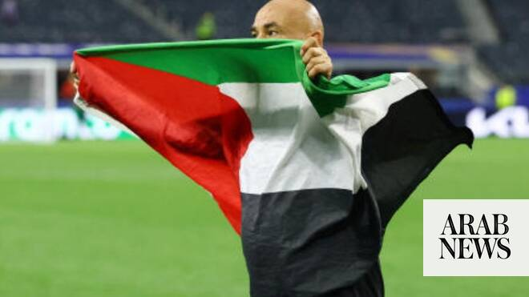

# Egypt coach dedicates historic World Cup win to ‘good people’ of Palestine

Source: https://www.arabnews.com/node/2649653/sport
Captured source: https://www.arabnews.com/node/2649653/sport
Published: 2026-07-04T18:26:50+03:00
Modified: 2026-07-04T18:26:50+03:00
Author: Arab News

## Summary

BEIRUT: Shortly after Egypt made history by reaching a World Cup 16th round for first time by beating Australia, their coach celebrated the victory by waving a Palestinian flag. Hossam Hassan’s players had just won their Round of 32 match against Australia in a penalty shootout at Dallas Stadium on Friday when he carried a Palestinian flag and headed to one of the corners to

## Image

## Video Or Embed URLs

- blob:https://www.arabnews.com/0f5c7d8b-bdd6-412d-84b4-b2769bdc9140
- https://imasdk.googleapis.com/js/core/bridge3.774.0_en.html
- https://91553f687fc0d11b2beea169b41b63e6.safeframe.googlesyndication.com/safeframe/1-0-45/html/container.html
- about:blank
- https://static.addtoany.com/menu/sm.25.html
- https://sync.teads.tv/wigo-no-slot
- https://ep2.adtrafficquality.google/sodar/sodar2/255/runner.html
- https://www.google.com/recaptcha/api2/aframe
- https://cm.g.doubleclick.net/partnerpixels?gdpr=0&us_privacy=1---&gpp_sid=-1&url=https%3A%2F%2Fwww.arabnews.com%2Fnode%2F2649653%2Fsport

## Text

https://arab.news/jjpxw

Videos of Hossam Hassan celebrating with Palestinian and Egyptian flags go viral across social media

‘I dedicate this win to the people of Egypt and the people of Palestine,’ Hassan says

BEIRUT: Shortly after Egypt made history by reaching a World Cup 16th round for first time by beating Australia, their coach celebrated the victory by waving a Palestinian flag. For the latest updates, follow us @ArabNewsSport Hossam Hassan’s players had just won their Round of 32 match against Australia in a penalty shootout at Dallas Stadium on Friday when he carried a Palestinian flag and headed to one of the corners to celebrate the historic win. Videos of Hassan celebrating while carrying the flags of Palestine and Egypt went viral. “My heart and soul are with the good people of Palestine. I thank them very much for being happy for us. God bless them and have mercy on the souls of their martyrs. And I would like to tell them: I dedicate this win to the people of Egypt and the people of Palestine,” Hassan said after the match. In a 28-second video shared and reposted thousands of times on X, Hassan, a former striker who represented his country in the 1990 World Cup in Italy, was seen waving the Palestinian flag while a group of fans could be heard chanting: “Free, free Palestine.” Meanwhile, another set of related videos on social media showed people in Gaza wildly celebrating Egypt’s win, a victory that means the Pharaohs will face Lionel Messi’s Argentina in a 16th-round clash.

For the latest updates, follow us @ArabNewsSport
