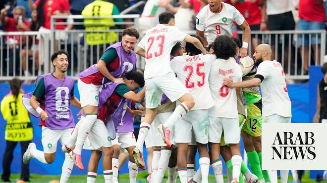

# Morocco beat co-hosts Canada to reach quarter-finals of World Cup

Source: https://www.arabnews.com/node/2649676/sport
Captured source: https://www.arabnews.com/node/2649676/sport
Published: 2026-07-04T22:04:20+03:00
Modified: 2026-07-04T22:37:06+03:00
Author: Arab News

## Summary

HOUSTON: Morocco produced a patient and professional performance to sweep past World Cup co-hosts Canada 3-0 in their round-of-16 clash on Saturday. A second-half brace from Azzedine Ounahi and a late Soufiane Rahimi strike on the break saw the Atlas Lions overpower their opponents, who offered little going forward throughout the match. Less than 24 hours earlier, Egypt had

## Image

## Video Or Embed URLs

- blob:https://www.arabnews.com/f9d0ae5d-b383-4d19-965c-90ad05ecf8fb
- https://imasdk.googleapis.com/js/core/bridge3.774.0_en.html
- https://f1c8011822fece3b311dd7824be8b76b.safeframe.googlesyndication.com/safeframe/1-0-45/html/container.html
- https://static.addtoany.com/menu/sm.25.html
- about:blank
- https://www.google.com/recaptcha/api2/aframe
- https://cm.g.doubleclick.net/partnerpixels?gdpr=0&us_privacy=1---&gpp_sid=-1&url=https%3A%2F%2Fwww.arabnews.com%2Fnode%2F2649676%2Fsport

## Text

https://arab.news/znpak

A second-half double from Azzedine Ounahi saw the Atlas Lions overpower their opponents

HOUSTON: Morocco produced a patient and professional performance to sweep past World Cup co-hosts Canada 3-0 in their round-of-16 clash on Saturday.

For the latest updates, follow us @ArabNewsSport

A second-half brace from Azzedine Ounahi and a late Soufiane Rahimi strike on the break saw the Atlas Lions overpower their opponents, who offered little going forward throughout the match.

Less than 24 hours earlier, Egypt had sent football fans around the Arab world into wild celebrations when they beat Australia on penalties in their first ever World Cup knockout match. They will now face reigning world champions Argentina in the Round of 16 on Tuesday, July 7 at Mercedes Benz Stadium in Atlanta.

Morocco, however, have been here before. In 1986 they became the first Arab nation to reach the knockout stages, before eventually losing to West Germany, while at Qatar 2022 they captured the hearts of millions around the world with a sensational run to the semi-finals where they lost 2-0 to France.

Even with Canada, they had previous. During their glorious run four years ago, they beat this tournament’s co-hosts 2-1 to top a group that also included Croatia and Belgium.

Several stalwarts from that team, such as Achraf Hakimi, Yassine Bounou, Noussair Mazraoui and Azzedine Ounahi, are still pivotal to the team and they have been joined by the likes of the gifted 18-year-old Ayyoub Bouaddi and new Bayern Munich signing Ismael Saibari, winning penalty hero against the Netherlands in the Round of 32.

To many, Morocco were clear favourites going into the match, and so it proved.

They will face the winner of the match between France and Paraguay, being played later on Saturday in Philadelphia.
