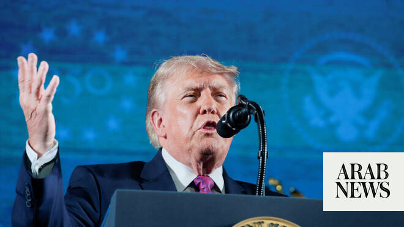

# Trump mixes patriotism with partisanship as he celebrates America’s ‘joyous’ 250th anniversary

Source: https://www.arabnews.com/node/2649705/world
Captured source: https://www.arabnews.com/node/2649705/world
Published: 2026-07-05T05:08:02+03:00
Modified: 2026-07-05T08:25:48+03:00
Author: AP

## Summary

WASHINGTON: President Donald Trump mixed partisan politics with patriotic appeals on Saturday as he commemorated the 250th anniversary of American independence, a moment he declared “one of the most joyous and glorious milestones of all time.” Speaking in Washington after storms prompted a roughly two-hour evacuation of the National Mall, Trump honored veterans, including

## Image

## Video Or Embed URLs

- https://f6ab6ed42d843689302eab8462fa84f2.safeframe.googlesyndication.com/safeframe/1-0-45/html/container.html
- https://static.addtoany.com/menu/sm.25.html
- about:blank
- https://imasdk.googleapis.com/js/core/bridge3.774.0_en.html
- https://www.google.com/recaptcha/api2/aframe
- https://sync.teads.tv/wigo-no-slot
- https://cm.g.doubleclick.net/partnerpixels?gdpr=0&us_privacy=1---&gpp_sid=-1&url=https%3A%2F%2Fwww.arabnews.com%2Fnode%2F2649705%2Fworld

## Text

https://arab.news/8tqt8

Past presidents have generally avoided in-person appearances at July 4 ‌celebrations, but Trump has blurred the line between official commemoration and ‌campaign-style politics

WASHINGTON: President Donald Trump mixed partisan politics with patriotic appeals on Saturday as he commemorated the 250th anniversary of American independence, a moment he declared “one of the most joyous and glorious milestones of all time.” Speaking in Washington after storms prompted a roughly two-hour evacuation of the National Mall, Trump honored veterans, including several from World War II and one of the first Black officers to lead a Special Forces team in combat in Vietnam. They appeared before flags that symbolized some of the most significant and challenging moments in American history, from the one that was draped over Abraham Lincoln’s casket to the one that flew on the plane piloted by the Wright Brothers. Yet Trump also leaned into partisan territory unusual for an Independence Day address, which presidents typically use as a moment to unify the country. Instead, he stumped again for the SAVE America Act, an elections bill that’s encountering challenges even from Trump’s fellow Republicans in Congress. He highlighted his support for the Second Amendment and revived denunciations of communism, which are becoming an increasingly central part of Trump’s message ahead of the November midterms. The speech capped a holiday that Trump has gone to great lengths to shape to his own tastes. He was introduced by two musical performers who often appear at his trademark rallies, including Lee Greenwood, who performed “God Bless America.” The event organizers were largely aligned with the White House, supplanting a bipartisan organization that was launched by Congress a decade ago. “We will always be on top,” Trump said. “We will never let our country fall. We will always be the best.” Trump didn’t talk about himself as much as he does during his normal rally speeches. Still, he still found time to include a joke about seeking a third presidential term and about World War II’s “greatest generation.” “They are the greatest generation,” Trump said. “I hate to admit that, but they are.” Anticipation for the milestone holiday has been building for much of the year, serving as an opportunity for Americans to reflect on their complicated history as onetime colonizts of an empire who became a superpower of their own. Organizers of celebrations months in the making had to adjust or cancel activities entirely as much of the East Coast sweltered under heat that approached and in many cases surpassed triple digits.

Heat is defining the big weekend in many places Severe weather prompted the cancelation of celebrations in Hartford, Connecticut, along with Harrisburg and Wilkes-Barre, Pennsylvania. Spectators at Boston’s fireworks and concert were told to briefly seek shelter before events later resumed. An evacuation was also ordered in Philadelphia. New York and Pittsburgh moved forward with fireworks but shifted the time to accommodate the shifting weather. The disruption was particularly acute in Washington, where signs at the Great American State Fair posted an alert shortly after 7 p.m. ET encouraging participants to leave the area. Crowds gathered in museums, subway stations and federal buildings near the Mall. At the Ronald Reagan Building and International Trade Center they waited in chairs and sat on the floor to cool off in the air conditioning. Crowds were building in the area several hours before the evacuation. Tina Hale, 58, of Cohoes, New York, watched three of her grandchildren children dip their hands into a pool of water near a museum. Hale pointed toward the sky and urged them to look up as three military jets roared above the crowd. “If that doesn’t make you proud to be an American,” she said. David Koshko, 42, and his wife, Jennifer Koskho, of Harrisburg, Pennsylvania, came to Washington for a baseball game but planned to stay for the city’s fireworks show. After baking in the heat for hours during the Pittsburgh Pirates’ win over the Washington Nationals, they took a break in the shade of an overpass near the National Mall to plot their next stop. “Just to be a part of the 250 years (anniversary) is an amazing thing,” said David Koshko, a commercial driver and veteran of the Marine Corps reserves. In Philadelphia, fireworks began to crack as early as midday in the birthplace of the nation near the site where the Declaration of Independence was adopted by delegates to the Second Continental Congress. Hundreds of visitors were gathering at Independence Hall in the sweltering heat to await the celebrations coinciding with the France-Paraguay World Cup knockout game at Philadelphia Stadium, which began with commemorations of the holiday. “It’s one big party in here,” Carlos Alban, who traveled to Philadelphia from Chicago to watch the match, said as he arrived at the stadium, adding that he spotted a fan in the parking lot dressed as one of the Founding Fathers. In New York, tall ships, with their masts, rigging and white sails outlined against a blue sky, made a procession around the Statue of Liberty and up the Hudson River, recalling the fanfare around America’s 200th anniversary in 1976. The 43 ships were followed by a display of aerial might with a stealth bomber and the Navy’s Blue Angels. Patrouille de France, the French Air Force’s acrobatic teams, flew over New York Harbor with their red, white and blue trails, evoking images of the American flag. “We got up early and just rode our bikes about a mile down here to come see the scene,” said Oona Moore, a Jersey City, New Jersey, resident who took in the New York festivities. “We saw the tall ships and we saw the planes, you know, all different manner of military aircraft. I’ve never seen it so close and in the sky at the same time.” At George Washington’s Mount Vernon, people took the Oath of Allegiance to become US citizens. They stood with eyes closed and hands over hearts for the national anthem. In Phoenix, Steven Dortch, 25, and his brother JayLn Dortch, 23, gathered at Granada Park to try to forge a new July 4 cookout tradition. JayLn Dortch said young people in the US give him hope by thinking for themselves and not taking the words from older people at face value. He said the country needs to keep in mind the everyday, hardworking people who “keep America going.”
