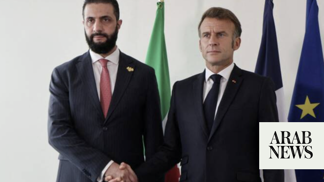

# Syria expecting Macron in first post-Assad visit by Western head of state

Source: https://www.arabnews.com/node/2649735/middle-east
Captured source: https://www.arabnews.com/node/2649735/middle-east
Published: 2026-07-05T15:07:36+03:00
Modified: 2026-07-05T20:02:22+03:00
Author: AFP

## Summary

DAMASCUS: Syria said on Sunday it was expecting a visit by French President Emmanuel Macron, the first by a Western European head of state since Syria’s new leader Ahmed Al-Sharaa took power in 2024. State news agency SANA, citing the Syrian presidency’s media office, said “Macron is expected to visit Syria to discuss ways of strengthening bilateral relations and issues of

## Image

## Video Or Embed URLs

- https://05c10d72ad95592c6c6f09402e4c50b0.safeframe.googlesyndication.com/safeframe/1-0-45/html/container.html
- https://static.addtoany.com/menu/sm.25.html
- about:blank
- https://imasdk.googleapis.com/js/core/bridge3.774.0_en.html
- https://www.google.com/recaptcha/api2/aframe
- https://sync.teads.tv/wigo-no-slot
- https://cm.g.doubleclick.net/partnerpixels?gdpr=0&us_privacy=1---&gpp_sid=-1&url=https%3A%2F%2Fwww.arabnews.com%2Fnode%2F2649735%2Fmiddle-east

## Text

https://arab.news/np49h

Macron would be the first Western European head of state to visit since the fall of Bashar Assad’s regime

DAMASCUS: Syria said on Sunday it was expecting a visit by French President Emmanuel Macron, the first by a Western European head of state since Syria’s new leader Ahmed Al-Sharaa took power in 2024. State news agency SANA, citing the Syrian presidency’s media office, said “Macron is expected to visit Syria to discuss ways of strengthening bilateral relations and issues of common interest,” without specifying a date for the trip. The French presidency did not immediately comment. The last French president to visit was Nicolas Sarkozy in 2009, before longtime ruler Bashar Assad brutally crushed pro-democracy protests in 2011, sparking a conflict that killed more than half a million people and devastated Syria. SANA said Macron would be accompanied by a delegation “including investors and representatives of French companies” and discussions would also address “regional and international” developments. The announcement came after a bombing at a Damascus cafe on Thursday killed 10 people, the latest challenge to Syria’s new authorities as they seek to reunify the country after more than 13 years of civil war. Early last year, Qatar’s Emir Sheikh Tamim bin Hamad Al-Thani became the first foreign head of state to visit Damascus after Assad’s December 2024 toppling. European Commission chief Ursula von der Leyen visited in January, and Ukraine’s President Volodymyr Zelensky followed in April. But Macron is the first head of an EU state and prominent Western leader to head to the Syrian capital, after hosting Sharaa in Paris last year. That visit preceded Sharaa’s Washington trip last year to meet US President Donald Trump.
