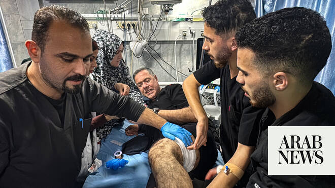

# ‘We want to know he’s safe’ — family awaits Israeli response on detained Gaza doctor after court order

Source: https://www.arabnews.com/node/2649850/middle-east
Captured source: https://www.arabnews.com/node/2649850/middle-east
Published: 2026-07-06T16:41:00+03:00
Modified: 2026-07-06T17:05:29+03:00
Author: Sherouk Zakaria

## Summary

DUBAI: The son of detained Gaza hospital director Dr. Hussam Abu Safiya said the family was “anxiously awaiting” Israel’s response to concerns over the doctor’s deteriorating condition in custody. Elias Abu Safiya’s remarks came after the Israeli Supreme Court on Sunday ordered the government to respond within two days to allegations that Abu Safiya has been subjected to

## Image

## Video Or Embed URLs

- https://5fe28793a1b7af8653cf9e714aaea732.safeframe.googlesyndication.com/safeframe/1-0-45/html/container.html
- https://static.addtoany.com/menu/sm.25.html
- about:blank
- https://www.google.com/recaptcha/api2/aframe
- https://imasdk.googleapis.com/js/core/bridge3.774.0_en.html
- https://cm.g.doubleclick.net/partnerpixels?gdpr=0&us_privacy=1---&gpp_sid=-1&url=https%3A%2F%2Fwww.arabnews.com%2Fnode%2F2649850%2Fmiddle-east

## Text

https://arab.news/m7zyg

Israeli Supreme Court ordered the government to respond within two days to allegations that Abu Safiya has been subjected to torture

Elias Abu Safiya said family hoped the court order would finally compel Israeli authorities to disclose his father’s condition

DUBAI: The son of detained Gaza hospital director Dr. Hussam Abu Safiya said the family was “anxiously awaiting” Israel’s response to concerns over the doctor’s deteriorating condition in custody.

Elias Abu Safiya’s remarks came after the Israeli Supreme Court on Sunday ordered the government to respond within two days to allegations that Abu Safiya has been subjected to torture and is facing life-threatening deterioration in prison.

The court instructed the state to submit by Tuesday its response to a petition filed by Physicians for Human Rights Israel in April. The petition sought the immediate release of 14 Palestinian doctors held without charge, while specifically addressing serious allegations concerning Abu Safiya’s physical and psychological state.

Speaking to Arab News, Elias said the family hoped the court order would finally compel Israeli authorities to disclose his father’s condition after more than 18 months in detention without charge.

“As a family, we wait with painful hearts for an official and clear response from the Israeli government regarding my dad’s physical and mental health and the violations he has been subjected to during his time in prison,” he said from Kazakhstan. “We want to know he’s safe and well. This is all we hope for.”

Elias said the family is increasingly fearful after reports from Abu Safiya’s lawyer alleged that the pediatrician and director of Kamal Adwan Hospital in northern Gaza had been subjected to prolonged solitary confinement and repeated beatings, leaving him with severe injuries that initially made him difficult to recognize during a prison visit on Thursday.

Attorney Nasser Odeh wrote to them that Abu Safiya was “still being tortured, insulted and deprived of food and water” while being held in solitary confinement at the underground Rakefet interrogation facility in Nitzan Prison.

“We were told that the prison guards assaulted him with an iron hammer that broke parts of his body, and left his face disfigured to the point that the lawyer barely recognized him,” Elias told Arab News.

Odeh reported that, during the visit, Abu Safiya struggled to sit upright and appeared on the verge of losing consciousness multiple times.

The account prompted PHRI to warn that his life was in “imminent danger” and call for urgent judicial and medical intervention.

The organization filed its petition on April 30, but the court repeatedly granted the state’s requests to delay its response before ordering the government to submit its position by Tuesday.

Elias said he believed the court’s decision reflected mounting international pressure and exposure of Israeli violations against Palestinian prisoners detained without formal charge.

Abu Safiya, a father of six, has been held by Israel since Dec. 27, 2024 after refusing military orders to evacuate Kamal Adwan hospital, the last functioning facility in besieged northern Gaza at the time.

He was detained under the “Unlawful Enemy Combatants Law,” which allows prolonged detention without the presentation of formal evidence or criminal charges for renewable six-month periods.

After the Be’er Sheva District Court extended his detention on April 28, Abu Safiya appealed to the Supreme Court, which rejected the appeal last month while he was in solitary confinement at Al-Nafha Prison.

Odeh said Abu Safiya told him he had been beaten daily since his transfer to the Rakefet facility on June 24, causing him to lose consciousness on several occasions and without receiving appropriate medical care.

“This is the last time you will see me… They brought me here to kill me. I don’t see myself surviving. This is the end,” Odeh reported Abu Safiya’s words as being.

Israel accused Abu Safiya of being involved in “terrorist activities” and holding “a rank” in Hamas that made Kamal Adwan Hospital a stronghold during the war, allegations denied by Abu Safiya’s lawyer and family.

The doctor’s arrest sparked condemnation from human rights organizations, UN bodies and doctors around the world who have called for his immediate release. His lawyer, Amnesty International and other rights groups have repeatedly voiced concerns that he was subjected to torture and denied adequate food and medical care.

Elias called on the international community “to swiftly intervene and save whatever is left from my father’s life and all other prisoners in Israeli jails.”

He said: “We hope that these violations would stop.”
