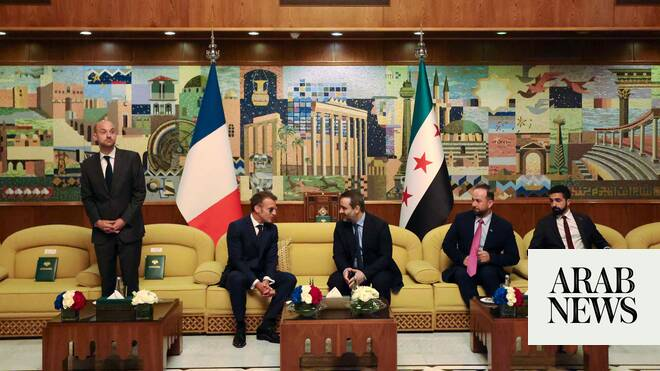

# Syria president hails France’s ‘constructive role’ in transition as Macron visits

Source: https://www.arabnews.com/node/2649872/middle-east
Captured source: https://www.arabnews.com/node/2649872/middle-east
Published: 2026-07-06T20:01:57+03:00
Modified: 2026-07-06T23:31:26+03:00
Author: Reuters

## Summary

DAMASCUS: French President Emmanuel Macron landed in Syria on Monday in the first visit to Damascus by a European Union head of state since rebels led by President Ahmed Al-Sharaa toppled Bashar Assad in 2024. The visit underlines Syria’s geopolitical transformation under Sharaa, a former Al-Qaeda commander who has established close ties with Western and Middle Eastern powers

## Image

## Video Or Embed URLs

- blob:https://www.arabnews.com/8decc57e-e13d-45b4-8fa7-de72d141e100
- https://imasdk.googleapis.com/js/core/bridge3.774.0_en.html
- https://cb59172828cdb3d81b5a99a87fbca5e4.safeframe.googlesyndication.com/safeframe/1-0-45/html/container.html
- https://static.addtoany.com/menu/sm.25.html
- about:blank
- https://ep2.adtrafficquality.google/sodar/sodar2/255/runner.html
- https://www.google.com/recaptcha/api2/aframe
- https://cm.g.doubleclick.net/partnerpixels?gdpr=0&us_privacy=1---&gpp_sid=-1&url=https%3A%2F%2Fwww.arabnews.com%2Fnode%2F2649872%2Fmiddle-east

## Text

https://arab.news/jmpnh

First trip by EU head of state since Assad toppled

Visit ⁠underlines Syria’s geopolitical ‌transformation under ‌Al-Sharaa

DAMASCUS: French President Emmanuel Macron landed in Syria on Monday in the first visit to Damascus by a European Union head of state since rebels led by President Ahmed Al-Sharaa toppled Bashar Assad in 2024.

The visit underlines Syria’s geopolitical transformation under Sharaa, a former Al-Qaeda commander who has established close ties with Western and Middle Eastern powers that shunned Assad, as he seeks to rebuild a country shattered by ‌13 years ‌of war.

“I am here to affirm France’s ​commitment ‌to ⁠the Syrian people. ​For ⁠a sovereign Syria, united in its diversity and at peace with its neighbors. Together, let’s open a new page of stability and peace,” Macron said in a post on X published after his arrival.

He was received at Damascus airport by Syrian Foreign Minister Asaad Al-Shaibani.

Syria’s reconstruction is set ⁠to be one of the key themes ‌of the trip, and Macron will ‌be accompanied by business leaders including the CEOs ​of TotalEnergies and French ‌container shipping group CMA CGM, a French presidential official told reporters in ‌a briefing ahead of the visit.

Macron will also stress France’s commitment to a free, pluralistic Syria that respects all of its communities and meet Syrians from all backgrounds and affiliations, the official added.

Sharaa met Macron ‌during a visit to France last year, his first to a European country since toppling Assad. ⁠The French president ⁠was a leading voice calling for the lifting of Western sanctions that had throttled the Syrian economy and were largely removed last year.

Qatari Emir Sheikh Tamim bin Hamad Al-Thani was the first foreign head of state to make a trip to Syria after Assad was toppled, visiting in January 2025.

European Commission President Ursula von der Leyen visited Damascus in January, while Ukrainian President Volodymyr Zelensky met Sharaa during a visit to Syria in April.

Syria president hails France’s ‘constructive role’

Al-Sharaa hailed France’s “constructive role” in the transition since the toppling of longtime ruler Bashar Assad.

“Macron has sought to engage with us in Syria and followed every step and stage of the transition,” Sharaa said in an interview with French channel BFMTV aired on Monday evening.

He added France also “helped Syria in lifting the sanctions imposed on it” under Assad.

Macron to return Syrian antiquities

Macron will return antiquities loaned to France before the outbreak of civil war in Syria during his visit to the country this week, the Elysee Palace said Monday.

“The president is bringing back to Syria archaeological objects that were loaned to the Arab World Institute in 2010 and which, for obvious reasons, were not able to be returned to Syria,” the Elysee said.

These 23 objects returned to the National Museum of Damascus span a period from prehistory through to the Abbasid era and include artefacts covering the Mesopotamian, Canaanite, Nabataean, Palmyrene, Roman, Byzantine and Umayyad civilisations, the presidency said.

Syria devolved into civil war in 2011, when then-leader Bashar Assad brutally cracked down on pro-democracy protesters. In response, Paris broke off diplomatic relations with Damascus.
