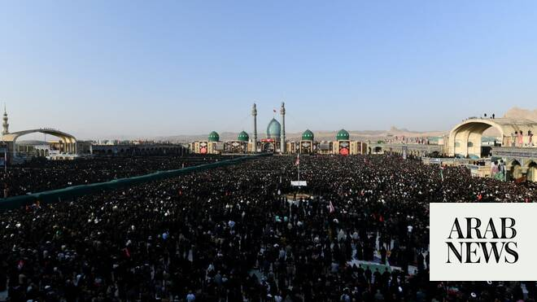

# Crowds bid farewell to Khamenei in Iranian holy city of Qom

Source: https://www.arabnews.com/node/2649926/middle-east
Captured source: https://www.arabnews.com/node/2649926/middle-east
Published: 2026-07-07T06:10:27+03:00
Modified: 2026-07-07T11:58:45+03:00
Author: AFP

## Summary

Tehran: Thousands of people took to the streets on Tuesday in the Iranian holy city of Qom during a fourth day of marathon funeral proceedings for late supreme leader Ayatollah Ali Khamenei. The remains of Khamenei, who was killed in late February on the first day of the US-Israeli war against Iran, are lying in state at the Jamkaran Mosque in Qom, a holy city that houses Shia

## Image

## Video Or Embed URLs

- blob:https://www.arabnews.com/97ad2521-6308-458e-9572-828df0db9b63
- https://imasdk.googleapis.com/js/core/bridge3.774.0_en.html
- https://b7e58d7b861debcae97f7e45327bf528.safeframe.googlesyndication.com/safeframe/1-0-45/html/container.html
- https://static.addtoany.com/menu/sm.25.html
- about:blank
- https://sync.teads.tv/wigo-no-slot
- https://ep2.adtrafficquality.google/sodar/sodar2/255/runner.html
- https://www.google.com/recaptcha/api2/aframe
- https://cm.g.doubleclick.net/partnerpixels?gdpr=0&us_privacy=1---&gpp_sid=-1&url=https%3A%2F%2Fwww.arabnews.com%2Fnode%2F2649926%2Fmiddle-east

## Text

https://arab.news/cbf9e

Monday’s procession will be followed by similar events in Qom on Tuesday and in Iraq’s holy cities of Najaf and Karbala on Wednesday

On the third day of the six-day funeral ceremonies, there was still no sign of Ali Khamenei’s successor and son Mojtaba

Tehran: Thousands of people took to the streets on Tuesday in the Iranian holy city of Qom during a fourth day of marathon funeral proceedings for late supreme leader Ayatollah Ali Khamenei. The remains of Khamenei, who was killed in late February on the first day of the US-Israeli war against Iran, are lying in state at the Jamkaran Mosque in Qom, a holy city that houses Shia Islam’s most influential seminaries and shrines. Aerial footage broadcast by state television showed the streets of Qom — home to about 1.5 million people — packed with mourners. A prayer service was held inside the mosque by Abdollah Javadi-Amoli, a 93-year-old ayatollah and influential conservative Shia figure in the Islamic republic. The massive crowd at the service chanted in unison, “death to America,” a rallying cry frequently heard at official gatherings in Iran. Other television footage showed mourners, including clerics wearing turbans, paying their respects at the coffins of Khamenei and four relatives killed alongside him, including a granddaughter reportedly only 14 months old. A procession then followed with a truck carrying the bodies toward the mausoleum of Fatima Masumeh, the sister of Imam Reza, the eighth Shia imam, a descendant of the Prophet Muhammad. The previous day, a lengthy funeral procession in Tehran drew huge crowds, with authorities keen to project an image of strength and unity following the war, and after massive, bloody anti-government protests across Iran six months ago. Iranians flooded the streets of the capital in an event comparable to the 1989 funeral of Khamenei’s predecessor, Ayatollah Ruhollah Khomeini, the founder of the Islamic republic. But so far in the ceremonies there has been no sign of Khamenei’s successor and son Mojtaba Khamenei, who has not been seen in public since his appointment in early March. Iranian officials have said he was wounded in the airstrike that killed his father and it remains unknown if he will appear for the ceremonies. Another funeral procession is scheduled to be held on Wednesday in neighboring Iraq, which is home to a large Shia community. The final burial of Khamenei, who ruled Iran for over three decades until his death at the age of 86, will take place on Thursday in his hometown of Mashhad, a holy city in the northeast of the country.
