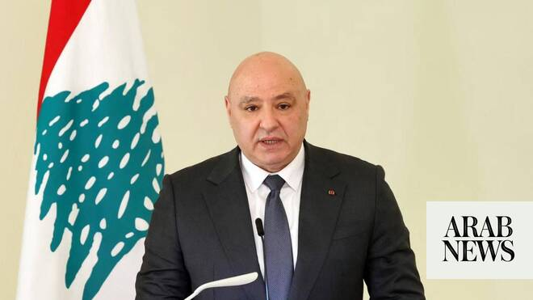

# White House invites Lebanon’s Aoun to visit US on July 21, official says

Source: https://www.arabnews.com/node/2650057/middle-east
Captured source: https://www.arabnews.com/node/2650057/middle-east
Published: 2026-07-08T07:22:49+03:00
Modified: 2026-07-08T09:07:44+03:00
Author: ReutersArab News

## Summary

WASHINGTON: The White ​House has invited Lebanese President Joseph Aoun to visit ‌the ‌United ​States ‌on July ⁠21, ​a White House ⁠official told Reuters on Wednesday, ⁠after Israel and ‌Lebanon signed ‌a ​framework ‌agreement ‌in Washington last month following several days ‌of US-mediated talks aimed at ⁠ending ⁠fighting between Israel and Iran-backed Hezbollah militants.

## Image

## Video Or Embed URLs

- https://de0ff8d540a4b01056309f99bd9cf5a3.safeframe.googlesyndication.com/safeframe/1-0-45/html/container.html
- https://static.addtoany.com/menu/sm.25.html
- about:blank
- https://www.google.com/recaptcha/api2/aframe
- https://imasdk.googleapis.com/js/core/bridge3.774.0_en.html
- https://sync.teads.tv/wigo-no-slot
- https://cm.g.doubleclick.net/partnerpixels?gdpr=0&us_privacy=1---&gpp_sid=-1&url=https%3A%2F%2Fwww.arabnews.com%2Fnode%2F2650057%2Fmiddle-east

## Text

https://arab.news/p9gx5

Invitation comes after Israel and ‌Lebanon signed ‌a ​framework ‌agreement ‌in Washington last month

WASHINGTON: The White ​House has invited Lebanese President Joseph Aoun to visit ‌the ‌United ​States ‌on July ⁠21, ​a White House ⁠official told Reuters on Wednesday, ⁠after Israel and ‌Lebanon signed ‌a ​framework ‌agreement ‌in Washington last month following several days ‌of US-mediated talks aimed at ⁠ending ⁠fighting between Israel and Iran-backed Hezbollah militants.

According to the embassy, “the invitation reflects the enduring partnership between Lebanon and the United States and provides an opportunity for the two leaders to discuss issues of mutual interest, including bilateral relations, regional security, and continued US support for Lebanon’s sovereignty, stability, territorial integrity, and state institutions.”

Israeli Foreign Minister Gideon Saar confirmed on Tuesday that the next round of talks with Lebanon will take place in Rome, as the two countries work to build on a framework agreement reached last month with US backing.
