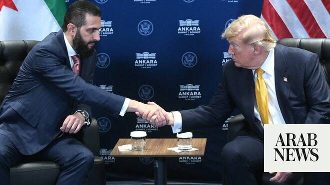

# US to remove Syria from terror blacklist, in boost for Al-Sharaa

Source: https://www.arabnews.com/node/2650141/middle-east
Captured source: https://www.arabnews.com/node/2650141/middle-east
Published: 2026-07-08T18:46:24+03:00
Modified: 2026-07-08T22:59:57+03:00
Author: AFP

## Summary

WASHINGTON: The United States said Wednesday it will delist Syria as a state sponsor of terrorism, a decades-old designation that severely impeded investment, in a new vote of confidence in leader Ahmad Al-Sharaa. Secretary of State Marco Rubio notified Congress of the long-expected move, which will be effective in 45 days unless lawmakers take the unlikely step of blocking it.

## Image

## Video Or Embed URLs

- blob:https://www.arabnews.com/458730a4-d305-4b14-9426-915234b66b50
- https://imasdk.googleapis.com/js/core/bridge3.774.0_en.html
- https://7668f121d243d4a832a91980c191d970.safeframe.googlesyndication.com/safeframe/1-0-45/html/container.html
- https://static.addtoany.com/menu/sm.25.html
- about:blank
- https://www.google.com/recaptcha/api2/aframe
- https://sync.teads.tv/wigo-no-slot
- https://cm.g.doubleclick.net/partnerpixels?gdpr=0&us_privacy=1---&gpp_sid=-1&url=https%3A%2F%2Fwww.arabnews.com%2Fnode%2F2650141%2Fmiddle-east

## Text

https://arab.news/42pns

US and Syrian presidents meet on the sidelines of a NATO summit in Turkiye with Al-Sharaa

Secretary of State Marco Rubio says lifting sanctions will give the Syrian people a chance at greatness

WASHINGTON: The United States said Wednesday it will delist Syria as a state sponsor of terrorism, a decades-old designation that severely impeded investment, in a new vote of confidence in leader Ahmad Al-Sharaa. Secretary of State Marco Rubio notified Congress of the long-expected move, which will be effective in 45 days unless lawmakers take the unlikely step of blocking it. The step came as President Donald Trump met on the sidelines of a NATO summit in Turkiye with Al-Sharaa, a former jihadist who has sought to recast himself as a unifying figure after the 2024 toppling of the Assad family, which ruled with an iron fist for a half century. “This is yet another historic step by President Trump to give the Syrian people a chance at greatness,” Rubio said in a statement. “Lifting sanctions on Syria will unlock international trade and investment, give Syria a chance to rebuild, and open up a new chapter for the Syrian people,” he said. Trump’s embrace of Al-Sharaa comes despite misgivings from Israel, which has repeatedly launched airstrikes in Syria, one of its historic adversaries. Trump had earlier publicly pressed for Syria to make peace with Israel but went ahead with the delisting decision despite a lack of tangible progress. Rubio said in his statement that “a stable, unified Syria at peace with itself and its neighbors benefits not only the region, but the entire world.” Syria is seeking economic support to rebuild after years of brutal war that helped rise to the Islamic State extremist group and generated a major refugee crisis. Meeting in Ankara with Al-Sharaa, who has traded his guerrilla fatigues for a suit, Trump said, “He’s doing an unbelievable job in unifying Syria. What a job he’s doing.” “Syria was a mess with what happened with the previous government,” Trump said.

Impediment to business

Trump’s initial lifting of sanctions had a muted impact as Syria was still considered a state sponsor of terrorism, meaning that businesses face legal risks inside the United States if they operate in the country. Rubio said that the delisting decision came after “formal assurances” by Al-Sharaa that “Syria will not support acts of international terrorism in the future.” With the removal, only three countries remain on the terror blacklist — Iran, North Korea and Cuba. Cuba was controversially designated by the Trump administration at the end of its first term as it exerted pressure on the communist-led island. The United States has listed Syria as a state sponsor of terrorism since 1979. Under ousted president Bashar Assad and his late father Hafez, Syria was a haven for Palestinian militant groups and Damascus was alleged to have direct involvement in incidents such as a 1986 attempted bombing of a flight of Israeli carrier El Al. In recent years, Syria’s US terrorism designation has been primarily related to Assad’s relationship with Iran and support for Hezbollah, the Lebanese Shia militant movement. Last month Trump suggested that Syria under the Sunni Al-Sharaa could take over from Israel in a military campaign to degrade Hezbollah. Al-Sharaa denied any intention to intervene militarily in Lebanon, which Syria had occupied for decades under the Assads.
