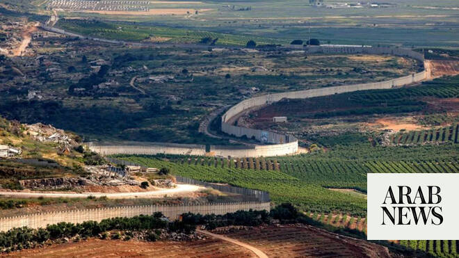

# Lebanon to attend Rome talks only if Israel withdraws from 2 ‘pilot’ zones: diplomatic source

Source: https://www.arabnews.com/node/2650189/middle-east
Captured source: https://www.arabnews.com/node/2650189/middle-east
Published: 2026-07-09T02:09:59+03:00
Modified: 2026-07-09T02:13:58+03:00
Author: AFP

## Summary

BEIRUT, Lebanon: Lebanon demands Israel’s withdrawal from two “pilot zones” in the south as a condition for participating in the next round of direct negotiations in Rome next week, a diplomatic source familiar with the talks told AFP on Wednesday. The two sides had previously met for five rounds of US-sponsored talks in Washington aimed at ending the war between Israel and

## Image

## Video Or Embed URLs

- https://c5f2dbe1ffc77328f57503d56dc8eed0.safeframe.googlesyndication.com/safeframe/1-0-45/html/container.html
- https://static.addtoany.com/menu/sm.25.html
- about:blank
- https://www.google.com/recaptcha/api2/aframe
- https://imasdk.googleapis.com/js/core/bridge3.774.0_en.html
- https://sync.teads.tv/wigo-no-slot
- https://cm.g.doubleclick.net/partnerpixels?gdpr=0&us_privacy=1---&gpp_sid=-1&url=https%3A%2F%2Fwww.arabnews.com%2Fnode%2F2650189%2Fmiddle-east

## Text

https://arab.news/4hegj

Israel and Lebanon have already held five rounds of US-sponsored talks in Washington aimed at ending the war with Hezbollah

BEIRUT, Lebanon: Lebanon demands Israel’s withdrawal from two “pilot zones” in the south as a condition for participating in the next round of direct negotiations in Rome next week, a diplomatic source familiar with the talks told AFP on Wednesday. The two sides had previously met for five rounds of US-sponsored talks in Washington aimed at ending the war between Israel and Iran-backed Lebanese militant group Hezbollah and paving the way for peace. They recently reached a framework agreement that calls for Hezbollah’s disarmament and a gradual Israeli withdrawal from occupied Lebanese territory while Lebanon’s army deploys into “pilot zones.” However, the agreement — rejected by Hezbollah — does not set a timetable for Israel’s withdrawal, and Israeli officials have also vowed that their forces will remain in a “security zone” 10 kilometers (six miles) deep as long as Hezbollah remains armed. The source, requesting anonymity, said “Lebanon is stipulating Israel’s withdrawal from two pilot zones in order to participate in the round of negotiations” that Italy said will take place in Rome on July 15 and 16. The Lebanese diplomatic source said the US State Department told the negotiating delegations that “reaching a framework agreement is the end of one phase and the beginning of a new one.” The next round — aiming for a permanent agreement — required the negotiators to be close to their countries “for consultation.” The source added that Israel was quick to accept Rome as the location for talks as an opportunity to “reduce the pressure” imposed on it by Washington during negotiations to reach the ceasefire and framework agreement. Lebanon’s contacts with the US meanwhile received guarantees that Washington would maintain “the same level of engagement in the negotiations and the same policy in managing the talks” in Rome.

The talks precede Lebanese President Joseph Aoun’s expected visit to Washington later this month, at the invitation of his US counterpart Donald Trump. Aoun said on Wednesday that the visit reflects “the United States’ support for the path to finding a lasting solution to the series of Israeli wars and attacks on our country.” The Lebanese presidency has not announced the date of the visit, but media reports suggest it will take place on July 21. Hezbollah drew Lebanon into the regional war on March 2 by attacking Israel, claiming it was acting in retaliation for the death of Iran’s supreme leader, killed in US-Israeli strikes on Iran on February 28. Israel responded with a large-scale bombing campaign and a ground offensive, killing more than 4,300 people and occupying territory near the border. The framework agreement followed an earlier deal between Tehran and Washington aimed at ending the wider regional war, which also established a ceasefire in Lebanon. Israel, however, still carries out occasional strikes on southern Lebanon, with two people killed in a strike on Wednesday. The diplomatic source said Beirut wants to “affirm its right and ability to negotiate on its own behalf” after Iran insisted on including Lebanon in its agreement with Washington. Hezbollah leader Naim Qassem reiterated the group’s rejection of the framework agreement. “Not a single clause of the agreement will pass,” he said in a speech at commemorations ahead of the burial Thursday of slain Iranian supreme leader Ali Khamenei.
